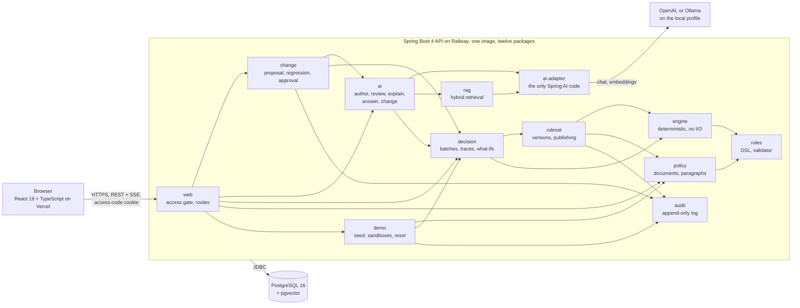

<p align="center">
  
</p>

# PolicyPilot

[](https://github.com/liorshaya/PolicyPilot/actions/workflows/ci.yml?query=branch%3Amain)

An AI copilot over a deterministic rules engine. A model writes rules from Hebrew policy text, reviews them against
the text, answers questions with citations and proposes changes. A deterministic Java engine makes every decision and
records a full trace. A person approves every policy change.

**The model proposes and explains, the rules engine decides, a person approves.** No decision ever passes through a
model: the model's output is a rule set that a validator checks and a person publishes, an answer whose every citation
the API verifies, or a change that the engine replays on 200 cases before a person approves it. The engine that
decides reads only published rules.

Live demo: https://policypilot.liorshaya.com (behind an access code, sent with the invitation).

## Contents

- [Architecture](#architecture)
- [Demo script](#demo-script)
- [Talking points](#talking-points)
- [Setup](#setup)
- [Security](#security)
- [Testing](#testing)
- [Definition of Done](#definition-of-done)
- [Known limitations](#known-limitations)
- [Documents](#documents)

## Architecture



The module diagram of [Document 2](docs/02-architecture.md#backend-module-structure) inside the containers of its
deployment: arrows point from the package that calls to the package it calls. The twelve packages depend inward only,
and [`PackageRulesTest`](backend/src/test/java/com/liorshaya/policypilot/architecture/PackageRulesTest.java) fails
the build on any other arrow. `engine` and `rules` are pure Java, with no framework, clock or I/O, and they have no
outgoing arrows. Only `ai.adapter` imports Spring AI, so the provider changes with a profile (`openai` or `ollama`)
and no use case notices.

The four flows of the demo:

| Flow | What the model does | What decides | Where a person stands |
| --- | --- | --- | --- |
| Author | Reads the policy and writes a rule set in the JSON DSL, each rule quoting its paragraph; a second prompt reviews the draft against the text | The JSON schema and the semantic validator (Document 3's codes), with at most two repairs | Acknowledges the reviewer's findings and publishes; nothing runs before that |
| Decide | Nothing; on request, explains a decision from its trace alone | The engine, on the published version: the same input gives the same bytes, with a trace naming every rule and value | Reads the trace |
| Ask | Answers from retrieved paragraphs, rules and tool results, citing each with a marker | Every marker is checked against what this turn supplied; a decision or a what-if comes from the engine through a read-only tool | Reads an answer whose every claim links to its source |
| Change | Proposes patches to the rules a request affects | The patch validator, the full validator on the patched rule set, then the engine replays the 200 cases on both versions | Reads the diff and the regression report, then approves with a note: version 2 is published and audited, version 1 stays as it was |

The design, its trade-offs and every value are in [the documents](#documents): the DSL and its conformance suite in
Document 3, the prompts and the citation protocol in Document 4, the threat model in Document 5.

## Demo script

Four steps on the live site in three minutes, each a click in the guided demo panel. Every visitor gets a sandbox of
their own on the published lending policy, and the model's answers for the scripted inputs come from a response
cache, so the demo does not wait on the provider. Timings were measured on the live site from a laptop over home
broadband, as a new visitor; the date of each is given.

| Step (Brief's time) | Input | What appears | Measured |
| --- | --- | --- | --- |
| 1. Author (0:00 to 0:45) | Panel step 1 fills the policy form with the Hebrew lending policy (9 paragraphs); "Generate rules" | The stages parsing, authoring, validating and reviewing, then a draft of 26 rules and the reviewer's 9 findings, among them the age conflict between paragraphs 1 and 8 (70 against retirees to 75, F-1) and the undefined "stable income" of paragraph 4 (F-4). Each finding marks the rows of the rules it names, and publishing waits until the errors, the gaps and the injections are acknowledged | 0.8 s to the draft, from the cache (2026-09-24); a draft the cache has not seen takes 67 to 101 s, its review 50 to 80 s |
| 2. Decide (0:45 to 1:15) | Panel step 2, "Run 200 cases"; case 17; "Explain for an officer" | 113 approved, 60 declined, 27 to manual review, and the rules that decided most. Case 17: manual review by R-330, "נדרש ערב בשל אירוע אשראי אחד ב-24 החודשים האחרונים" (a guarantor is required after one credit event in the last 24 months), with the values each rule compared. The explanation cites R-010 (¶ 5), R-020 (¶ 6) and R-330 (¶ 7), says a model wrote it from the trace alone, and lists the rules evaluated that did not apply | 1.8 s from the panel's click to the 200 decisions (2026-09-25); 0.5 s for the explanation from the cache (2026-09-22) |
| 3. Ask (1:15 to 2:00) | Panel step 3 types the first question below; the presenter sends it, then asks the other three | Hebrew answers streamed right to left, with citation chips that open the paragraph, the rule or the decision | first token in 0.9 and 1.3 s for the cached questions; about 3 s for the what-if, answered live (2026-09-24) |
| 4. Change (2:00 to 3:00) | Panel step 4 fills the request "העלה את ההכנסה החודשית המינימלית ל-9,000" (raise the minimum monthly income to 9,000); "Propose the change"; then "Approve and publish" with a note | The two affected rules, R-170 and R-410, as a side-by-side diff; "12 of the 200 decisions made on version 1 flip.", listed by id: 8, 11, 33, 72, 93, 99, 100, 139, 152, 161, 174 and 185, six approvals and six manual reviews that R-170 now declines. After the approval, version 2 and the audit log's newest entry: Change approved, with the note and "2 rules modified" | 0.8 s to the proposal, from the cache (2026-09-24) |

The questions of step 3, with what the answer must contain (the labels of
[`fixtures/eval/questions.json`](fixtures/eval/questions.json)):

| Question | Tool the model calls | The answer cites | It says |
| --- | --- | --- | --- |
| למה בקשה מספר 17 הופנתה לבדיקה? | `getDecision(17)` | decision 17, paragraph 7 | the missing guarantor |
| האם בקשה 17 הייתה מאושרת אם היה ערב? | `simulate(17, {has_guarantor: true})` | the simulation, rule R-900, paragraph 9 | approved |
| מהי תקופת ההחזר המקסימלית להלוואה? | none | paragraph 2 | 84 months |
| מהי הריבית המקסימלית שהבנק רשאי לגבות? | none, and no model call | nothing | the fixed sentence "המסמכים אינם עוסקים בשאלה הזו; אפשר לשאול על כלל, על סעיף או על מספר בקשה." |

A scripted answer is cached only when it met its label, and served only after its tool calls were run again in the
visitor's sandbox with the same results, so a cached explanation is never shown for a decision the engine no longer
makes. The what-if question is the exception today: its answers are correct (the simulation, R-900 and paragraph 9
in each of six runs) but word the approval "אושרה" rather than the label's "מאושר", so none is kept and it is asked
live on every run, about 13,000 tokens each. The fourth question never reaches the model: retrieval finds nothing
above the threshold, and the API answers with Document 4's sentence.

Screenshots of steps 1 to 3 on a desktop and on a phone are in [`docs/demo/`](docs/demo/); the four steps and the
recorded two-minute run are added on day 18.

**Closing line**: "The model wrote and explained every rule you saw. It never made a single decision. That split is
the whole design."

**Encore** (30 seconds): the [evaluation report](docs/eval/2026-09-24-authorv2-reviewv1-answerv2-changev2.md) scores
18 labeled policies with OpenAI and with the local Ollama model side by side, which shows the on-premises path without
running it live; and the municipal tax discount policy, seeded as a second protected policy, shows that a new domain is
only data.

## Talking points

What the project has to prove ([Brief](docs/01-project-brief.md#background-and-motivation)), and where each shows:

1. **The split: models author and explain, a deterministic engine decides.** ESI's own line, "a fusion of human
   expertise, rule-based systems and artificial intelligence". Show the architecture diagram, `engine` with no
   outgoing arrow, and case 17's trace; then the closing line.
2. **Discipline around unreliable model output.** Provider-native structured output against the DSL's JSON schema, a
   semantic validator with named codes, at most two repairs, a reviewer pass, and an evaluation set that measures the
   conversion, including where it falls short (rule recall 0.43, under its 0.90 target; see
   [Known limitations](#known-limitations)).
3. **Retrieval with citations and an honest "not in the documents".** Hybrid retrieval (pgvector and PostgreSQL full
   text, fused by rank), every citation marker checked against what the turn supplied, and a threshold that refuses
   before the model is called. Retrieval recall at 8 is 0.91 on the 23 answerable labeled questions, and refusal
   accuracy 0.93 on all 30.
4. **An agent that changes policy, with regression and a human gate.** Step 4: the model proposes, the validator
   refuses any removal the request does not name (red-team fixture RT-04), the engine replays 200 cases, and nothing
   is published until a person approves.
5. **Any provider, by configuration.** `openai` or `ollama` is a Spring profile; the header names the provider and the
   model of each role (`GET /api/v1/system/provider`). The evaluation report's second column quantifies the local
   model's gap instead of hiding it.

The questions the interviewers are likely to ask, one sentence each
([Document 2, Architecture Decision Records](docs/02-architecture.md#architecture-decision-records)):

| Question | Answer |
| --- | --- |
| Why not let the model decide? | Decisions must be reproducible, explainable and auditable, and a model call is none of the three (ADR-1) |
| Why a custom engine and not Drools? | About 400 lines can be tested exhaustively and defended line by line; Drools would add a second rule language for the model to write (ADR-2) |
| Why a JSON DSL? | It is what structured output produces natively and what a schema validates; the decision table is a view of the same JSON (ADR-3) |
| Why Spring AI? | The framework-native choice for a Spring Boot shop, with chat, structured output, tools and embeddings under one API, kept replaceable behind `ai.adapter` (ADR-4) |
| Why pgvector and not a vector database? | One database keeps transactions, provenance joins and hybrid search in one place, with nothing else to deploy (ADR-5) |
| Why a monolith? | One developer, one deployable, one database; ArchUnit gives the boundaries services would give (ADR-6) |
| Why server-sent events? | The streams are one-directional and fit HTTP, cookies and Railway's proxy as they are (ADR-7) |
| Why validate what the provider's schema mode already enforces? | The schema removes syntax errors; the validator catches unknown fields and unresolved provenance, which no schema can express, and works the same on Ollama (ADR-8) |
| Why hybrid retrieval? | Policy questions carry exact terms, a rule id, a field, a number, where lexical search wins, and Hebrew embeddings are weaker than English ones (ADR-9) |
| Why Maven, Java 21 and one repository? | The conventional choice in Israeli enterprise Java shops and the LTS most companies run; one clone holds the fixtures, the documents, the API and the web app (ADR-10) |

Behind the demo, three tabs answer a question about testing by opening it (Document 6): the engine's mutation
report, [`EngineConformanceTest`](backend/src/test/java/com/liorshaya/policypilot/engine/EngineConformanceTest.java)
with [its fixtures](fixtures/conformance/), and the latest
[evaluation report](docs/eval/2026-09-24-authorv2-reviewv1-answerv2-changev2.md).

## Setup

Needs git, Docker with Compose, and GNU Make. From a clean clone:

```sh
git clone https://github.com/liorshaya/PolicyPilot.git && cd PolicyPilot
cp .env.example .env   # then fill in the three values the table below marks as required
make up                # builds and starts the database, the backend and the frontend; waits for the health check
```

The web app is at http://localhost:5173 (the access code is the one in `.env`), the API's health at
http://localhost:8080/actuator/health. The two demo secrets can be generated:

```sh
echo "POLICYPILOT_ACCESS_CODE=$(LC_ALL=C tr -dc 'a-z' </dev/urandom | head -c 8)"
echo "POLICYPILOT_COOKIE_SECRET=$(openssl rand -hex 32)"
```

| Variable | Required | What it is |
| --- | --- | --- |
| `OPENAI_API_KEY` | yes, on the `openai` profile | The provider key; the backend does not start without one. The steps that call a model need a real key, since a fresh database has no cached answers; deciding, the trace and the audit log never call a model |
| `POLICYPILOT_ACCESS_CODE` | yes | The code the gate asks for: 8 lowercase letters |
| `POLICYPILOT_COOKIE_SECRET` | yes | Signs the session cookie: at least 32 bytes |
| `POLICYPILOT_ADMIN_CODE` | no | Opens the manual reset, `POST /api/v1/admin/reset` with the header `X-PolicyPilot-Admin-Code`; without it, the reset refuses every call |
| `SPRING_PROFILES_ACTIVE` | no | `openai` by default; `ollama` for a local model; Railway runs `openai,cloud` |
| `DATABASE_URL` | no | Only when not using the Compose database |
| `OLLAMA_BASE_URL` | no | Only when Ollama runs outside Compose |

`make up-ollama` runs the same stack on a local model: Ollama with qwen3:14b and bge-m3, which it downloads on the
first start (about 10.5 GB), and the backend on the `ollama` profile with no provider key.

A fresh GitHub runner runs the block above as written, from `git clone` to the gate page, on every change to the
README or the stack (`compose-smoke`): 85 s of the 300 s budget on 2026-09-25 ([run](https://github.com/liorshaya/PolicyPilot/actions/runs/36118010530)).
[`RUNBOOK.md`](RUNBOOK.md) is the owner's operating guide, in Hebrew: deployment, secrets, logs and incidents.

| Command | What it runs |
| --- | --- |
| `make test` | The backend's unit and integration tests (Testcontainers, so Docker) and the frontend's Vitest with coverage |
| `make check` | CI stage 1's hygiene checks, the Python reference's self-test and the case generator's no-diff check |
| `make e2e` | Playwright on the demo flows, every API call answered from the committed fixtures |
| `make e2e-stack` | Playwright against the stack of `make up`: the access gate and sandbox isolation |

## Security

Security is minimal by design, and says so: one shared access code for one demo audience, the provider key in
environment variables, no secret in the repository. The threat model and every control are in
[Document 5](docs/05-security-specification.md); each control has a test that fails when the control is removed.

| Area | Control |
| --- | --- |
| Access | The access code (8 lowercase letters, compared in constant time) is exchanged for a signed session cookie: HMAC-SHA256, HttpOnly, Secure, 24 hours. The exchange allows 5 attempts a minute per IP and locks an IP out for 15 minutes after 20 failures. Every `/api/**` route answers 401 without the cookie, walked from the OpenAPI document so a new route cannot be missed. CSRF has three independent defenses: the CORS allowlist, a custom header, the `Origin` check |
| Isolation | Every entity carries its sandbox, taken from the session and never from the request; another sandbox's id answers 404; the seeded rule sets are protected, and an edit forks a copy. Playwright checks it against the real stack with two visitors: what one adds and decides, the other neither sees nor opens by its id |
| Integrity | A published version is immutable, enforced by a database trigger; the audit log is append-only by its grants; the API connects as a role with the minimum grants. The only path that deletes is the reset of sandboxes idle for 24 hours, nightly or through the admin code, and it never touches a protected row |
| Prompt injection | Policy text, questions and tool results enter prompts only inside delimited, escaped sections; bidi and zero-width characters are stripped at the boundary; the chat's four tools are read-only, at most four calls and one what-if a turn; a citation marker the turn did not supply is removed; the stream is scanned for secrets. The red-team fixtures RT-01 to RT-10 all pass on every push, through the recorded model |
| Spend | A daily budget of 400,000 tokens with a hard stop, token caps and timeouts per prompt, a circuit breaker and the cached scripted answers; a monthly limit at the provider is set with the secrets' rotation before the demo |
| Supply chain | gitleaks in CI and as the pre-commit hook, Semgrep, OWASP Dependency-Check, `npm audit`, Trivy on the image before it is pushed (a High or Critical finding with a fix fails it), actions pinned by commit, an SBOM on every tag; Railway runs the scanned image by digest. No tracked file may carry an invisible or bidi control character |

**Data.** Every applicant, case, policy and decision is a synthetic fixture, and the case schema has no free-text
field; no real data may be loaded into the demo. The OpenAI API is used under its data-usage terms, which the
provider keeps current [on its own page](https://platform.openai.com/docs/guides/your-data). The `ollama` profile is
there for an organization that cannot send its policies to a cloud provider: it sends nothing outside the machine.

**Identity.** There are no user accounts, a non-goal of the Brief: the actor on an audit entry is the visitor's
sandbox, or `demo-analyst` for the seeded data. A production deployment would put an identity provider in front of
the same authorization layer, which is why every entity already carries its sandbox. What else production would add
is listed per risk in [Document 5, Residual Risks](docs/05-security-specification.md#residual-risks-and-changes-to-other-documents).

## Testing

Expected values come from outside the code: the Python reference implementation and the fixtures for the engine and
the validator, the OpenAPI document for the API, recordings of real model runs and the labeled set for the AI layer.
Model calls in tests replay those recordings; the database, the validator and the engine are always real. A test is
kept only when it asserts a value from the specification, would fail if the behavior were wrong, and does not mock
the thing under test.

| Level | What | Tests on `main` |
| --- | --- | --- |
| Unit | Engine, DSL validator, conformance, prompts, the citation resolver, security units, architecture rules | 1,348 |
| Integration | Testcontainers PostgreSQL: every route, sandbox isolation, the recorded AI flows, the red-team fixtures, the contract walk, the Hebrew fixtures through every route | 410 |
| Frontend | Vitest: every screen in both directions, the decision table, the SSE client, the chat markers | 363 |
| End to end | Playwright: the four demo steps in one run through the guided panel, the layout at a laptop's and a phone's width, and against the real stack the access gate and sandbox isolation | 35 |

The five numbers Document 6 publishes, from CI on `main` ([run of 2026-09-25](https://github.com/liorshaya/PolicyPilot/actions/runs/36119033561)):

- **Coverage**: 97.2% of the backend's lines and 94.0% of its branches, unit and integration tests merged; the
  frontend's statements 94.3%, branches 87.3%. Each package's numbers are in the CI job summary.
- **Mutation score**: `engine` and `rules` at 100% line coverage and a PIT score of 100%, 1,463 of 1,463 mutants
  killed; both are hard gates.
- **Conformance**: 31 conformance cases, Java and Python reference agree on all.
- **Evaluation**: the table below.
- **Red team**: RT-01 to RT-10 pass ([Security](#security)).

Evaluation run 2 ([report](docs/eval/2026-09-24-authorv2-reviewv1-answerv2-changev2.md), 2026-09-24): 18 labeled
policies, 30 questions and 6 change requests, scored for both providers. The targets are the strong model's; the
Ollama column shows that the local path works and how far behind it is.

| Metric | Target | openai (gpt-5.6-terra) | ollama (qwen3:14b) | Verdict |
| --- | --- | --- | --- | --- |
| Rule precision | 0.90 | 0.34 | 0.32 | FAIL |
| Rule recall | 0.90 | 0.43 | 0.05 | FAIL |
| Provenance accuracy | 0.95 | 0.97 | 1.00 | PASS |
| Schema-valid first try | 0.90 | 1.00 | 0.17 | PASS |
| Valid after repairs | 1.00 | 1.00 | at least 0.06 | PASS |
| Case agreement | 0.95 | 0.67 | 0.02 | FAIL |
| Reviewer recall | 0.80 | 0.87 | 0.38 | PASS |
| Reviewer precision | 0.70 | at least 0.46 | at least 0.44 | needs an analyst pass |
| Retrieval recall at 8 | 0.90 | 0.91 | 1.00 | PASS |
| Citation accuracy | 0.90 | 0.91 | 0.83 | PASS |
| Refusal accuracy | 0.90 | 0.93 | 0.83 | PASS |
| Change correctness | 0.83 | 1.00 | 0.00 | PASS |

Performance, from the CI job summary of the same run, measured on its runner (AMD EPYC 7763, 4 cores, 15 GiB) and
shown beside Document 6's targets; a timing test fails only above three times its target, so a slow runner shows as a
trend, not a red build:

| Metric | Target | Measured on a CI runner |
| --- | --- | --- |
| 200 cases decided and stored, through the API (median of 3) | under 1 s | 315 ms |
| One decision through the API (median of 20) | under 50 ms | 22 ms |
| Chat first token, the recorded model answering after 100 ms | under 500 ms | 128 ms |
| Chat first token, a scripted answer from the cache | under 500 ms | 65 ms |

CI runs eight stages on every push, cheapest first, and `main` deploys only when stages 1 to 6 pass:
[`ci.yml`](.github/workflows/ci.yml), stage by stage in [Document 6](docs/06-test-strategy.md). The requirements
map to their tests in the [traceability matrix](docs/quality/traceability.md), generated from the tests' tags, with
no empty row.

## Definition of Done

The Brief's eleven lines, walked on 2026-09-25: on the live site what calls no model, the rest in CI and on a fresh
runner. Steps 1, 3 and 4 were last walked on the live site on 2026-09-24, for gate G3.

| # | Line | Result | Evidence |
| --- | --- | --- | --- |
| 1 | `docker compose up` and one command start the system on a clean machine in under 5 minutes | Met | the README's setup block on a fresh GitHub runner, from `git clone` to the gate page: 85 s of 300 ([compose-smoke](https://github.com/liorshaya/PolicyPilot/actions/runs/36118010530)) |
| 2 | The sample policy converts into a schema-valid rule set on the first or second attempt in at least 9 of 10 runs | Met | 10 of 10 valid on the first attempt on `gpt-5.6-terra`, 2026-09-20 ([gate G1](docs/worklog.md#gate-g1-proof-collected-2026-09-20-day-7-passed), [recordings](fixtures/eval/recordings/openai/author/v1/)); 18 of 18 on the first try in evaluation run 2 |
| 3 | At least 90% of the generated rules match the labeled rules | Not met | the evaluation runner matches 10 of the lending policy's 18 labeled rules (recall 0.56, [run 2](docs/eval/2026-09-24-authorv2-reviewv1-answerv2-changev2.md)); the manual checklist of 2026-09-22 counted 14 of 18 ([report](docs/eval/rule-match-lending.md)) |
| 4 | 200 cases decide in under 1 second, and a rerun is byte-identical | Met in the test environment | 315 ms median on a CI runner through the API with persistence ([`DecisionPerformanceIT`](backend/src/test/java/com/liorshaya/policypilot/decision/DecisionPerformanceIT.java)); two runs byte-identical in the engine and through the API ([`EngineConformanceTest`](backend/src/test/java/com/liorshaya/policypilot/engine/EngineConformanceTest.java), [`BatchDecisionIT`](backend/src/test/java/com/liorshaya/policypilot/decision/BatchDecisionIT.java)). On the live site the 200 cases take 1.8 s from the panel's click, network included, and give 113, 60 and 27 as `cases-expected.json` |
| 5 | Every decision has a trace naming each fired rule and the compared values | Met | [`TraceTest`](backend/src/test/java/com/liorshaya/policypilot/engine/TraceTest.java); case 17 on the live site: decided in 298 µs, manual review with R-330's reason, every step listed with the values it compared |
| 6 | The three scripted questions return cited answers, and the out-of-scope question returns "not covered by the documents" | Met on 2026-09-24 | every expected citation present, the fixed sentence for the rate question with no model call ([gate G3's walk](docs/worklog.md#day-15-gate-g3-collected-2026-09-24-passed)); the what-if is answered live on every run (see the demo script) |
| 7 | The scripted change request produces a diff, a regression report and a version 2 with an audit entry, and version 1 decisions stay unchanged | Met on 2026-09-24 | [gate G3](docs/worklog.md#day-15-gate-g3-collected-2026-09-24-passed): the two rules, the 12 flips, version 2 and its audit entry on the live site, case 17 unchanged on version 1 |
| 8 | Switching the profile from `openai` to `ollama` needs no code change and the chat step still works | Not met | the profile switches with no code change, and the header names qwen3:14b and bge-m3; the chat step does not work on qwen3:14b (see [Known limitations](#known-limitations)) |
| 9 | 100% line coverage and a mutation score of at least 90% on the engine and the validator; integration tests cover every use case with a recorded model; the traceability matrix has no empty row | Met | 100% and 1,463 of 1,463 mutants; [the matrix](docs/quality/traceability.md) |
| 10 | The README has the architecture diagram, the design principle, the demo script, known limitations and a 2-minute recorded run | Not yet | all but the recorded run, which is day 18's |
| 11 | The live demo runs the four scripted steps with the access code, and a request without the code is rejected | Rejection met | without the cookie, `GET /api/v1/rulesets` answers 401 `SESSION_INVALID` (2026-09-25); with the code, the gate opens in 2.2 s and step 2 runs through the panel; the four steps in one sandbox wait for the paid walk, last run on 2026-09-24 |

## Known limitations

The plan ran first in two weeks instead of four: Document 7's scope ladder was cut from rung 2 to rung 10 on entry,
with a few pieces outside the ladder, and the `v1.0.0` tag of 2026-09-22 is that version. The full plan was restored
the same day, and each cut leaves this list in the pull request that ships it. What is still open:

- **The guided demo panel's box** (rung 7) and **the change flow's Definition of Done** (rung 10) close with day 16's
  walk: the Playwright run of all four steps through the panel passes in CI stage 7 since #138, and the change flow
  passed gate G3 on the live site on 2026-09-24.
- **The chat step on the local model** (rung 3, and the provider badge's box, which asks for it): the `ollama` profile
  loads with no code change, answers every prompt, and the header names its models, but qwen3:14b calls no tool and
  wraps its answers in JSON, and bge-m3's similarities pass a threshold tuned for OpenAI's embeddings, so a question
  outside the policy gets an answer instead of the refusal. The evaluation report's Ollama column measures the gap:
  3 of 18 drafts pass the schema on the first try, change correctness is 0 of 6.
- **Rule match below 90%** (Brief line 3): rule recall 0.43, precision 0.34 and case agreement 0.67 over the 18
  labeled policies, up from 0.12, 0.10 and 0.00 once `author/v2` gave the model the field names the cases use. What
  still misses is listed per policy in the report: derived values named differently (`debt_to_income_ratio` for
  `debt_to_income`), terms the policy leaves undefined ("stable income" as a field the cases do not have), set values
  rounded otherwise. Provenance is right on 0.97 of the rules that match, and every OpenAI draft passes the schema on
  its first answer.
- **The what-if question is answered live** on every demo run, about 3 s and 13,000 tokens, because its correct
  answers word the approval differently from the label (see the demo script).
- **The encore on the second domain** (rung 2): the municipal tax discount policy is seeded as a second protected
  policy and its 10 labeled cases decide as labeled; the encore itself is rehearsed on day 19.
- **The reset's admin code is not rotated yet**: the nightly reset and the manual one have run on the live site since
  day 15; the admin code is rotated with the other secrets after the video, on day 18.
- **Retrieval**: an English question about the Hebrew policy can be refused as not covered (Q-14 in run 2), and a
  paragraph reached only through a rule's quote can be missed: for 2 of the 23 answerable questions, no expected
  chunk is among the eight retrieved.
- **Deliberately not built** (Document 2): user accounts, roles, per-user audit identity, and encryption at rest
  beyond Railway's; **one shared access code** and **in-memory rate limits** on a single instance. Each is accepted
  for a demo, with what production would add, in
  [Document 5, Residual Risks](docs/05-security-specification.md#residual-risks-and-changes-to-other-documents).

## Documents

| Document | What it decides |
| --- | --- |
| [1. Project Brief](docs/01-project-brief.md) | Scope, the demo, requirements, the Definition of Done |
| [2. Architecture](docs/02-architecture.md) | Modules, flows, the data model, routes, deployment |
| [3. Rules DSL Specification](docs/03-rules-dsl-specification.md) | The DSL, the validator codes, the trace, the conformance suite |
| [4. AI Pipeline and Prompts](docs/04-ai-pipeline-and-prompts.md) | Prompt contracts, the repair loop, retrieval, the citation protocol, the cache, the evaluation metrics |
| [5. Security Specification](docs/05-security-specification.md) | Threats, controls, red-team fixtures, residual risks |
| [6. Test Strategy](docs/06-test-strategy.md) | Test levels, coverage and mutation gates, CI stages |
| [7. Work Plan](docs/07-work-plan.md) | Days, gates, the scope ladder |
| 8. This README | Setup, the demo script, talking points, the Definition of Done |

Progress: [`docs/progress-checklist.md`](docs/progress-checklist.md) and [`docs/worklog.md`](docs/worklog.md).
The working rules every coding session starts from: [`CLAUDE.md`](CLAUDE.md).

## Stack

Java 21 · Spring Boot 4.0 · Spring AI 2.0 · PostgreSQL 16 + pgvector · Flyway · React 19 · TypeScript · Vite ·
TanStack Query · Vitest · Playwright · Docker Compose · GitHub Actions · Railway · Vercel
