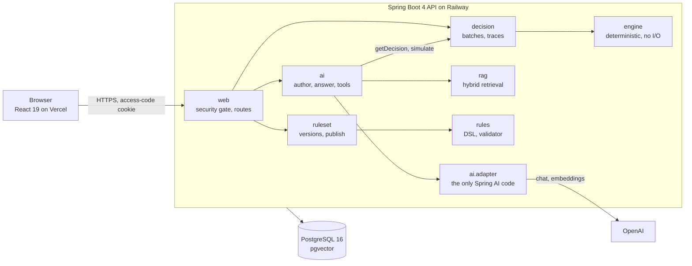

<p align="center">
  
</p>

# PolicyPilot

An AI copilot over a deterministic rules engine. A model writes rules from Hebrew policy text and answers questions
with citations. A deterministic Java engine makes every decision and records a full trace. A person publishes every
rule set.

**The model proposes and explains, the rules engine decides, a person approves.** No decision ever passes through a
model: the model's output is a rule set that a validator checks and a person publishes, or an answer whose every
citation the API verifies. The engine that decides reads only published rules.

Live demo: https://policypilot.liorshaya.com (behind an access code, sent with the invitation).

## Contents

- [Architecture](#architecture)
- [Demo script](#demo-script)
- [Setup](#setup)
- [Security](#security)
- [Testing](#testing)
- [Definition of Done](#definition-of-done)
- [Known limitations](#known-limitations)
- [Documents](#documents)

## Architecture



A request goes through the access gate, then to one module. Twelve packages depend inward only, and
[`PackageRulesTest`](backend/src/test/java/com/liorshaya/policypilot/architecture/PackageRulesTest.java) enforces it.
`engine` and `rules` are pure Java with no framework, clock or I/O. Only `ai.adapter` imports Spring AI, so the
provider can change (`openai` or `ollama` profile) without touching a use case.

The three flows the demo shows:

| Flow | What the model does | What decides | Where a person stands |
| --- | --- | --- | --- |
| Author | Reads the policy and writes a rule set in the JSON DSL, each rule quoting its paragraph | The schema and the semantic validator, with at most two repairs | Publishes the draft; nothing runs before that |
| Decide | Nothing | The engine, on the published version: the same input gives the same bytes, with a trace naming every rule and value | Reads the trace |
| Ask | Answers from retrieved paragraphs, rules and tool results, citing each with a marker | Every marker is checked against what this turn supplied; a decision or a what-if comes from the engine through a tool | Reads an answer whose every claim links to its source |

The design, its trade-offs and every value are in [the documents](#documents): the DSL and its conformance suite in
Document 3, the prompts and the citation protocol in Document 4, the threat model in Document 5.

## Demo script

Three steps on the live site, about two minutes. Each visitor gets a sandbox of their own on the published lending
policy. The timings were measured on the live site on 2026-09-22 from a laptop over home broadband, as a new
visitor, by a script and in Chromium on a desktop and on an emulated iPhone 13.

| Step | Input | What appears | Measured |
| --- | --- | --- | --- |
| 1. Author | Policy screen, the seeded Hebrew lending policy (9 paragraphs), "Generate rules" | The stages parsing, authoring, validating and reviewing, then a draft of 22 rules with the reviewer's 10 findings: among them the conflict between paragraphs 1 and 8 (age 70 against retirees to 75) and the undefined "stable income" of paragraph 4. "Review the draft" opens the rule set: each finding names the rules and paragraphs it concerns, every rule it names carries a mark on its row, and publishing waits until the errors, the gaps and the injections are acknowledged | 0.9 s to the draft, both answers from the response cache (a draft the cache has not seen takes 67 to 101 s, its review 50 to 80 s) |
| 2. Decide | Cases screen, "Run 200 cases", then case 17, then "Explain for an officer" | 113 approved, 60 rejected, 27 referred, the rules that decided most, and case 17: referred by R-330 with the values it compared. The explanation cites R-010 (¶ 5), R-020 (¶ 6) and R-330 (¶ 7), says a model wrote it from the trace alone, and lists the rules that were evaluated and did not apply | 1.4 s for the 200 cases, 0.5 s for the explanation from the cache (14 s the first time); case 17 itself decides in 61 µs |
| 3. Ask | Assistant screen, the three questions below, then the rate question | Hebrew answers streamed right to left, with citation chips that open the paragraph, the rule or the decision | first token: 0.6 to 0.8 s for each question in 12 of 14 asks |

The questions of step 3, as asked, with what the answer must contain (the labels of
[`fixtures/eval/questions.json`](fixtures/eval/questions.json)):

| Question | Tool the model calls | The answer cites | It says |
| --- | --- | --- | --- |
| למה בקשה מספר 17 הופנתה לבדיקה? | `getDecision(17)` | decision 17, paragraph 7 | the missing guarantor |
| האם בקשה 17 הייתה מאושרת אם היה ערב? | `simulate(17, {has_guarantor: true})` | the simulation, rule R-900 | approved |
| מהי תקופת ההחזר המקסימלית להלוואה? | none | paragraph 2 | 84 months |
| מהי הריבית המקסימלית שהבנק רשאי לגבות? | none, and no model call | nothing | the fixed "not covered by the documents" sentence |

A scripted question is served from a response cache once it has been answered well. The cache holds an answer only
when it met its label, and serves it only after re-running its tool calls in the visitor's sandbox and getting the
same results, so a cached explanation is never shown for a decision the engine no longer makes. The key includes the
conversation so far, so the cache was warmed both ways: the questions in the order above in one conversation, and each
on its own. Both are served from the cache: over 14 asks the first token came in 0.6 to 0.8 s twelve times, and in 1.3
and 3.0 seconds the other two, because a cached answer still embeds the question for retrieval. The fourth question
never reaches the model. Warming took five tries for the second question in the order above: four correct answers said
"the result was approval" rather than the label's word "approved", and the cache kept none of them.

Screenshots of each step on the live site, on a desktop and on a phone, are in [`docs/demo/`](docs/demo/). The
recorded two-minute run is linked here once it is recorded.

**Closing line**: "The model wrote and explained every rule you saw. It never made a single decision."

## Setup

Needs Docker (with Compose) and GNU Make. The backend tests need Docker for Testcontainers; the frontend needs Node 24.

```
cp .env.example .env        # fill in the values; the file lists the names only
make up                     # database, backend and frontend, then waits for the health check
make test                   # backend (unit and integration, Testcontainers) and frontend tests
make check                  # the CI hygiene checks and the Python reference self-test
```

| Variable | What it is |
| --- | --- |
| `OPENAI_API_KEY` | The provider key; without it, only cached answers work |
| `SPRING_PROFILES_ACTIVE` | `openai` locally; `openai,cloud` on Railway |
| `POLICYPILOT_ACCESS_CODE` | The code the gate asks for |
| `POLICYPILOT_COOKIE_SECRET` | At least 32 bytes; signs the session cookie |
| `DATABASE_URL` | Only when not using the Compose database |
| `OLLAMA_BASE_URL` | Only for `make up-ollama`, which runs the same stack on a local model |

The web app is at http://localhost:5173 and the API health at http://localhost:8080/actuator/health. A clean GitHub
runner with no caches brings the stack up in 93 s of the 300 s budget
([compose smoke run](https://github.com/liorshaya/PolicyPilot/actions/runs/35672409158)).
[`RUNBOOK.md`](RUNBOOK.md) is the owner's operating guide (in Hebrew): deployment, secrets, logs and incidents.

## Security

The threat model is [Document 5](docs/05-security-specification.md). Every control there has a test that fails when
the control is removed.

| Area | Control |
| --- | --- |
| Access | One access code, exchanged for a signed HttpOnly cookie (HMAC-SHA256); constant-time comparison; rate limit and lockout on the exchange; every `/api/**` route answers 401 without the cookie, walked from the OpenAPI document so a new route cannot be missed |
| Isolation | Every entity carries its sandbox, taken from the session, never from the request; another sandbox's id answers 404; the seeded rule set is protected, and an edit forks a copy |
| Integrity | A published version is immutable, enforced by a database trigger; the audit log is append-only by its grants; the API runs as a restricted role |
| Prompt injection | Policy text and questions enter prompts only inside delimited, escaped sections; bidi and zero-width characters are stripped; the two chat tools read only and are capped per turn; a marker the turn did not supply is removed; the stream is scanned for secrets. Red-team fixtures RT-01 to RT-10 run on every push through the recorded model |
| Spend | A daily token budget with a hard stop, per-prompt token caps and timeouts, a circuit breaker, a monthly limit at the provider, and cached scripted answers |
| Supply chain | gitleaks (also as the pre-commit hook), Semgrep, OWASP Dependency-Check, `npm audit`, Trivy on the image before it is pushed, pinned actions and versions, an SBOM on every tag; Railway runs the scanned image by digest |

No secret is in the repository: `.env` is ignored and `.env.example` lists names only.

## Testing

Expected values come from outside the code: the Python reference implementation and the fixtures for the engine and
the validator, the OpenAPI document for the API, recordings of real model runs and the labeled set for the AI layer.
Model calls in tests replay those recordings; the database, the validator and the engine are always real.

| Level | What | Count on `main` |
| --- | --- | --- |
| Unit | Engine, DSL validator (all 31 conformance cases, run in Java and in the Python reference), prompts, citation resolver, security units | 1,050 |
| Integration | Testcontainers PostgreSQL: every route, sandbox isolation, the recorded AI flows, red-team fixtures, the contract walk | 299 |
| Frontend | Vitest: the decision table grammar, the SSE client, the chat markers, RTL rendering | 223 |
| End to end | Playwright: the access gate and the three demo steps | 16 |

`engine` and `rules` have 100% line coverage and a PIT mutation score of 100% (1,207 of 1,207 mutants killed), both
hard gates. CI runs eight stages on every push, cheapest first, and `main` deploys only when stages 1 to 6 pass:
[`ci.yml`](.github/workflows/ci.yml), stage by stage in [Document 6](docs/06-test-strategy.md).

## Definition of Done

The Brief's lines 1 to 6, the minimum for the two-week version, walked on 2026-09-22:

| # | Line | Result | Evidence |
| --- | --- | --- | --- |
| 1 | `docker compose up` and one command start the system on a clean machine in under 5 minutes | Met | [Compose smoke run](https://github.com/liorshaya/PolicyPilot/actions/runs/35672409158) on a fresh GitHub runner: 93 s of the 300 s budget, 2026-09-22 |
| 2 | The sample policy converts into a schema-valid rule set on the first or second attempt in at least 9 of 10 runs | Met | 10 of 10 valid on the first attempt on `gpt-5.6-terra`, 2026-09-20 ([gate G1](docs/worklog.md#gate-g1-proof-collected-2026-09-20-day-7-passed), [recordings](fixtures/eval/recordings/openai/author/v1/)) |
| 3 | At least 90% of the generated rules match the labeled rules | Not met | 14 of 18 (78%) on the canonical run, 67% median over ten ([report](docs/eval/rule-match-lending.md)) |
| 4 | 200 cases decide in under 1 second, and a rerun is byte-identical | Met in the test environment | 76 to 129 ms median through the API with persistence ([`DecisionPerformanceIT`](backend/src/test/java/com/liorshaya/policypilot/decision/DecisionPerformanceIT.java)); two runs byte-identical in the engine and through the API ([`EngineConformanceTest`](backend/src/test/java/com/liorshaya/policypilot/engine/EngineConformanceTest.java), [`BatchDecisionIT`](backend/src/test/java/com/liorshaya/policypilot/decision/BatchDecisionIT.java)); on the live site, decision 17 equals the Python reference's decision field for field. Across the network the batch takes 1.3 to 1.7 s; Document 6's comparison across two CI machines is not built |
| 5 | Every decision has a trace naming each fired rule and the compared values | Met | [`TraceTest`](backend/src/test/java/com/liorshaya/policypilot/engine/TraceTest.java); case 17 on the live site: R-330 with the values it compared |
| 6 | The three scripted questions return cited answers, and the out-of-scope question returns "not covered by the documents" | Met | The walk of 2026-09-22 above: every expected citation present, the fixed sentence for the rate question with no model call; also the [day 9 cloud check](docs/worklog.md#day-9-cloud-check-collected-2026-09-22-passed) |

Lines 7 to 11 are not met in full. Lines 7, 8 and 11 need work that was cut: the change flow, a chat run on Ollama
and demo step 4. Line 9's coverage and mutation gates hold, but the requirements that were cut have no tests. Line 10
waits for the recorded run. The [known limitations](#known-limitations) give each cut.

## Known limitations

The plan ran in two weeks instead of four. Document 7's scope ladder was cut from rung 2 to rung 10 on entry, and a
few pieces outside the ladder with it. Each cut below names its rung or its piece. On 2026-09-22, after the `v1.0.0`
tag, the full plan was restored: each cut leaves this list in the pull request that ships it.

- **The change flow's Definition of Done is not walked yet** (rung 10): gate G3 passed on day 15, with demo step 4
  end to end on the cloud site (the two rules, the 12 flips, version 2 and its audit entry, case 17 unchanged under
  version 1), but the Definition of Done walk with its evidence links is day 16's, so Brief line 7 is not ticked.
- **The guided demo panel is not yet proven in one run** (rung 7): since day 14 it drives all four steps with one click
  each, and each step has a Playwright test of its own; the run of all four steps in one go is day 16's.
- **Rule match below 90%** (Brief line 3, not met): evaluation run 2 scores rule recall at 0.43, precision at 0.34 and
  case agreement at 0.67 over the 18 labeled policies
  ([the run of 2026-09-24](docs/eval/2026-09-24-authorv2-reviewv1-answerv2-changev2.md)), up from 0.12, 0.10 and 0.00
  once `author/v2` gave the model the field names the cases use. What still misses is listed per policy: rules that
  name a derived value differently (`debt_to_income_ratio` for `debt_to_income`), terms the policy leaves undefined
  ("stable income" as a field the cases do not have), and set values rounded otherwise. Provenance is correct on 0.97
  of the rules that matched, and every draft passed the schema on its first answer.
- **The Ollama column** (rung 3): the `ollama` profile answers every prompt on qwen3:14b and bge-m3, and its column
  of evaluation run 2 shows the gap (3 of 18 drafts pass the schema, change correctness 0 of 6), but the chat step
  in the interface on a local model is day 16's, so Brief line 8 is not verified.
- **The encore on the second domain** (rung 2): the municipal tax discount policy is seeded as a second protected
  policy since day 15 and its 10 labeled cases decide as labeled; the encore itself is rehearsed on day 19.
- **The reset's admin code is not rotated yet**: the nightly reset and `POST /api/v1/admin/reset` exist since day 15
  and both ran on the cloud site; rotating the admin code after its test is part of the secrets rotation of days
  17 to 19.
- **The provider badge's box is still open**: since day 16 the header names the provider, the model of each role
  and the embedding model with its dimension (`GET /api/v1/system/provider`), but the box also asks for the chat
  step run on the `ollama` profile, which is Brief line 8.
- **Retrieval**: recall at 8 is 38 of 48 expected chunks on the 30 labeled questions
  ([report](docs/eval/retrieval-first-pass.md)). A paragraph reached only through a rule's quote can be missed, and an
  English question about the Hebrew policy can be refused as not covered.
- **One shared access code** and **in-memory rate limits** on a single instance: accepted for a demo, listed with
  what production would add in [Document 5, Residual risks](docs/05-security-specification.md).

## Documents

| Document | What it decides |
| --- | --- |
| [1. Project Brief](docs/01-project-brief.md) | Scope, the demo, requirements, the Definition of Done |
| [2. Architecture](docs/02-architecture.md) | Modules, flows, the data model, routes, deployment |
| [3. Rules DSL Specification](docs/03-rules-dsl-specification.md) | The DSL, the validator codes, the trace, the conformance suite |
| [4. AI Pipeline and Prompts](docs/04-ai-pipeline-and-prompts.md) | Prompt contracts, the repair loop, retrieval, the citation protocol, the cache |
| [5. Security Specification](docs/05-security-specification.md) | Threats, controls, red-team fixtures, residual risks |
| [6. Test Strategy](docs/06-test-strategy.md) | Test levels, coverage and mutation gates, CI stages |
| [7. Work Plan](docs/07-work-plan.md) | Days, gates, the scope ladder |

Progress: [`docs/progress-checklist.md`](docs/progress-checklist.md) and [`docs/worklog.md`](docs/worklog.md).
The working rules every coding session starts from: [`CLAUDE.md`](CLAUDE.md).

## Stack

Java 21 · Spring Boot 4.0 · Spring AI 2.0 · PostgreSQL 16 + pgvector · Flyway · React 19 · TypeScript · Vite ·
TanStack Query · Vitest · Playwright · Docker Compose · GitHub Actions · Railway · Vercel
