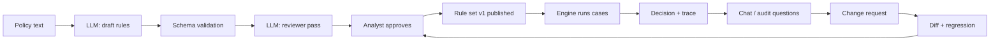

# PolicyPilot Project Brief

2026-09-27 · Lior Shaya

## Overview

PolicyPilot is an AI copilot for a business rules engine: it turns policy text into executable rules, runs them deterministically, and explains every decision.

**Core principle: the LLM authors and explains; the rules engine decides.** Language models are used to author rules from natural language, review them against the source text, answer questions over the rule base and its documents, and propose changes. Every decision on a real case is made by a deterministic Java engine that evaluates a versioned rule set and records a full trace. No decision ever passes through a model.

Primary demo domain: consumer loan approval. The architecture is domain-agnostic, and a second domain (municipal tax discount) can be added as data only, without code changes.

Stack in one line: Java 21 + Spring Boot 4 + Spring AI 2.x on the backend, PostgreSQL + pgvector for data and embeddings, React + TypeScript (Vite) on the frontend, OpenAI by default with a local Ollama option behind the same interface; the live demo runs on Railway (backend and database) and Vercel (frontend).

**Language decision: natural language in Hebrew, engineering in English.** The sample policy, the chat questions and the model's free-text output (rule labels, explanations, answers) are in Hebrew, because ESI's clients (Israeli banks, HMOs and government agencies) write their policies in Hebrew, and that is the hard, relevant case to demonstrate. The code, the Rules DSL keys, the UI chrome, the API and all project documents are in English, as is standard in Israeli hi-tech and in ESI's own product material. An English policy fixture is kept as a secondary demo and as a fallback if Hebrew model output proves unstable.

## Background and Motivation

This project is built for a technical interview at [ESI Labs](https://esi.co.il/), whose core product LOGIST is a business rules management system (BRMS) with natural language rule authoring, real-time execution and a full audit trail.

ESI describes its direction as "Agentic AI - a fusion of human expertise, rule-based systems and artificial intelligence", and its solutions cover credit scoring, loan approvals, eligibility determination, pricing, medical protocols and billing. Its published case studies stress explainability and traceability: an eligibility engine with an "Audit & Explanation Layer", and a credit scoring engine that pairs predictive models with "deterministic BRMS logic for transparency".

The role asks for: converting natural language into rules, free chat over existing systems, RAG and embeddings, prompt engineering, calling OpenAI and other model providers from Java / Spring Boot, and a React + TypeScript client. PolicyPilot is designed so that each of these is a visible, demonstrable feature rather than a checkbox (see Job Requirements Coverage).

What the project must prove in the interview:

1. A sound design decision: models author and explain, a deterministic engine decides. This mirrors ESI's own philosophy and is the first sentence of the pitch.
2. Engineering discipline around unreliable model output: strict JSON schemas, validation, a reviewer pass, and an evaluation set that measures conversion accuracy.
3. A working RAG pipeline with citations and honest "not in the documents" answers.
4. A demo that runs end to end in three minutes without surprises.

## Goals and Non-Goals

The project commits to five goals and explicitly refuses everything else.

**Goals**

1. Convert a policy document written in natural language (English or Hebrew) into a validated, executable rule set, with every rule linked to the passage it came from.
2. Execute rule sets deterministically on cases, producing a decision plus a complete trace (which rules fired, in what order, with which values).
3. Answer free-form questions over the rule base, the source documents and past decisions, with citations, using RAG and tool calling.
4. Handle a policy change request end to end: find affected rules, propose a diff, run a regression on existing cases, require human approval, and record a new immutable version with an audit entry.
5. Run against a cloud model (OpenAI) or a local model (Ollama) by changing configuration only.

**Non-goals**

- Not a production BRMS: no rule engine optimizations (Rete, indexing), no clustering, no multi-tenant isolation.
- Not a public SaaS product. The live deployment is a protected demo (access code, rate limits, nightly reset) with no landing page, sign-up or billing.
- No machine learning scoring models. Credit risk in the demo is rule-based only; a scoring model is mentioned as a future integration point.
- No authentication or role management beyond a single shared access code and a single demo user with an `actor` label on audit entries.
- No document ingestion of scanned PDFs or OCR. Inputs are plain text, Markdown, or text-based PDF.
- No fine-tuning of models. All model behavior is achieved through prompting, schemas and retrieval.
- No visual drag-and-drop rule builder. Rules are edited as a decision table and as JSON, with the LLM as the primary authoring path.

## Users and Use Cases

Three personas cover every flow in the system; the demo plays all three in sequence.

| Persona | Who they are | What they do in PolicyPilot |
| --- | --- | --- |
| Policy analyst | Business user in the credit department, owns the lending policy, writes no code | Pastes or edits policy text, reviews the generated rules, resolves flagged ambiguities, publishes a rule set version |
| Credit officer | Handles loan applications, needs consistent decisions and a reason for each one | Submits cases (single or batch), reads the decision and its trace, escalates cases marked for manual review |
| Auditor / compliance | Must explain any past decision and any policy change | Asks questions in the chat, opens the audit log, compares two rule set versions, exports a decision trace |

**Core flows**

Reading the diagram: the model drafts and reviews, but nothing reaches the engine before an analyst approves it, and a change request loops back through the same approval gate.

1. **Author**: the analyst pastes the policy, gets a draft rule set, sees each rule next to its source passage, resolves ambiguities the reviewer flagged, and publishes.
2. **Decide**: the credit officer submits a case; the engine returns approve / reject / manual review with a trace in under a second.
3. **Ask**: anyone asks "why was application 17 rejected?" or "what is the minimum income for self-employed applicants?"; the answer cites the rule and the policy passage, or says the documents do not cover it.
4. **Change**: the analyst writes "raise the minimum income threshold to 9,000"; the system proposes a diff, reruns all cases, reports how many decisions flip, and publishes version 2 only after approval.
5. **Audit**: the auditor opens any decision, sees the rule set version it was made with, and opens the change history between versions.

## The Demo

The demo is a scripted three-minute story with four wow moments; everything in scope exists to make these four moments work.

| Step | Time | What the audience sees | Wow moment |
| --- | --- | --- | --- |
| 1. Author | 0:00-0:45 | Paste the sample lending policy (Hebrew text, about one page). Click "Generate rules". A decision table of about 25 rules appears; each row links to its source paragraph. The reviewer's findings mark the rows they concern, and the presenter points to two of them: an ambiguity ("stable income" is undefined) and a conflict between two paragraphs (age 70 in one, retirees up to 75 in another). The others are real gaps a one-page policy leaves, such as how the 9% annual rate becomes a monthly one and whether 35% and 40% belong to the referral band (decided 2026-09-27, day 15). | Rules with provenance and a reviewer that catches problems a human would miss |
| 2. Decide | 0:45-1:15 | Click "Run 200 cases". A dashboard shows approved / rejected / manual review counts and top rejection reasons. Open case 17: the trace shows the three rules that fired, with the applicant's values. | Deterministic decisions with a readable trace, under a second for 200 cases |
| 3. Ask | 1:15-2:00 | Type in the chat: "Why was application 17 rejected?" The answer names the rule, quotes the policy paragraph, and links both. Follow-up: "Would it be approved with a guarantor?" The assistant asks the engine for a what-if simulation of the same version and cites its result: approved, with a flag that income stability is checked manually. Then: "What is the maximum loan term?" if not in the documents, the assistant says so. | Grounded answers with citations, and an honest "not in the policy" |
| 4. Change | 2:00-3:00 | Type: "Raise the minimum monthly income to 9,000". The agent lists the two affected rules, shows a diff, reruns the 200 cases: 12 decisions flip, listed by id. Click "Approve". Version 2 is published, the audit log shows who changed what, when and why. | Agentic change with regression and a human approval gate |

**Closing line for the presenter**: "The model wrote and explained every rule you saw. It never made a single decision. That split is the whole design."

**Optional encore (30 seconds)**: open the evaluation report in the repository, which scores the same labeled policies with OpenAI and with the local Ollama model, to show that the on-premises path works without running it live; if a laptop is available, run the `ollama` profile locally instead. If the second domain is ready, load the municipal tax discount policy to show that only data changed.

**Demo safety**: the presentation runs on the deployed site from the interviewers' machine, so the sample policy, the 200 synthetic cases and the change request are fixed fixtures checked into the repository and pre-loaded; a guided demo panel drives the four steps with one click each; model outputs for steps 1, 3 and 4 are served from the response cache so the demo does not depend on live API latency or an unknown network; the access code is short enough to type on any keyboard; and a recorded video of the full run is on the presenter's phone as the fallback.

## Functional Requirements

Twenty-three requirements, prioritized MoSCoW: Must ships in every version of the demo, Should ships in the full 19-day plan, Could ships only if time remains; the two-week version keeps every Must and the Should items the Work Plan's Scope ladder leaves in (Document 7).

| ID | Requirement | Priority |
| --- | --- | --- |
| FR-1 | Upload or paste a policy document (Markdown, plain text, text PDF) in English or Hebrew, and store it with a version | Must |
| FR-2 | Generate a draft rule set from a policy document via the LLM, as JSON that conforms to the Rules DSL schema | Must |
| FR-3 | Reject or repair any generated rule that fails schema validation, with a bounded retry (max 2) | Must |
| FR-4 | Attach to every rule the source passage (document id, paragraph index, quoted text) it was derived from | Must |
| FR-5 | Run a reviewer pass that flags ambiguities, contradictions and unsupported rules, with a reason per flag | Should |
| FR-6 | Display the rule set as an editable decision table and as raw JSON; manual edits are validated the same way | Must |
| FR-7 | Publish a rule set as an immutable version; only published versions can decide cases | Must |
| FR-8 | Evaluate a case against a published version and return decision, matched rules, and an ordered trace | Must |
| FR-9 | Evaluate a batch of cases (200 fixtures) and return aggregate counts and per-case results | Must |
| FR-10 | Persist every decision with the rule set version, input snapshot, trace and timestamp | Must |
| FR-11 | Explain a stored decision in natural language, citing rules and source passages | Should |
| FR-12 | Chunk and embed policy documents and rules into pgvector on publish | Must |
| FR-13 | Chat endpoint that answers questions with retrieved context and citations, streamed to the client | Must |
| FR-14 | Chat can call tools: lookup a decision by id, get batch statistics, list rules in a version, simulate a stored decision with changed inputs (what-if, never stored) | Should |
| FR-15 | Chat answers "not covered by the documents" when retrieval confidence is low, instead of guessing | Must |
| FR-16 | Conversation memory per chat session (last N turns) | Should |
| FR-17 | Change request in natural language: identify affected rules using embeddings plus the LLM | Should |
| FR-18 | Produce a proposed rule set diff and a regression report (decisions that flip) before any publish | Should |
| FR-19 | Human approval step creates the new version and an audit entry (actor, timestamp, request text, diff) | Should |
| FR-20 | Side-by-side diff view of any two versions | Could |
| FR-21 | Switch model provider (OpenAI / Ollama) and model name through configuration, visible in the UI | Should |
| FR-22 | Evaluation harness: run the conversion on a labeled set of policies and report precision / recall per rule, for both providers | Should |
| FR-23 | Guided demo panel: the four scripted steps as one-click actions that pre-fill the inputs, so the demo can be driven from any machine | Should |

## Non-Functional Requirements

Seven properties define the quality bar; the first three are the ones ESI will probe hardest.

| ID | Property | Requirement |
| --- | --- | --- |
| NFR-1 | Determinism | The same case against the same rule set version always yields the same decision and trace. The engine contains no randomness and no model calls. |
| NFR-2 | Explainability | Every decision carries a trace a non-developer can read: rule id, rule text, the values compared, the outcome. Every rule carries its source passage. |
| NFR-3 | Auditability | Rule set versions are immutable. Every publish, change request and approval is logged with actor, timestamp and diff. A decision always references the exact version that made it. |
| NFR-4 | Provider independence | All model access goes through one internal interface. OpenAI and Ollama are interchangeable via configuration; no provider-specific code outside the adapter layer. |
| NFR-5 | Hebrew support | Policies, rules, questions and answers work in Hebrew and English. The UI supports RTL. Embeddings use a multilingual model (OpenAI text-embedding-3 or bge-m3 locally). |
| NFR-6 | Performance | Single case decision under 50 ms; batch of 200 cases under 1 s; chat first token under 3 s with a cloud model; rule generation for a one-page policy under 30 s. |
| NFR-7 | Robustness to model failure | Invalid model output never reaches the database. Timeouts, rate limits and malformed JSON degrade to a visible error, never to a silent wrong rule. |

Security is minimal by design (single demo user, API keys in environment variables, no secrets in the repository), and the README states this explicitly.

## Job Requirements Coverage

Every skill named in the role maps to at least one Must requirement, so the two-week version already covers the full list.

| Skill the role asks for | Where it shows in PolicyPilot | Requirements |
| --- | --- | --- |
| Natural language to rules | Policy text to Rules DSL via structured output with a JSON schema, validation, bounded retry, reviewer pass | FR-2, FR-3, FR-4, FR-5 |
| Free chat over existing systems | Chat over the rule base, documents and decision history; tools that query the live system | FR-13, FR-14, FR-16 |
| RAG | Chunking, embedding on publish, retrieval with citations, low-confidence refusal | FR-12, FR-13, FR-15 |
| Embeddings | pgvector store for document chunks and rules; similarity search also drives change-impact analysis | FR-12, FR-17 |
| Prompt engineering | Five distinct prompts (author, review, explain, answer, change), each versioned in the repo, with an evaluation harness | FR-2, FR-5, FR-11, FR-17, FR-22 |
| LLM usage in general | Model-agnostic adapter, streaming, tool calling, conversation memory, failure handling | NFR-4, NFR-7, FR-13, FR-14 |
| Java / Spring Boot calling OpenAI and other providers | Spring AI ChatClient and EmbeddingModel with OpenAI and Ollama starters, selected by Spring profile | FR-21, NFR-4 |
| React + TypeScript client | Policy editor, decision table, case runner and trace view, streaming chat, diff view | FR-6, FR-8, FR-9, FR-13, FR-20 |

Local model option: Ollama running Qwen3 for chat and bge-m3 for embeddings, so the same demo runs with no external API, which matters for ESI's banking and government clients.

## Scope by Phase and Timeline

Five phases (0 to 4) over 15 to 19 working days, scheduled day by day in Document 7; phase 2 is the earliest point at which the project is presentable, and phases are cut from the end.

| Phase | Working days | Ships | Demo steps enabled |
| --- | --- | --- | --- |
| 0. Foundations | 1 | Repository, Docker Compose (PostgreSQL + pgvector, Ollama), Spring Boot skeleton with Spring AI, React + Vite skeleton, CI running tests, fixtures (sample policy, 200 cases), first deployment to Railway and Vercel so that every green main is live from day 1 (Document 7) | none |
| 1. Core | 5-6 | Rules DSL + JSON schema, deterministic engine with trace, policy to rules via structured output with validation and retry, versioned rule sets, decision persistence, decision table UI, case runner and trace view | 1 (without reviewer flags), 2 |
| 2. Chat and RAG | 3-4 | Chunking and embedding on publish, retrieval with citations, streaming chat UI, low-confidence refusal, tools for decisions and statistics, conversation memory, reviewer pass on generated rules | 1 (complete), 3 |
| 3. Agentic change | 3-4 | Change request flow: impact analysis via embeddings, proposed diff, regression run, approval gate, audit log, diff view | 4 |
| 4. Polish | 3-4 | Ollama profile and provider switch in the UI, Hebrew and RTL pass, evaluation harness with 18 labeled policies, README with architecture diagram, demo script, recorded fallback video, second-domain fixture (municipal tax discount, data only, half a day), guided demo panel, final deployment checks on Railway (backend, database) and Vercel (frontend) behind the access code | encore |

Cut order if time runs short: the second-domain fixture, FR-20 diff view, the Ollama column of the evaluation report (the harness itself stays), then the whole of phase 3 (the demo then ends at step 3 and the change request is described in the README as the next step). The Ollama switch is cheap (configuration plus one dropdown) and stays in even under pressure.

Working rhythm: each phase ends with a tagged commit and a 30-second screen recording, so there is always a presentable state, and the last three days are reserved for rehearsal and bug fixing, never for new features.

## Deployment

Decision: the backend and database run on Railway, the frontend on Vercel's free tier, and the site is a protected live demo, not a public product.

| Component | Where | Notes |
| --- | --- | --- |
| Backend (Spring Boot + Spring AI) | Railway, running the image that CI builds from the Dockerfile and scans, deployed by digest once CI passes on `main` | OpenAI provider only in the cloud; the Ollama profile is demonstrated locally |
| Database (PostgreSQL + pgvector) | Railway service on the `pgvector/pgvector:pg16` image (PostgreSQL 16 with the pgvector extension) | Seeded with the sample policy, the published rule set and the 200 fixture cases |
| Frontend (React + TypeScript) | Vercel free tier, deployed from the `frontend/` folder | Calls the Railway API over HTTPS; the API base URL is an environment variable |
| Domain | `policypilot.liorshaya.com` for the frontend, or the Vercel default domain | Subdomain of the portfolio site, quoted in the email to the interviewers together with the access code |

Protections, all Must for the public deployment:

- A single access code from an environment variable, entered once and kept in a cookie; every API route rejects requests without it.
- Rate limiting per IP on every endpoint that calls a model (Bucket4j), a hard monthly spend limit in the OpenAI dashboard, and a per-request token cap.
- Cached model outputs for the four scripted demo steps, so repeated visits cost nothing.
- The seeded official rule set is read-only; each visitor works in a sandbox copy that a scheduled job resets nightly.
- No secrets in the repository; keys live in the Railway and Vercel environment settings.

Timing: the deployment pipeline is set up on day 1 so that every green main is live from the start, and phase 4 holds only the final checks (Document 7). If phase 2 slips, the live site still shows the two-week scope, and the repository with `docker compose up` plus the recorded video remains the delivery.

## Success Criteria and Definition of Done

The project is presentable when all eleven items below are true; the first six are the minimum for the two-week version.

- [ ] `docker compose up` followed by one command starts the whole system on a clean machine in under 5 minutes.
- [ ] The sample lending policy converts into a rule set that passes schema validation on the first or second attempt in at least 9 of 10 runs.
- [ ] At least 90% of the rules in the generated set match the labeled expected rules for the sample policy (measured by the evaluation harness or by a manual checklist).
- [ ] The 200 fixture cases decide in under 1 second, and rerunning them yields byte-identical results.
- [ ] Every one of the 200 decisions has a trace that names each fired rule and the compared values.
- [ ] The three scripted chat questions return cited answers, and the out-of-scope question returns "not covered by the documents".
- [ ] The scripted change request produces a diff, a regression report and a version 2 with an audit entry, and version 1 decisions remain unchanged.
- [ ] Switching the profile from `openai` to `ollama` requires no code change and the chat step still works.
- [ ] Unit tests cover the engine and the DSL validator at 100% line coverage with a mutation score of at least 90%; integration tests cover every use case with a recorded model; the traceability matrix has no empty row (Document 6).
- [ ] The README contains the architecture diagram, the design principle, the demo script, known limitations and a 2-minute recorded run.
- [ ] The live demo on Railway and Vercel runs the four scripted steps with the access code, and a request without the code is rejected.

## Risks and Mitigations

The two risks that can sink the demo are unstable rule generation and scope creep; both have a concrete mitigation from day one.

| Risk | Likelihood | Impact | Mitigation |
| --- | --- | --- | --- |
| Rule generation is inconsistent between runs | High | High | Strict JSON schema with provider-native structured output, temperature 0, few-shot examples, bounded retry, cached outputs for the demo fixtures |
| The model invents rules not in the policy | Medium | High | Provenance is mandatory: a rule without a matching source passage fails validation; the reviewer pass checks each rule against its passage |
| Scope creep into phase 3 before phase 1 and 2 are solid | High | High | Phase gates with tagged commits; phase 3 starts only when the Definition of Done items 1-6 pass |
| Hebrew retrieval quality is poor with a given embedding model | Medium | Medium | Multilingual embeddings (text-embedding-3, bge-m3), hybrid search (vector + keyword), test questions in both languages in the evaluation set |
| API outage or latency during the interview | Low | High | Cached model outputs for scripted steps, Ollama fallback, recorded video |
| Interviewers know BRMS far better than the presenter | Certain | Medium | Present the project as an exploration, not a product; lead with the design decision; keep a list of known limitations and open questions ready |
| Spring AI 2.x API changes during development | Low | Low | Pin the version in the build file; isolate all Spring AI usage in the adapter layer |

## Document Set

Seven documents follow this brief, written in this order, each short enough to be read in ten minutes and each one the input to the next.

| # | Document | What it decides | Written when |
| --- | --- | --- | --- |
| 1 | Project Brief (this document) | Scope, demo, requirements, timeline | Now |
| 2 | Architecture Document | Components, module boundaries, data flow, data model, API surface, model adapter design, decision records for the key choices | Before phase 0 |
| 3 | Rules DSL Specification | The JSON rule format: fields, operators, combinators, actions, provenance, the JSON schema, worked examples from the lending policy, evaluation semantics and conflict resolution | Before phase 1 |
| 4 | AI Pipeline and Prompt Specification | The five prompts (author, review, explain, answer, change), structured output contracts, validation and retry policy, chunking and retrieval strategy, tool definitions, evaluation set and metrics | Before phase 1 (author prompt) and phase 2 (retrieval) |
| 5 | Security Specification | Threat model, every kind of injection and its control, prompt injection defense in depth with red-team fixtures, authentication and sandbox authorization, input limits, model and tool safety, supply chain, OWASP mappings, security test plan | Before phase 0 |
| 6 | Test Strategy | Test levels, coverage targets by risk with mutation testing on the engine, definition of done for every task, traceability matrix from requirements to tests, fixtures, CI gates, working method | Before phase 0 |
| 7 | Work Plan | Day-by-day tasks per phase with their tests, phase gates, demo rehearsal schedule | After documents 2-6 |
| 8 | README and Demo Script | Setup, architecture summary, the scripted demo, known limitations, security and testing sections, talking points for the interview | End of phase 4 |

Documents 1 to 7 live in the repository under `docs/` as Markdown, exported from these living documents, so the interviewers can read them next to the code.

## Glossary

| Term | Meaning in this project |
| --- | --- |
| Policy | A natural language document describing how decisions must be made (for example, a lending policy). Stored with a version. |
| Rule | One executable unit: conditions over case fields plus an action (approve, reject, refer to manual review, set a value), with a priority and a provenance link. |
| Rules DSL | The JSON format in which rules are expressed, defined by a JSON schema. |
| Rule set | An ordered collection of rules generated from one or more policies. Has a draft state and immutable published versions. |
| Case | The input to a decision: a set of named fields (applicant age, monthly income, existing debt, and so on). |
| Decision | The engine's output for one case against one rule set version: outcome, matched rules, trace, timestamp. |
| Trace | The ordered record of which rules were evaluated, which fired, and the values compared. |
| Provenance | The origin of a rule: quoted (a paragraph index and a verbatim quote from the policy, the only kind a model may produce), analyst (a person's note with the actor, set by the system on approval or on a manual edit), or pending (a proposed change awaiting approval, allowed only inside a change proposal). |
| Reviewer pass | A second model call that checks the draft rules against the policy text and flags ambiguities, conflicts and unsupported rules. |
| Change request | A natural language instruction to modify a published rule set, processed into a diff, a regression report and, after approval, a new version. |
| Regression | Rerunning all stored cases against a proposed rule set and reporting decisions that changed. |
| RAG | Retrieval-augmented generation: answering a question by retrieving relevant chunks (rules, policy passages, decisions) and passing them to the model as context. |
| Chunk | A unit of text stored with its embedding for retrieval; here, one policy paragraph or one rule. |
| Tool calling | Letting the model request a function call (for example, `getDecision(id)`) that the backend executes and returns, so answers can use live system data. |
| Provider | The model backend: OpenAI (cloud) or Ollama (local), selected by a Spring profile. |
| BRMS | Business Rules Management System, the category of product ESI's LOGIST belongs to. |
| Simulation | A what-if evaluation of a stored decision's input with some fields changed, against the same rule set version; returned to the chat or the UI, never stored as a decision. The only way a counterfactual question is answered. |
| Flag | A note a rule attaches to a decision without changing its outcome; used for advisory conditions and for policy criteria that stay manual (an approval carries the flags a person still has to check). |
| Sandbox | A visitor's private copy of the demo data, created on the first write and deleted after 24 hours; the seeded rule set is protected and shared read-only, so no visitor can alter what another one sees. |
