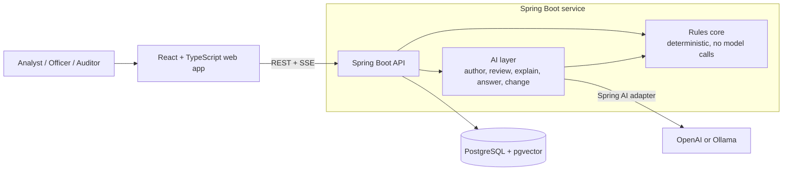
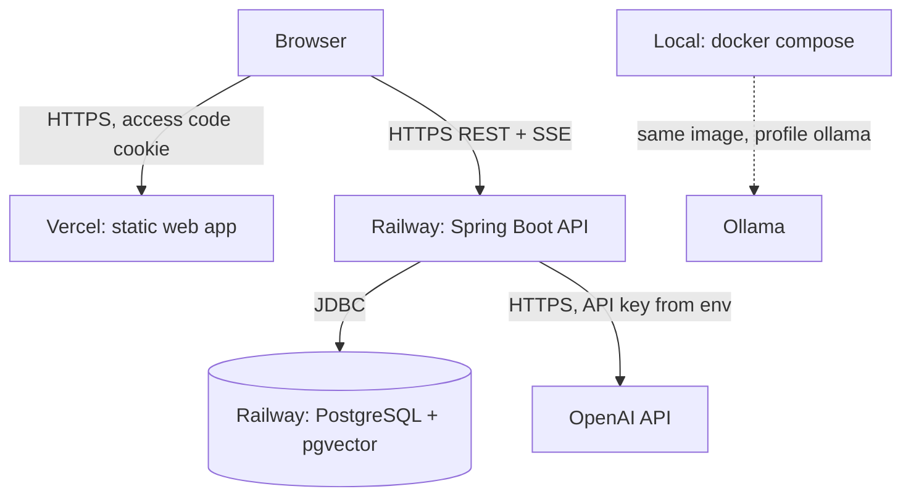
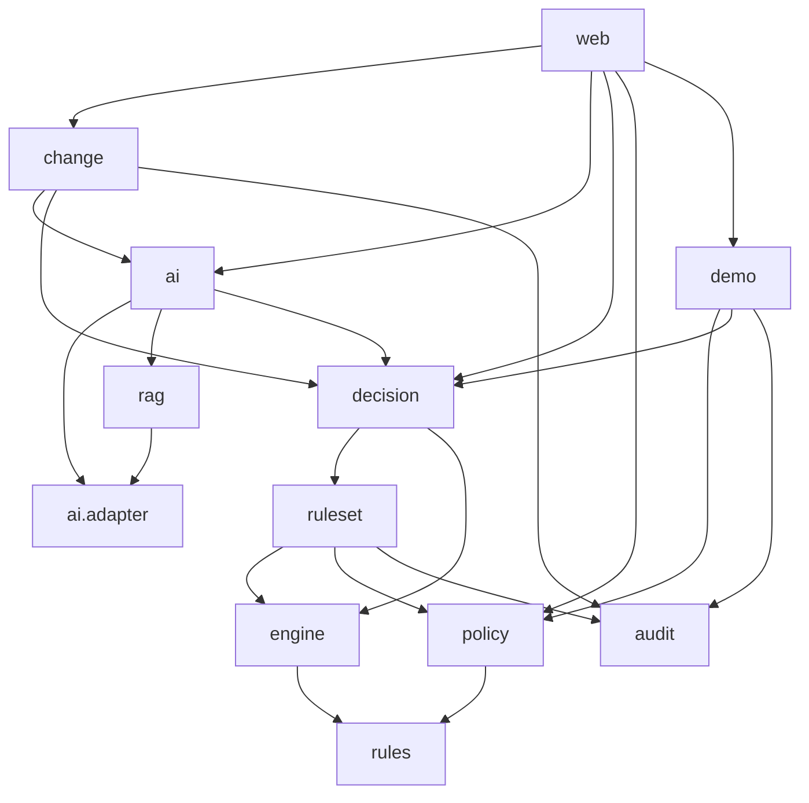
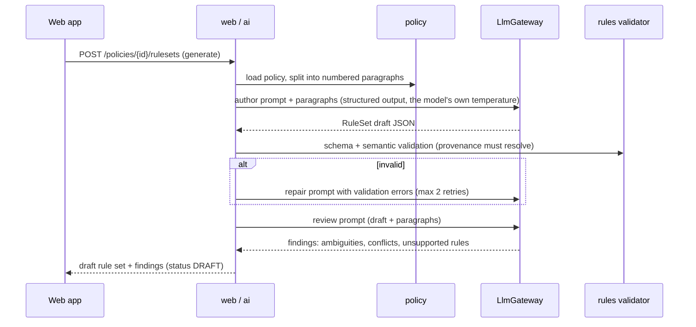
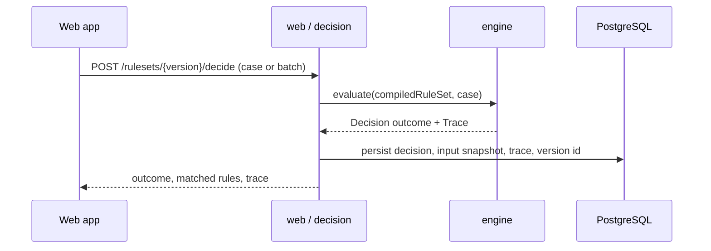
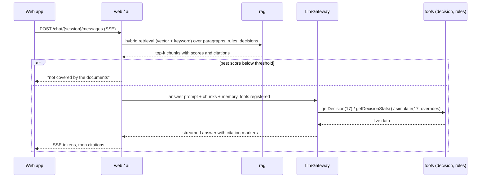
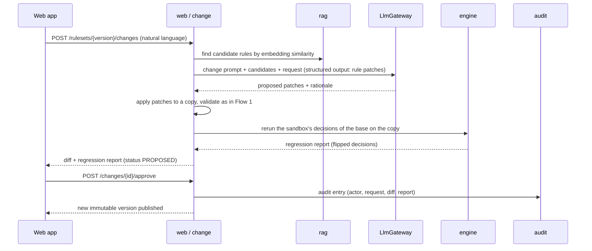
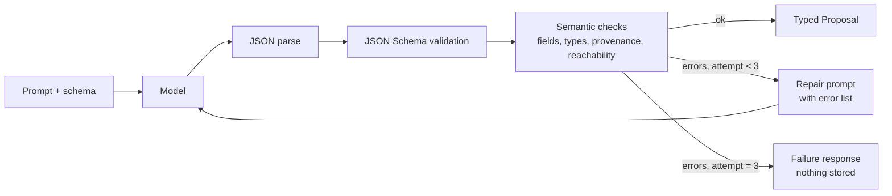
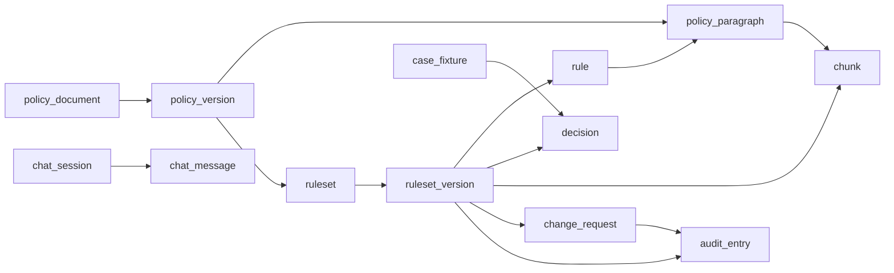
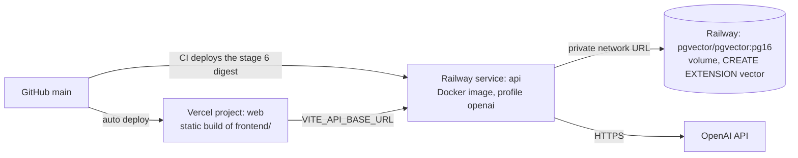

# PolicyPilot Architecture

2026-09-27 · Lior Shaya

Document 2 of the PolicyPilot set. It builds on the scope, demo and requirements fixed in the [Project Brief](01-project-brief.md) and is the input to the Rules DSL Specification (Document 3) and the AI Pipeline and Prompt Specification (Document 4).

## Architecture at a Glance

PolicyPilot is a modular monolith: one Spring Boot service with a deterministic rules core, an AI layer around it, one PostgreSQL database that also holds the vectors, and a React client. The model providers sit outside the trust boundary of every decision.

Reading the diagram: the client only ever talks to the API; the AI layer can read the rules core and propose changes to it, but the rules core never calls the AI layer or a model, which is what makes decisions deterministic and auditable.

The design principle from the brief, restated as an architectural rule: **anything that decides a case lives in the rules core and is pure Java; anything that reads or writes natural language lives in the AI layer and produces proposals, explanations or answers, never decisions.**

## Constraints That Shape the Design

Each non-functional requirement in the brief becomes one enforceable architectural rule; the first four are checked by tests, not by convention.

| From the brief | Architectural rule | How it is enforced |
| --- | --- | --- |
| NFR-1 Determinism | The `engine` package depends on nothing but the JDK and the `rules` model; it has no clock, no random source and no I/O | ArchUnit test: no class in `engine` may import `ai`, `rag`, Spring AI or `java.net`; a property-based test reruns 200 cases twice and asserts identical traces |
| NFR-2 Explainability | Every decision is built from a `Trace` object that the engine emits; the API never derives an explanation from anything else | The `Decision` entity stores the serialized trace; the explain prompt receives the trace as its only source of facts |
| NFR-3 Auditability | Published rule set versions are immutable rows; changes create new versions; every write to a version or approval writes an `AuditEntry` in the same transaction | JPA entities without setters for published versions; a DB trigger rejects `UPDATE` on published versions |
| NFR-4 Provider independence | All model calls go through two internal interfaces, `LlmGateway` and `EmbeddingGateway`, implemented once on Spring AI | ArchUnit test: only the `ai.adapter` package may import `org.springframework.ai` |
| NFR-5 Hebrew support | Text is UTF-8 end to end; chunking is paragraph-based, never byte-based; the embedding model is multilingual; the UI direction is a per-language setting | Fixtures in both languages in the evaluation set; RTL snapshot tests in the web app |
| NFR-6 Performance | Rule evaluation is in-memory over a compiled rule set cached per version; batch evaluation is a loop, not 200 HTTP calls | Micro-benchmark in the test suite with a 1 s budget for 200 cases |
| NFR-7 Robustness to model failure | Model output enters the system only through a validated `Proposal` type; a failed validation is an error response, never a stored rule | Validation layer with JSON Schema plus semantic checks, bounded retry, and a circuit breaker on the gateway |

Two scope constraints also shape the architecture: one developer and 15-20 working days, which rules out microservices, message brokers and separate vector databases, and a public demo on Railway and Vercel, which requires the API to be stateless apart from the database so it can restart or redeploy at any time.

## System Context and Containers

Four runtime containers: the web app, the API, the database and the model provider; only the API holds credentials and only the API is allowed to reach the provider.

| Container | Technology | Responsibility | Talks to |
| --- | --- | --- | --- |
| Web app | React 19, TypeScript, Vite, TanStack Query, served as static files | Policy editor, decision table, case runner, trace view, chat, diff and audit views | API only, over HTTPS (REST for commands and queries, SSE for streamed chat and long jobs) |
| API | Java 21, Spring Boot, Spring AI, one deployable JAR in a Docker image | All business logic: rules core, AI layer, persistence, protections | Database over JDBC; model provider over HTTPS through the Spring AI adapter |
| Database | PostgreSQL 16 with the pgvector extension | Policies, rule sets and versions, cases, decisions, audit log, chat sessions, document chunks with embeddings | Nothing outbound |
| Model provider | OpenAI API (cloud) or Ollama (local), selected by profile | Chat completions with structured output and tool calling; embeddings | Nothing in the system; it is called, never calling |

Reading the diagram: in the cloud, the browser loads the static app from Vercel and calls the API on Railway directly, so CORS is configured for the Vercel origin only; locally, the same API image runs under Docker Compose with the `ollama` profile and no external calls.

Trust boundaries: the browser is untrusted (every request carries the access code and is rate limited); the model provider is untrusted for correctness (its output is validated before use) but trusted for confidentiality of the demo data, which is synthetic by design.

## Backend Module Structure

One Maven project, one Spring Boot application, twelve packages under `com.liorshaya.policypilot` (eleven top-level plus `ai.adapter`), with dependencies allowed in one direction only: inward toward `rules` and `engine`.

| Package | Contains | May depend on |
| --- | --- | --- |
| `rules` | The Rules DSL model: `RuleSet`, `Rule`, `Condition`, `Action`, `Provenance`; the JSON Schema; the validator with its contexts | JDK, Jackson |
| `engine` | `RuleEngine`, `CompiledRuleSet`, `Trace`, operators and combinators, simulation (a pure re-evaluation) | `rules` |
| `policy` | Policy documents and their versions, paragraph splitting and the policy text limits, storage | `rules` (for provenance ids), persistence |
| `ruleset` | Rule sets and their versions: drafts, manual edits, publishing with its audit entry, immutability, the `rule` rows, the compiled rule set cached per version, fork on write of protected rule sets, including the approval of a change proposed on one | `rules`, `engine` (compile), `policy` (the paragraphs provenance cites), `audit`, persistence |
| `decision` | Case model, `DecisionService` (single, batch, simulate), decision persistence and statistics, exports | `ruleset` (published versions), `engine`, `rules`, persistence |
| `ai` | `LlmGateway`, `EmbeddingGateway`, `AnswerCache`, prompt registry, structured output contracts, validation loop, marker resolver, tool argument validation, the five use cases (author, review, explain, answer, change) | `rules`, `engine` (read-only, for regression), `policy`, `ruleset` (drafts), `decision`, `rag`, persistence |
| `ai.adapter` | The only package that imports Spring AI: `SpringAiLlmGateway`, `SpringAiEmbeddingGateway`, provider configuration, schema variant derivation, token budget guard, response cache, `ScriptedAnswerCache` (the `AnswerCache` of the chat) | Spring AI, `ai` interfaces, persistence |
| `rag` | Chunking, embedding on publish, the pgvector chunk store (parameterized SQL, no Spring AI `VectorStore`), hybrid retrieval, citation building | `policy`, `rules`, `ruleset` (the published version to chunk, its `embedding_status`), `ai` (the `EmbeddingGateway` interface), persistence |
| `change` | Change requests, impact analysis, diff, regression run, approval (pending to analyst provenance), the next version through `ruleset` | `ai`, `rules`, `ruleset`, `engine`, `decision`, `audit` |
| `audit` | `AuditEntry`, append-only log service | persistence |
| `demo` | Sandbox service (fork on write to protected rows), nightly reset and re-seed, manual reset with the admin code, fixture loading | `policy`, `ruleset`, `decision`, `audit`, persistence |
| `web` | REST controllers, SSE endpoints, DTOs, error mapping, access-code exchange and filter, CSRF defenses, rate limiting, input normalization and upload reading (type by magic bytes, PDF text in memory) | every package above, but nothing depends on it |

Reading the diagram: arrows point from the package that calls to the package it calls; `engine` and `rules` are leaves with no outgoing arrows, and `ai.adapter` is the only node that touches Spring AI.

Why a modular monolith and not services: one developer, one deployable, one database, and every flow in the demo crosses at least three of these packages; the package boundaries are enforced by ArchUnit tests so the structure survives fast iteration, and any package could later become a service without changing its interface.

Persistence is Spring Data JPA with Flyway migrations; each package owns its own entities and repositories, and cross-package access goes through service interfaces, never through another package's repository.

## Core Flows

Four flows cover the whole demo; the model appears in three of them and in none of them does it produce a decision.

**Flow 1: Author (policy to rule set)**

The draft stays in `DRAFT` until the analyst approves; approval compiles the rule set, publishes an immutable version, embeds its rules and the policy paragraphs, and writes an audit entry, all in one transaction plus one asynchronous embedding job.

**The review is part of the draft** (decided 2026-09-22, day 10). The review runs only on a draft that validated, and its findings are stored with that draft version in `review_json`, so the analyst sees them again on every visit. An answer the review's checks refuse is never served from the cache again. A failed review call does not lose the draft: the stream still ends with the draft, whose review is `FAILED`. An edit through `PUT .../rules` marks the review `STALE`, and `POST .../review` runs it again. Publishing is refused with `FINDINGS_UNRESOLVED` until the review is `DONE` and every blocking finding is acknowledged. The blocking findings are the errors (`conflict`, `unsupported`), each needing a note that goes into the audit entry; every `gap`, needing a resolution (`rule_added`, `flag_added` or `interpretation`, Document 3, Publishing gate); and every `injection`, which the analyst must have seen before the passage can reach a published version (Document 5, RT-05). An `ambiguity` or `duplicate` can be acknowledged or left open; the publish audit entry lists both kinds.

**Flow 2: Decide (case to decision)**

No model call anywhere in this flow; the compiled rule set is cached per version in memory, so a batch of 200 cases is a loop over an already parsed structure.

**Flow 3: Ask (question to cited answer)**

**Flow 4: Change (request to new version)**

The regression run is the safety net that makes the agentic step acceptable to a rules-engine audience: the model proposes, the engine measures the consequences, the human decides. Two details of the approval step matter for the audit trail: rules the model added or replaced whose content the policy text no longer supports carry `pending` provenance in the proposal (Document 3), and approval is the moment the system rewrites each `pending` into `analyst` provenance with the approver as `actor`, the request text and the model's rationale as `note`, and the change request id; a proposal that claims `analyst` provenance for a patched rule fails validation, so the model can never assert who approved a change.

A change proposed on a protected version is approved into the sandbox's own copy of its rule set (decided 2026-09-24, day 13): the copy's version 1 is the protected version as published and its version 2 is the change, so the protected version never changes and every other sandbox goes on reading it (Document 5).

## Rules Engine Design

The engine is a forward, priority-ordered evaluator over a compiled rule set: simple enough to be fully tested and explained, expressive enough for a real lending policy. The DSL grammar and schema are Document 3; this section fixes the semantics the DSL must satisfy.

**Evaluation model**

1. A case is a flat map of typed fields (`monthly_income: 8500`, `employment_type: "self_employed"`, `has_guarantor: true`); the rule set declares the fields it expects with types, and a case missing a required field is rejected before evaluation.
2. Rules are evaluated in priority order (lower number first, ties broken by rule id) against the case; a rule fires when its condition tree evaluates to true.
3. Actions are of three kinds: `decide` (approve, reject, refer), `set` (derive a field, for example `debt_to_income`), and `flag` (attach a note without affecting the outcome).
4. A `decide` action with `terminal: true` stops evaluation; a non-terminal `decide` records a candidate outcome and continues. The final outcome is the first terminal decision, or else the highest-severity candidate (reject over refer over approve), or else the rule set's declared default.
5. Every evaluated rule is written to the trace, whether it fired or not, with the values that were compared.

**Condition language**: comparisons (`eq`, `ne`, `lt`, `lte`, `gt`, `gte`, `in`, `not_in`, `between`, `matches`, `present`, `absent`), combinators (`all`, `any`, `not`) and the constant `always`, arithmetic over numeric fields for derived values, and references to fields set earlier in the same evaluation. No loops, no function calls, no side effects: the language is intentionally not Turing complete so every rule is statically checkable, and `matches` runs on a linear-time regular expression engine (Document 5).

**Compilation**: on publish, the JSON rule set is parsed once into an immutable `CompiledRuleSet` (rules sorted, field references resolved to typed accessors, constants pre-parsed); the compiled form is cached per version id, and evaluation allocates only the trace.

**Static checks at validation time**: unknown fields, type mismatches, field domains that are inverted or declared on a non-numeric field (a case value outside a valid domain is a case error, CASE\_OUT\_OF\_RANGE, raised before evaluation), unreachable rules (a terminal rule with a strictly broader condition earlier in the order), pairwise numeric overlaps between rules with conflicting `decide` actions, duplicate ids, derived-field ordering (a rule may read a derived field only if the rule that sets it runs earlier in priority order, and the set-rule dependency graph must be acyclic), a terminal referral placed before a terminal rejection, a non-terminal candidate that a later `always` decision would always override, and a division by a field that may be zero without a guard. These are deterministic checks in Java (the full list with codes and severities is in Document 3); the model's reviewer pass adds the semantic checks a program cannot make.

**Trace format**: an ordered list of `TraceStep { ruleId, label, priority, status, comparisons: [{field, op, expected, actual, result}], actions: [{type, field?, from?, to?, outcome?, code?}], error?, provenance }` where `status` is `fired`, `not_fired`, `skipped` (after a terminal decision), `disabled` or `error`; the decision object carries the final outcome, the deciding rule id, the derived values, the flags and the candidates (Document 3, Evaluation Semantics). The trace is the single source for the explain prompt and for the UI's trace view.

Why not Drools or another BRMS: the interview audience builds a BRMS for a living, and the point of this project is the AI layer; a 400-line engine that the presenter can defend line by line beats an embedded engine whose behavior the presenter cannot fully explain. Drools is named in the ADRs as the production alternative.

## AI Layer Design

The AI layer is five use cases behind two gateway interfaces, with a validation loop between every model output and the rest of the system. Prompt texts, few-shot examples and evaluation cases are Document 4.

**Gateways**

| Interface | Methods | Spring AI implementation |
| --- | --- | --- |
| `LlmGateway` | `<T> Completion<T> complete(PromptSpec, Class<T> schema)` for structured output, where `Completion` carries the parsed value with the call's `TokenUsage`; `TokenUsage stream(PromptSpec, List<ChatTool>, Consumer<String>)` for chat, which passes each piece of text to the consumer as it arrives, runs the tools the model calls, and returns what the call cost; it blocks, and the caller runs it off the request thread | `ChatClient` with `.entity(T.class)` and provider-native JSON schema output where the model supports it; `@Tool` annotated methods for tool calling; advisors for memory and logging |
| `EmbeddingGateway` | `float[] embed(String)`; `List<float[]> embedAll(List<String>)` | `EmbeddingModel` from the OpenAI or Ollama starter; dimension read from configuration and validated against the vector column at startup |
| `AnswerCache` | `Optional<CachedAnswer> find(PromptSpec)`; `void keep(PromptSpec, CachedAnswer)`; `void served(PromptSpec)`: the scripted chat answers of Document 4, a text with its tool calls and their results, under the key of every cached call | No Spring AI type: the key takes the model the prompt's role names, and `served` writes the ledger row of a cache hit |

**Prompts as versioned resources**: each prompt is a directory `src/main/resources/prompts/<name>/` with `prompt.yml` (metadata: output schema, model role, temperature, token cap, timeout, repairs, cache policy), `v<N>.system.st` and `v<N>.user.st` (StringTemplate, the format Spring AI's `PromptTemplate` uses), `v<N>.examples.json` (few-shot examples) and `v<N>.CHANGELOG.md`; the registry loads them at startup and the active version per prompt is a property (`policypilot.ai.prompt-versions.<name>`), so an evaluation run can compare `author/v3` against `author/v4` without a code change. The five prompts: `author`, `review`, `explain`, `answer`, `change`, plus the `repair` template that reuses the system prompt of the prompt it repairs (Document 4).

**Structured output and the validation loop**

Reading the diagram: the model never writes to the database; it produces a `Proposal` that becomes a draft only after every check passes, and a third failure is surfaced to the user with the error list instead of being silently accepted.

**Provider-native structured output**: with OpenAI the JSON Schema is sent as the response format with strict mode off, because strict mode makes every declared property mandatory and the DSL forbids some of them in context (Document 4, Structured output settings); with Ollama the schema is sent as the `format` parameter, and the same validator catches what either model gets wrong. The strong model runs `author`, `review` and `change` at its own temperature, the only one it accepts, the fast model runs `explain` at its own, and `answer` runs at 0.3.

**RAG pipeline**

| Stage | Design |
| --- | --- |
| Chunking | One chunk per policy paragraph (paragraphs are already the provenance unit) and one chunk per rule (its label, condition rendered as text, action, source quote); decisions are not embedded, they are reached through tools |
| Embedding | On publish, asynchronously, with the configured `EmbeddingGateway`; chunk rows carry `ruleset_version_id` so retrieval can be scoped to the version the user is looking at. Publishing sets the version's `embedding_status` to `PENDING` and `ruleset` announces the publication after commit; `rag` moves the version to `EMBEDDING`, then `READY` with its chunks, or `FAILED` with none. At startup `rag` takes every `PENDING` and `FAILED` version again, so a restart or a deploy retries a failure once and never in a loop; an `EMBEDDING` version is left alone, because during a rolling deploy the old instance may still be embedding it, and a clean stop ends its run as `FAILED` |
| Storage | pgvector column `vector(1536)` for OpenAI `text-embedding-3-small` or `vector(1024)` for `bge-m3`; the dimension is part of the profile and checked at startup |
| Retrieval | Hybrid: cosine similarity over embeddings plus PostgreSQL full-text search (`tsvector` with the `simple` dictionary, which handles Hebrew tokens), fused with reciprocal rank fusion; top 8 chunks; the "not covered" answer is gated by the best chunk's cosine similarity, not by the fused score, whose largest possible value with `k = 60` is 2/61 (Document 4, Retrieval Pipeline, Threshold) |
| Prompting | Chunks are passed with ids; the `answer` prompt must cite chunk ids, and the API resolves ids to paragraph or rule links before streaming citations to the client |
| Memory | The last 10 turns of the chat session, read from `chat_message` so they survive restarts, rendered by the API into the answer prompt's `<history>` section (Document 4); not Spring AI's `MessageWindowChatMemory`, which would send history as separate messages outside the prompt the registry renders |

**Tools available to the `answer` prompt**: `getDecision(applicationNumber)`, `getDecisionStats(versionId)`, `listRules(versionId)`, `getRule(ruleId)`, and `simulate(applicationNumber, overrides)`, which re-evaluates a stored decision's input with some fields changed against the same version and returns a full decision object marked `simulation: true`, without storing anything. The application number is the case number a person reads on the screen and the model cites as `[[d:17]]`; it names the sandbox's latest stored decision of that case on the session's version. The tools are plain `ChatTool` objects in `ai`, and `ai.adapter` registers them with Spring AI as tool callbacks, since only the adapter may import Spring AI. All tools are read-only with respect to stored data, scoped to the version in the chat session, and logged with their arguments. The prompt is instructed that a counterfactual ("would it be approved with a guarantor?") may only be stated from a `simulate` result; the model never derives an outcome from rule definitions, because skipped rules leave no evaluation in the trace.

**Change impact analysis**: the `change` use case embeds the request text, takes the two rules of the version most similar to it and every rule the request names by id, and adds every rule that reads a field those rules test or a field derived from one (Document 4, Prompt 5); the model sees only those candidates and answers patches (add, replace, remove by rule id) with a rationale per patch; patches are applied to a copy and the copy goes through the Patches schema, the proposal validator, the same validation loop and the regression run described in Flow 4.

**Failure handling**: the gateway wraps provider calls with a timeout (60 s for authoring, 20 s for chat first token), a retry with backoff on 429 and 5xx, and a circuit breaker (Resilience4j) that fails fast for 30 s after 5 consecutive failures, so a provider outage becomes an immediate, honest error in the UI.

## Data Model

Fourteen tables in one PostgreSQL schema; rule sets and policies are versioned by immutable rows, every decision points at the exact version that produced it, and every mutable row carries the `sandbox_id` that authorizes access to it (Document 5).

Reading the diagram: arrows point from parent to child; `rule` links back to `policy_paragraph` for provenance, and `chunk` is fed by both paragraphs and rules so retrieval can return either kind with a citation.

| Table | Key columns | Notes |
| --- | --- | --- |
| `policy_document` | `id`, `sandbox_id`, `protected`, `forked_from_id`, `title`, `language`, `created_at` | Logical document; content lives in versions; protected marks the seeded demo policy, whose sandbox\_id is null (a check constraint ties the two); forked\_from\_id points a sandbox's copy of a protected policy at its origin, one copy per sandbox |
| `policy_version` | `id`, `document_id`, `version_no`, `raw_text`, `created_at` | Immutable once a rule set is generated from it |
| `policy_paragraph` | `id`, `policy_version_id`, `index`, `text` | The provenance unit; index is stable within a version |
| `ruleset` | `id`, `sandbox_id`, `protected`, `forked_from_id`, `name`, `domain`, `default_outcome`, `created_at` | Logical rule set ("Consumer lending policy"); `domain` is the DSL document's `id`, shared by every version; `protected` marks the seeded demo rows that no session may modify, whose sandbox\_id is null; forked\_from\_id points a sandbox's copy of a protected rule set at its origin, one copy per sandbox |
| `ruleset_version` | `id`, `ruleset_id`, `version_no`, `status` (DRAFT, PUBLISHED, SUPERSEDED), `policy_version_id`, `rules_json` (jsonb), `field_schema_json` (jsonb), `retired_ids` (jsonb), `embedding_status`, `published_at`, `published_by`, `parent_version_id`, review\_json (jsonb, nullable) | `rules_json` is the full DSL document; a DB trigger forbids updates once `status = PUBLISHED`, except to `embedding_status`, which is null on a DRAFT and then `PENDING`, `EMBEDDING`, `READY` or `FAILED` (RAG pipeline, Embedding); review\_json is null until the draft is reviewed, then holds the review's status (DONE, FAILED, STALE), its prompt version, its findings with an id each (F-1, F-2, ...) and their acknowledgements, and the coverage map (Flow 1) |
| `rule` | `id`, `ruleset_version_id`, `rule_id` (from the DSL), `priority`, `label`, `provenance_kind` (quoted, analyst, pending), `paragraph_id` (nullable), `source_quote` (nullable), `rule_json` (jsonb) | Denormalized from `rules_json` on publish for querying, provenance joins and embedding |
| `case_fixture` | `id`, `sandbox_id`, `protected`, `fixture_set`, `case_no`, `name`, `fields_json` (jsonb), `expected_outcome` (nullable), `tags` | The 200 synthetic applicants plus any case entered in the UI; the 200 are protected rows of fixture set `cases-200` with their case numbers 1 to 200, and `tags` carries each one's stratum |
| `decision` | `id`, `sandbox_id`, `ruleset_version_id`, `case_id` (nullable), `input_json` (jsonb), `status` (OK, ERROR), `outcome`, `deciding_rule_id`, `error_code` (nullable), `trace_json` (jsonb), `decided_at`, `duration_micros` | Input is snapshotted so a decision can be replayed even if the fixture changes; `trace_json` holds the decision object of Document 3, whose `trace` is the ordered steps, so nothing about a decision is reconstructed when it is read back; simulations are never written here |
| `chunk` | `id`, `ruleset_version_id`, `kind` (PARAGRAPH, RULE), `ref_id`, `text`, `embedding` (vector), `tsv` (tsvector), `created_at` | `tsv` is built from `text` with the `simple` configuration after the lexical normalization of Document 4 (Retrieval Pipeline); HNSW index on `embedding` (cosine), GIN index on `tsv`, B-tree index on `ruleset_version_id`; a query names one version, which the caller has already resolved through the version's rule set and sandbox |
| `change_request` | `id`, `sandbox_id`, `base_version_id`, `request_text`, `status` (PROPOSED, APPROVED, REJECTED), `patches_json`, `rationale_json`, `regression_json`, `result_version_id`, `created_at`, `decided_at`, `actor` | The full proposal is kept even when rejected: `patches_json` holds the patches as validated, with the request's id in every pending provenance, and `rationale_json` the summary, the untouched rules, the notes and the candidates the model was shown; `regression_json` holds the regression report (Document 3) and `result_version_id` the version an approval published, in the sandbox's own copy of the rule set when the base is protected; a proposal that fails validation or is refused is not stored; the API role may insert and update rows but never delete one |
| `audit_entry` | `id`, `at`, `actor`, `action` (PUBLISH, CHANGE\_PROPOSED, CHANGE\_APPROVED, CHANGE\_REJECTED, GAP\_ACKNOWLEDGED, RESET), `ruleset_version_id`, `change_request_id`, `details_json` | Append-only: no update or delete grants on this table; a stale sandbox's entries are deleted with the sandbox, only by the database procedure `purge_stale_sandboxes` (Security and Demo Protections; decided 2026-09-27, day 15) |
| `chat_session`, `chat_message` | `id`, `sandbox_id`, `ruleset_version_id`, `created_at`; `id`, `session_id`, `turn`, `role`, `content`, `citations_json`, `tool_calls_json`, `token_usage_json`, `at` | Memory window is read from `chat_message` by `turn`, which a question and its answer share and which numbers a session's exchanges from 1, because two messages can carry the same timestamp; token usage per message feeds the cost view |
| `model_call` | `id`, `at`, `prompt_name`, `prompt_version`, `model`, `provider`, `attempt`, `input_tokens`, `output_tokens`, `latency_ms`, `validation_result`, `cache_hit`, `trace_id` | Written by a `ChatClient` advisor for every call; feeds the cost view and the evaluation runner |
| `model_response_cache`, `token_ledger` | `key` (hash of prompt version, model, input), `response_json`, `created_at`; `day`, `tokens_used`, `hard_stop` | The cache serves the scripted demo steps; the ledger enforces the daily budget (Document 5) |

Migrations are Flyway SQL files checked into the repository and run as the database owner; the API's own connections switch to the role `policypilot_app`, which holds only the grants the API needs (no update or delete on `audit_entry`, no delete on `ruleset_version`; Document 5); the vector dimension in `chunk.embedding` is set by the migration for the active profile (1536 for OpenAI, 1024 for bge-m3), and switching profiles on an existing database requires a re-embed job, which the README documents.

## API Surface

A versioned REST API under `/api/v1`, JSON everywhere, Server-Sent Events for the two long-running interactions (chat and rule generation), and one error envelope.

| Method and path | Purpose | Notes |
| --- | --- | --- |
| `POST /policies` | Create a policy document with its first version (text or uploaded file) | JSON {title, language: he or en, text} or multipart (file, title, language); returns 201 with the paragraph split so the UI can show it immediately |
| `GET /policies` | The policy documents the caller's sandbox can see: its own and the protected ones | Each with its title, language, `protected`, `forkedFromId` and the number of paragraphs of its latest version, so the web app can open one without knowing its id |
| `GET /policies/{id}` | Policy with its versions and paragraphs |  |
| `POST /policies/{id}/rulesets` | Generate a draft rule set from the latest policy version | SSE stream: progress events (`parsing`, `authoring`, `validating`, `reviewing`), then the draft with its validation findings and its review, or an error event |
| `GET /rulesets` | The rule sets the caller's sandbox can see: its own and the protected ones | Each with its policy, `protected`, `forkedFromId` and the number and status of every version, so the web app finds the seeded rule set |
| `GET /rulesets/{id}/versions/{no}` | A rule set version with rules, findings and status |  |
| `PUT /rulesets/{id}/versions/{no}/rules` | Replace the rules of a DRAFT version after manual edits | The body is the whole DSL document, whose `id` stays the rule set's; runs the same validation (context `ANALYST_EDIT`); marks the review STALE; 422 with the error list on failure, 409 on a version that is not a DRAFT; on a protected version the sandbox gets its own copy of the rule set, whose version 1 is a DRAFT holding the edit, and the response carries the new ids and `forkedFromId` |
| `POST /rulesets/{id}/versions/{no}/publish` | Publish a DRAFT version, once its review allows it | Compiles, snapshots, embeds asynchronously, writes an audit entry listing the open warnings and every acknowledged finding with its resolution or note; 409 on a version that is not a DRAFT or is protected; 422 FINDINGS\_UNRESOLVED while the review is missing, FAILED or STALE, or a blocking finding is not acknowledged (Flow 1) |
| `POST /rulesets/{id}/versions/{no}/review` | Run the review prompt again on a DRAFT, after an edit or a failed review | Replaces the version's review and its acknowledgements with a fresh call: the cached answer for the same draft is forgotten first, so running it again reads the draft again; returns the version; a model-calling route for the rate limits; 409 on a version that is not a DRAFT or is protected; 503 PROVIDER\_UNAVAILABLE leaves the review FAILED |
| `POST /rulesets/{id}/versions/{no}/findings/{findingId}/acknowledge` | Acknowledge one review finding of a DRAFT | Body {resolution, note}: a gap needs resolution rule\_added, flag\_added or interpretation and writes a GAP\_ACKNOWLEDGED audit entry; an error needs a note; returns the version; the note follows the chat message limits (Document 5); 404 for an unknown finding id; 409 on a version that is not a DRAFT; 400 REQUEST\_INVALID when the resolution or the note the kind needs is missing, or a resolution is given for a kind other than gap |
| `POST /rulesets/{id}/versions/{no}/decide` | Decide one case (`case`) or a batch (`cases: [...]` or `fixtureSet: "cases-200"`) | Only a PUBLISHED version decides (409 otherwise); one case returns the full decision with its trace; a batch returns `aggregates` (outcome counts, errors, top 5 deciding rules) plus a summary per case, each trace at `GET /decisions/{id}`; an invalid case refuses the whole request with 422 `CASE_INVALID` and nothing is stored |
| `GET /decisions/{id}` | A stored decision with its trace |  |
| `POST /decisions/{id}/explain` | Natural language explanation of a decision | Uses the `explain` prompt with the trace as the only source; body {audience: officer or applicant}, officer when absent; returns summary, factors, conditions, notApplied and language (Document 4, Explanation contract) after dropping every entry that names a rule not fired, or not evaluated for notApplied, or a paragraph other than that rule's; cached by the decision object (the trace, which carries no id), the audience and the prompt version, so a case decided alike in every sandbox shares one explanation (Document 4, Prompt 3); a model-calling route for the rate limits; 400 for an audience that is neither; 404 for a decision of another sandbox; 503 PROVIDER\_UNAVAILABLE when the provider fails or its answer is not an explanation, of which nothing is shown |
| `GET /rulesets/{id}/versions/{no}/stats` | Outcome counts, top deciding rules and flag counts | Over the caller's sandbox, the latest decision per case; the top 5 rules by count, then by id; the flag counts are of the same decisions, by flag code; also exposed as a tool to the chat |
| `POST /rulesets/{id}/versions/{no}/retrieval` | The chunks hybrid retrieval returns for a question on this version, and whether the not-covered threshold stops it (Document 4, Retrieval Pipeline) | Read-only and scoped to the caller's sandbox; embeds the question, so it is a model-calling route for the rate limits; the question follows the chat message limits (Document 5); 409 while the version's `embedding_status` is not `READY`; returns the fused chunks with their ids, scores and citations, or the fixed not-covered sentence; the chat uses the same service |
| `POST /chat/sessions` | Open a chat session bound to a rule set version | Body `{rulesetId, versionNo}`; 201 with the session id, the version and its language; a PUBLISHED version the sandbox can see (404 otherwise, 409 for a DRAFT); the session belongs to the caller's sandbox |
| `POST /chat/sessions/{id}/messages` | Send a message | Body `{question}` (Document 5 chat limits); SSE stream: `token` events, then one `citations` event, then `usage`, then `done` with the stored message id; `error` with an error code instead when the provider fails, the first token misses its deadline or the denylist scan stops the stream; 409 while the version's embedding is not READY. Not resumable: the client offers a retry |
| `POST /rulesets/{id}/versions/{no}/changes` | Submit a change request in natural language | Body `{text}`, at most 2 KB and normalized like a chat message (Document 5); before any stream opens, 404 for a version the sandbox cannot see and 409 for one that is not PUBLISHED or whose embedding is not READY; a model-calling route for the rate limits. SSE stream: `analyzing`, `proposing` (with the candidate rules and fields), `validating`, `regression` (every decision the sandbox made on the base version, re-evaluated on the copy: Document 3, Regression report), then `proposal` with the patches, the candidates, the diff and the report; or `error` with the code, the findings and the model's last answer when the proposal fails validation after its repairs or the proposal validator refuses it (Document 3, Patch validation), and then nothing is stored. A stored proposal is a PROPOSED `change_request` with a CHANGE\_PROPOSED audit entry on its base version |
| `POST /changes/{id}/approve`, `POST /changes/{id}/reject` | Decide on a proposal | Body `{note}`, optional, at most 2 KB like a chat message (Document 5); 404 for a request of another sandbox; 409 unless the request is PROPOSED, or when its base is no longer the latest published version of its rule set. Approve, in one transaction: every `pending` provenance becomes `analyst` (Document 3), the patched document is published as the next version with the base as its parent, the request becomes APPROVED with that version as its result, and a CHANGE\_APPROVED audit entry on the new version holds the actor, the request text, the note, the diff and the regression report; the base stays PUBLISHED. On a protected base the sandbox gets its own copy of the rule set, whose version 1 is the base as published and version 2 the change, and the protected version never changes; 409 when the sandbox already has a copy. Reject publishes nothing: the request becomes REJECTED and a CHANGE\_REJECTED entry on the base version holds the note. Both return the decided request |
| `GET /rulesets/{id}/versions/{a}/diff/{b}` | Structural diff between two versions | Both versions of one rule set the sandbox can see (404 otherwise); fields by name, rules by id and the defaults as a whole, each added, removed or modified, a modified rule with its changed attributes and its changed condition leaves by JSON pointer, and the whole of every rule and field on either side (Document 3, Structural diff); the same diff the approval stores in its audit entry |
| `GET /audit?versionId=` | Audit entries, newest first | A version the sandbox can see (404 otherwise); an entry about another sandbox's change request is never shown, on a protected version either (Document 5) |
| `GET /system/provider` | Active provider, model names, embedding dimension | Shown in the UI header |
| POST /rulesets/{id}/versions/{no}/simulate | What-if evaluation: a stored decision id or a case, plus field overrides, against this version | Returns a full decision object with simulation: true and basedOnDecisionId; overrides must name declared fields; nothing is stored; also exposed as the simulate tool to the chat |
| POST /auth/code | Exchange the access code for the signed session cookie; the only route besides the health check that needs no cookie | Rate limited and locked out per IP; constant-time compare; every /api/\*\* request afterwards carries the cookie and the X-PolicyPilot-Client: web header (Document 5) |
| GET /decisions/{id}/export, GET /audit/export | Export a decision with its trace, or the audit log, as JSON or CSV (Accept header) | CSV cells are formula-prefixed and served as an attachment (Document 5); a decision's CSV has one row per trace step and the audit log's one row per entry, and both start with a UTF-8 byte order mark so spreadsheets read Hebrew; the audit export takes the `versionId` of `GET /audit` and, without it, holds every entry the sandbox can see; scoped to the caller's sandbox |
| POST /admin/reset | Re-seed the protected demo data and delete stale sandboxes on demand, for the presenter | Requires the session cookie and `POLICYPILOT_ADMIN_CODE` in the `X-PolicyPilot-Admin-Code` header (403 `ADMIN_CODE_INVALID` without it or with another value, compared in constant time); does the nightly job's work once and returns `{ "sandboxesDeleted": n, "reseeded": true\|false }`; writes a RESET audit entry (actor: the presenter's sandbox, or `nightly-reset` for the job; details: the counts deleted and the re-seeded flag); the response cache, the token ledger and the model call log are left as they are, since the scripted demo answers live in the cache (decided 2026-09-27, day 15) |

**Error envelope**: `{ "code": "RULESET_INVALID", "message": "...", "details": [ { "path": "/rules/3/condition/field", "problem": "FIELD_UNKNOWN" } ], "traceId": "..." }`; each path is the JSON pointer of a validation finding (Document 3, Error reporting shape), the node the decision table highlights, and each problem is the finding's code, never a message that repeats the request; codes are an enum shared with the client, and validation failures use HTTP 422, provider failures 503 with `code: PROVIDER_UNAVAILABLE`, missing or wrong access code 401, rate limit 429 with `Retry-After`.

**Error codes** (the enum; a message never repeats the offending value):

| Code | HTTP | When |
| --- | --- | --- |
| `REQUEST_INVALID` | 400 | Malformed JSON, an unknown property, a path id that is not a UUID or an `R-` id |
| `ACCESS_CODE_INVALID` | 401 | `POST /auth/code` with a wrong code |
| `SESSION_INVALID` | 401 | An `/api/**` request with a missing, tampered or expired cookie |
| `CSRF_REJECTED` | 403 | A state-changing request without `X-PolicyPilot-Client: web`, or with a missing or foreign `Origin` |
| `ADMIN_CODE_INVALID` | 403 | `POST /admin/reset` without the `X-PolicyPilot-Admin-Code` header, with a value other than the admin code, or on a deployment that has none |
| `NOT_FOUND` | 404 | An unknown id, or an id of another sandbox (the two are indistinguishable) |
| `VERSION_STATUS_CONFLICT` | 409 | Editing or publishing a version that is not a DRAFT, publishing a protected version, deciding on a version that is not PUBLISHED, or asking a question of a version whose embedding is not READY |
| `PAYLOAD_TOO_LARGE` | 413 | A body over 1 MB or an upload over 2 MB |
| `UNSUPPORTED_MEDIA_TYPE` | 415 | A content type the route does not take, an `Accept` it cannot produce, or a charset other than UTF-8 |
| `POLICY_INVALID` | 422 | Policy text over its limits or with a control character |
| `UPLOAD_REJECTED` | 422 | An upload that is not PDF or UTF-8 text, or a PDF over 50 pages, with JavaScript, embedded files or encryption, without text, or over 10 s |
| `RULESET_INVALID` | 422 | A rule set that fails the Document 3 validator |
| `CASE_INVALID` | 422 | A case that fails case validation (Document 3, step 1); each detail is the field's pointer and the problem code, never the value |
| `FINDINGS_UNRESOLVED` | 422 | Publishing a DRAFT whose review is missing, FAILED or STALE, or that has a blocking finding not acknowledged (Flow 1); each detail's path is /review or /review/findings/{findingId} and its problem the review status or the finding's kind |
| `RATE_LIMITED` | 429 | A rate limit or the code-exchange lockout, with `Retry-After` |
| `INTERNAL_ERROR` | 500 | Anything unexpected; no internals in the body |
| `PROVIDER_UNAVAILABLE` | 503 | The model provider failed or its circuit is open |
| `ANSWER_WITHHELD` | 502 | The denylist scan stopped a streamed answer that carried a secret (Document 5); sent as the stream's `error` event, and nothing of the answer is stored |

**SSE conventions**: every stream event has an `event` name and a JSON `data` payload; the client reconnects with `Last-Event-ID` for generation and change streams, which are idempotent per request id; chat streams are not resumable and the client shows a retry button instead.

OpenAPI is generated from the controllers with springdoc and served at `/api/docs`, so the interviewers can read the contract without the UI.

## Frontend Architecture

A single-page React 19 + TypeScript app built with Vite, organized by feature, with server state in TanStack Query and almost no client state, because everything the user sees is a view of API data.

**Structure**

| Folder | Contents |
| --- | --- |
| `frontend/src/api/` | Generated TypeScript client from the OpenAPI document (openapi-typescript), the SSE helper, the error envelope type, the access-code exchange, and the X-PolicyPilot-Client header on every request |
| `frontend/src/features/policy/` | Policy editor (textarea with paragraph numbering), upload, version list |
| `frontend/src/features/rules/` | Decision table (TanStack Table), rule detail drawer with provenance, JSON view, findings panel, publish dialog |
| `frontend/src/features/decide/` | Case form, batch runner, outcome dashboard, trace view |
| `frontend/src/features/chat/` | Chat panel with streamed tokens, citation chips that open the rule or paragraph, tool-call badges |
| `frontend/src/features/change/` | Change request box, diff view (side by side, rule level), regression report, approve and reject |
| `frontend/src/features/audit/` | Audit log, version timeline |
| `frontend/src/shared/` | Layout, provider badge, access-code gate, i18n, RTL utilities, design tokens |

**Key decisions**

1. Server state only through TanStack Query: every screen is a query or a mutation with cache invalidation by version id, so a publish or an approval refreshes the decision table, the stats and the audit log without manual wiring.
2. Streaming through a small `useSse(url, body)` hook over `fetch` with a `ReadableStream` (not `EventSource`, which cannot send a POST body or headers); events are reduced into typed state (`tokens`, `citations`, `usage`, `progress`).
3. The decision table is the central component: rows are rules, columns are the fields the rule set declares, cells render the condition on that field, and the action column is colored by outcome; it reads and writes the same DSL JSON the backend validates.
4. The trace view is a vertical list of trace steps with the compared values inline, green for fired and grey for not fired, and the deciding rule pinned at the top; it renders the `trace_json` verbatim, with no client-side logic that could disagree with the engine.
5. UI chrome in English, content in the document's language: `dir` is set per content block from the language of the policy or the message, so a Hebrew policy and Hebrew answers render right-to-left inside an English left-to-right shell; the fonts are Inter and Heebo.
6. Access-code gate: a single screen on first load stores the code in a cookie the API checks; the app never holds API keys.
7. Guided demo panel: a collapsible panel that lists the four scripted steps as one-click actions which pre-fill the inputs and call the same API the regular screens use; it exists so the demo can be driven from any machine and adds no logic of its own.

**Tooling**: ESLint and Prettier, Vitest with Testing Library for components, Playwright for the four scripted demo steps against a local Docker Compose stack, and the Vercel preview deployment on every pull request.

## Configuration and Model Providers

The stack is pinned to Spring AI 2.0.x on Spring Boot 4.0.x and Java 21, and the provider is a Spring profile, so `openai` and `ollama` differ only in properties and in which starter is on the classpath.

**Versions (as of September 2026)**

| Component | Version | Source |
| --- | --- | --- |
| Java | 21 (LTS) | Spring Boot 4 requires 17+; 21 is the common enterprise baseline |
| Spring Boot | 4.0.x | Spring AI 2.0.x supports Spring Boot 4.0.x and 4.1.x ([getting started](https://docs.spring.io/spring-ai/reference/getting-started.html)) |
| Spring AI | 2.0.1 via `spring-ai-bom` | Current stable release ([getting started](https://docs.spring.io/spring-ai/reference/getting-started.html)) |
| Starters | `spring-ai-starter-model-openai`, `spring-ai-starter-model-ollama` | Both model starters are on the classpath; the active profile decides which beans are created. No vector-store starter: its `PgVectorStore` owns a table of its own shape and takes Spring AI's `EmbeddingModel`, while the `chunk` table carries `kind`, `ref_id` and `tsv` for hybrid retrieval and `rag` may not import Spring AI, so `rag` reaches pgvector with parameterized SQL |
| PostgreSQL | 16 with pgvector 0.8 | Same image locally and on Railway |
| Node | 22 LTS, React 19, Vite 6, TypeScript 5 | Web app |

**Profiles**

| Property | `openai` profile | `ollama` profile |
| --- | --- | --- |
| `spring.ai.openai.api-key` / `spring.ai.ollama.base-url` | `${OPENAI_API_KEY}` | `http://ollama:11434` |
| Chat model | `gpt-5.6-terra` (role `strong`) for author, review and change; `gpt-5.6-luna` (role `fast`) for answer and explain; both are properties confirmed against the current model list (Document 4) | `qwen3:14b` with thinking disabled (or `qwen3:8b` on small machines) for all prompts |
| Embedding model | `text-embedding-3-small`, 1536 dimensions | `bge-m3`, 1024 dimensions |
| Structured output | Provider-native JSON schema, strict mode off (strict makes every declared property mandatory, which the DSL forbids in context; the answer is normalized and the canonical validator holds, Document 4) | `format` JSON schema; the validator does the rest |
| `policypilot.embedding.dimension` | 1536 | 1024 |
| `policypilot.ai.prompt-versions.*` | `author=v2, review=v1, explain=v1, answer=v1, change=v2` | same |

Notes that come from the Spring AI 2.0 upgrade guide ([upgrade notes](https://docs.spring.io/spring-ai/reference/upgrade-notes.html)) and that the adapter must respect: tool execution does not run inside the model, whose stream ends with the tool call; the adapter runs the calls through Spring AI's `ToolCallingManager` (what `ToolCallingAdvisor` on the `ChatClient` uses) and streams again with the results, at most five rounds, so the deadlines, the summed usage and the ledger cover every round; chat memory requires an explicit conversation id (the chat session id); model property paths are flat (`spring.ai.openai.embedding.model`, no `.options`); options objects are immutable and use `mutate()`.

**Application properties owned by PolicyPilot** (prefix `policypilot.`): `access-code`, `cookie-secret`, `admin-code` (all three from environment variables only), `rate-limit.per-minute` (default 20), `rate-limit.per-sandbox-per-hour` (60), `rate-limit.concurrent-streams` (3), web.allowed-origins (the CORS and Origin allowlist: http://localhost:5173 by default, https://policypilot.liorshaya.com in the cloud profile), `ai.models.strong`, `ai.models.fast`, `ai.prompt-versions.*`, `ai.timeouts.chat-first-token-seconds` (20), `ai.timeouts.prompt-seconds.*` (none: a prompt's own timeout; the `ollama` profile sets longer ones, Document 4, Model Configuration per Prompt), `ai.max-repair-attempts` (2), `ai.daily-token-budget`, `ai.log-payloads` (false in the cloud), `embedding.dimension` (1536 or 1024), `rag.top-k` (8), `rag.min-score` (0.35), `demo.reset-cron` (`0 0 3 * * *`), `demo.fixture-set` (`cases-200`). A prompt's own timeout, token cap and temperature live in its prompt file, not here. All have defaults in `application.yml`; secrets only through environment variables.

**Model selection per prompt**: the prompt registry maps each prompt name to a model name, so the expensive model is used only where accuracy matters (authoring, review, change) and the cheaper model where fluency matters (explain, answer); with Ollama both map to the same local model.

## Security and Demo Protections

The threat model is a public demo with synthetic data and a paid model API behind it: the assets to protect are the OpenAI budget and the integrity of the seeded demo, not confidentiality. The Security Specification (Document 5) is the authority on threats and controls, including every kind of injection, the six-layer prompt injection defense, the red-team fixtures and the OWASP mappings; this section keeps the summary that the architecture depends on.

| Control | Design | Where |
| --- | --- | --- |
| Access code | One shared code from `POLICYPILOT_ACCESS_CODE`; the web app exchanges it once at `POST /auth/code` for an HttpOnly, Secure, SameSite=Lax cookie signed with an HMAC; a servlet filter rejects any `/api/**` request without a valid cookie (401); the exchange is rate limited (5 per minute per IP, lockout after 20 failures) and compared in constant time | `web.security.AccessCodeFilter` |
| CSRF | Three independent defenses: CORS allows only the Vercel origin and localhost with credentials; every state-changing request must carry the custom header `X-PolicyPilot-Client: web`; the `Origin` header is checked on every non-GET request | `web.security.WebSecurityConfig` |
| Rate limiting | Bucket4j token buckets per client IP and per sandbox: 20 model-calling requests per minute per IP, 60 per hour per sandbox, 3 concurrent streams; other endpoints 120 per minute; 429 with `Retry-After` | `web.security.RateLimitFilter`, in-memory buckets (single instance) |
| Spend caps | A hard monthly limit set in the OpenAI dashboard; in the API, a daily token budget counter in the database (`token_ledger`) that switches the provider to cached responses when exceeded, with a banner in the UI | `ai.adapter.TokenBudgetGuard` |
| Cached demo outputs | The four scripted requests (generate for the sample policy, the three chat questions, the sample change request) are keyed by a hash of prompt version, model and input; a hit returns the stored output without a model call. A chat answer is kept with its tool calls and their results, and served only when the same calls return the same results in the caller's sandbox (Document 4, Prompt 4) | `ai.cache.ProposalCache` and, for the chat, the `ai.AnswerCache` interface that `ai.adapter` implements with the ledger row of a hit, both backed by a `model_response_cache` table |
| Sandbox isolation | Every mutable entity carries a `sandbox_id` resolved from the session, never from the request; foreign ids return 404; the seeded rule set is flagged `protected` and any write against it forks a visitor sandbox; a scheduled job (`demo.reset-cron`) deletes every sandbox whose newest row is older than 24 hours with everything it holds, and re-seeds if the protected rows are missing. The API role holds no delete grant on rule sets, versions, rules or the audit log, so the deletion runs in `purge_stale_sandboxes`, a database procedure owned by the migration role and granted to the API role, which calls it by name through JPA, so no SQL is written outside rag: it takes no sandbox id, measures the 24 hours against the earlier of the API's clock and the database's, and never deletes a protected row, nor an audit entry on a protected version unless a change request of the deleted sandbox wrote it (decided 2026-09-27, day 15) | `demo.SandboxService`, `demo.ResetJob` |
| Prompt injection | Data sections with escaping, conduct rules, read-only scoped tools, output validation (provenance, schemas, markers), human approval before publish, `injection` findings and red-team fixtures (Document 5) | Prompt templates, validators, `ai` use cases |
| Injection elsewhere | Parameterized SQL only; RE2J for `matches`; tree expressions with no eval; escaped templates; React rendering without raw HTML; JSON logging; in-memory file parsing with magic-byte checks; strict Jackson; no outbound URLs from input (Document 5, Injection table) | Across packages, enforced by ArchUnit, Semgrep and ESLint in CI |
| Input limits | Policy text up to 40 KB and 200 paragraphs, chat and change requests up to 2 KB, batch up to 500 cases, uploads only `.txt`, `.md`, `.pdf` up to 2 MB checked by magic bytes; Unicode NFC normalization with format and control characters stripped | `web` validation |
| Secrets | No secrets in the repository; `.env.example` documents the variables; Railway and Vercel environment settings hold the real values; the API never returns provider keys, and `/system/provider` returns names only; the log encoder redacts key prefixes and the cookie | CI check with gitleaks |
| CORS and headers | CORS allows the Vercel origin and localhost only; standard security headers and HSTS via Spring Security; HTTPS terminated by Railway and Vercel | `web.security.WebSecurityConfig` |

What is deliberately not built: user accounts, roles, per-user audit identity (the `actor` on audit entries is the sandbox id or `demo-analyst`), and any encryption at rest beyond what Railway provides. The README lists these under known limitations so the omission reads as a decision, not an oversight.

## Observability and Testing

Every model call is logged with its prompt version, model, token usage, latency and validation outcome, and the test pyramid has a dedicated evaluation layer for the prompts, because prompt quality is the part of this system that regresses silently.

**Observability**

| Signal | Design |
| --- | --- |
| Model call log | A `model_call` table: prompt name and version, model, provider, input and output token counts, latency, attempt number, validation result, cache hit, trace id; written by a `ChatClient` advisor so no use case can forget it |
| Request tracing | Micrometer tracing with a trace id on every response and in every log line; the same id appears in the error envelope so a screenshot from the interview can be matched to logs |
| Metrics | Micrometer counters and timers: decisions per second, model latency per prompt, validation failures per prompt, cache hit ratio, rate-limit rejections; exposed at `/actuator/prometheus` (protected) |
| Cost view | A small admin panel in the UI reading `model_call` aggregates: tokens and estimated cost per day and per prompt, which doubles as a talking point about running LLM features economically |
| Logs | JSON logs with the trace id; model prompts and outputs logged in full only when `policypilot.ai.log-payloads=true` (on locally, off in the cloud) |

**Test pyramid** (the levels, the coverage gates per package, mutation testing on the engine, the traceability matrix and the CI order are specified in Document 6, the Test Strategy; this table is the summary the architecture depends on)

| Layer | Scope | Tooling and target |
| --- | --- | --- |
| Unit | Engine operators, combinators, priority and terminal semantics, trace content; DSL validator and static checks; chunker; citation resolver | JUnit 5, AssertJ, jqwik property tests; 100% line coverage on `engine` and `rules` |
| Architecture | Package dependency rules (`engine` and `rules` import nothing from `ai`; only `ai.adapter` imports Spring AI) | ArchUnit |
| Integration | Repositories and migrations against real PostgreSQL with pgvector; publish transaction and audit entry; hybrid retrieval ranking on a fixed corpus | Testcontainers (`pgvector/pgvector:pg16`) |
| Contract | Every endpoint against the OpenAPI document; SSE event sequences | Spring MockMvc plus springdoc validation |
| AI pipeline (stubbed) | Authoring, review and change use cases with a fake `LlmGateway` that returns recorded outputs, including malformed ones, to exercise the validation loop and retries | Recorded fixtures in `src/test/resources/model-recordings` |
| Evaluation (live) | The `author` prompt on the 18 labeled policies: precision and recall of rules against expected rules, provenance accuracy, schema-valid-first-try rate; the `answer` prompt on 30 questions with expected citations; run on demand for both providers (OpenAI, and Ollama on a local machine), results committed as a Markdown report with one column per provider | `EvalRunner` (a Spring Boot test profile), `OPENAI_API_KEY` required |
| End to end | The four scripted demo steps against Docker Compose | Playwright |

**Rule labeling for the evaluation set**: each labeled policy is a Markdown file with a sibling `expected.rules.json`; a generated rule counts as a match when its condition tree is logically equivalent after normalization (sorted combinators, canonical operators) and its action is identical; provenance counts as correct when the paragraph index matches. The metric definitions live in Document 4.

CI (GitHub Actions) runs, in order, hygiene checks (gitleaks, fixture privacy, schema copies, generated client), fast tests with coverage gates (unit, architecture, conformance, Vitest, the Python reference self-test), mutation testing on `engine` and `rules`, static analysis and supply-chain scans (Semgrep, ESLint, Dependency-Check, `npm audit`), integration and contract tests with Testcontainers (including recorded AI tests, red-team fixtures, the authentication walk over every route and the authorization tests across sandboxes), the Docker image build with a Trivy scan, Playwright against Compose on pull requests, and the reports stage (coverage, mutation, traceability matrix, performance numbers, SBOM on tags); a failing gate stops the deployment even when the functional tests pass. The live evaluation and the live red-team run are a manual workflow so CI never needs the provider key.

## Deployment Topology

One repository, one Docker image for the API, one static bundle for the web app; locally everything runs under Docker Compose, in the cloud the API and the database run on Railway and the web app on Vercel.

**Repository layout (monorepo)**

| Path | Contents |
| --- | --- |
| `backend/` | Maven project, `Dockerfile` (multi-stage: build with Maven and Temurin 21, run on a JRE image), `src/main/resources/prompts/`, Flyway migrations |
| `frontend/` | Vite project, `vercel.json` with the SPA rewrite |
| `fixtures/` | `policies/` (sample policies with their rule sets, `cases-200.json` and golden files), `conformance/`, `eval/` (labeled policies, questions, changes, recordings), `redteam/`, `schemas/`, `reference/` (the Python reference implementation), `tools/` (the case generator); layout in Document 6 |
| `docs/` | Documents 1 to 7 exported as Markdown with a README index, the progress checklist and worklog.md (both maintained here, not exported), architecture diagrams, docs/quality/ (coverage, mutation and traceability reports) and docs/eval/ (evaluation reports) |
| `docker-compose.yml` | `db` (`pgvector/pgvector:pg16`), `ollama` (optional profile), `backend` (built from `backend/`), `frontend` (Vite dev server or nginx) |
| `.github/workflows/` | `ci.yml` (tests, image build and scan, Playwright, the Railway deploy by digest), `eval.yml` (manual, live evaluation) |

**Local**: `docker compose up` starts the database with pgvector, the API with the `openai` profile (reading `OPENAI_API_KEY` from `.env`), and the web app; `docker compose --profile ollama up` adds Ollama, pulls `qwen3:14b` and `bge-m3` on first start, and switches the API to the `ollama` profile. Flyway runs migrations and a seed job loads the fixtures on an empty database.

**Cloud**

Reading the diagram: Vercel builds and deploys the web app on every push to `main`; Railway never builds, and once stages 1 to 6 pass on `main` the CI job `deploy-railway` points the API service at the image stage 6 built and scanned, by digest. The web app is built with the Railway API URL baked in as `VITE_API_BASE_URL`, and the API reaches the database over Railway's private network, never over the public proxy.

| Concern | Railway (API and database) | Vercel (web) |
| --- | --- | --- |
| Build | Railway never builds: CI stage 6 builds the image from `backend/Dockerfile`, Trivy scans it, and the CI job `deploy-railway` deploys it by digest with the settings in `backend/railway.json` | Root directory `frontend/`, `npm run build`, output `dist/` |
| Database | A `pgvector/pgvector:pg16` image service with a persistent volume (not the Railway pgvector template, whose images run PostgreSQL 18); the first migration runs `CREATE EXTENSION IF NOT EXISTS vector` | none |
| Environment | `OPENAI_API_KEY`, `POLICYPILOT_ACCESS_CODE`, `POLICYPILOT_COOKIE_SECRET`, `POLICYPILOT_ADMIN_CODE`, `SPRING_PROFILES_ACTIVE=openai,cloud`, `DATABASE_URL` from the database service reference | `VITE_API_BASE_URL` |
| Health | `/actuator/health` as the Railway health check; restart on failure | Vercel static, nothing to check |
| Scaling | One instance (rate limits are in-memory, so a second instance would need a shared store); vertical resize if needed | CDN |
| Domain | api.policypilot.liorshaya.com for the API (a Railway custom domain, CNAME at Namecheap), so the API and the web app are one site and the session cookie is first-party, `policypilot.liorshaya.com` on Vercel for the web app |  |
| Cost | Railway usage-based, expected under 10 USD per month for the API plus the database at demo traffic | Free tier |

**Release discipline**: every phase ends with a git tag (`v0.1-core`, `v0.2-chat`, `v0.3-change`, `v1.0-demo`); Railway and Vercel deploy from `main` only (Railway through the CI job that deploys the scanned image by digest), feature work happens on branches with pull request previews on Vercel, and the demo rehearsal runs against the tagged `main` build two days before the interview, after which `main` is frozen.

**Presentation scenarios**: the interview demo runs on the deployed site from a machine that is not the presenter's, so the web app carries a guided demo panel (the four scripted steps as one-click actions that pre-fill the inputs), the access code is eight lowercase characters, the scripted requests are served from the response cache, and the rehearsal two days before the interview is done on a borrowed machine in a private browser window against the frozen `main` build. Backups, in order: the recorded video on the presenter's phone, and the local Docker Compose run with the `ollama` profile if a laptop is available after all.

## Architecture Decision Records

Ten decisions, each with the alternative that was seriously considered; these are the questions the interviewers are most likely to ask, so each answer is one sentence the presenter can say out loud.

| # | Decision | Alternatives considered | Why |
| --- | --- | --- | --- |
| ADR-1 | Models propose, a deterministic engine decides | Let the model decide cases directly with the policy in context | Decisions must be reproducible, explainable and auditable; a model call is none of the three, and this split is also what ESI's own product line stands for |
| ADR-2 | Custom rules engine (about 400 lines) | Drools, Easy Rules, JSON Logic | The engine is small enough to test exhaustively and defend line by line; Drools would add a second rule language (DRL) for the model to generate and an evaluation semantics the presenter cannot fully explain; named as the production alternative |
| ADR-3 | JSON Rules DSL with a JSON Schema | Free-text rules, DRL, a custom textual DSL, decision tables only | JSON is what structured output produces natively and what the schema validator checks; the decision table is a view of the same JSON, not a second format |
| ADR-4 | Spring AI | LangChain4j, raw OpenAI and Ollama HTTP clients | Spring AI is the framework-native choice for a Spring Boot shop, gives `ChatClient`, structured output, tools, memory advisors and vector stores under one API, and the adapter package keeps it replaceable; LangChain4j is the fallback if a needed feature is missing |
| ADR-5 | pgvector in the application database | Qdrant, Weaviate, Pinecone, Elasticsearch | One database keeps transactions, provenance joins and hybrid search (vector plus `tsvector`) in one place, and there is nothing else to deploy on Railway; a dedicated vector store is justified only at a scale the demo will never see |
| ADR-6 | Modular monolith with enforced package boundaries | Microservices (rules service, AI service, web BFF) | One developer, one deployable, one database; ArchUnit gives the discipline services would give, without the operational cost |
| ADR-7 | Server-Sent Events for streaming | WebSockets, long polling | Streams are one-directional (server to client) and map to HTTP semantics, cookies and Railway's proxy without extra configuration; WebSockets would be needed only for bidirectional traffic |
| ADR-8 | Provider-native structured output plus an independent validator | Prompt-only JSON with parsing, or trusting the provider's schema enforcement alone | Native schema mode removes most syntax errors; the validator catches semantic errors (unknown fields, unresolved provenance) that no schema can express, and works identically for Ollama |
| ADR-9 | Hybrid retrieval (vector plus full-text) with rank fusion | Vector only | Policy questions often contain exact terms (a rule id, a field name, a number) where lexical search wins, and Hebrew embeddings are weaker than English ones; fusion costs one extra query |
| ADR-10 | Maven, Java 21, monorepo | Gradle, Java 25, separate repositories | Maven is the conventional choice in Israeli enterprise Java shops and the Spring Initializr default; Java 21 is the LTS most companies run; one repository keeps fixtures, docs, API and web in one clone for the interviewers |

## Decisions on Open Questions

All eight questions are decided: Documents 3 and 4 implement the first three, the brief carries the next two, and the last three came out of the review of Document 3.

| Question | Decision | Why, and what it changes |
| --- | --- | --- |
| Field schema ownership | Both. The authoring step infers the case field schema from the policy (name, type, unit, allowed values, and the paragraph that implies each field) as part of the same structured output as the rules; the analyst confirms or edits it before publishing; the published rule set declares it and the engine enforces it. | Business users should not hand-write a schema, but a rule set must be self-describing to be executed and audited; the confirmation step also catches fields the model invented. Document 3 adds a `fields` section to the DSL. |
| Derived fields | Allowed to reference other derived fields. The validator builds the dependency graph of `set` rules, rejects cycles, and requires that a rule reading a derived field has a later priority than the rule that sets it; the engine evaluates strictly in priority order and needs no runtime ordering logic. | Real policies chain derived values (debt-to-income from income and debt, then a risk band from the ratio); a static check keeps the engine simple and makes ordering errors visible at authoring time, not at decision time. |
| Review pass output | Structured findings: `{ severity: error / warning, kind: ambiguity / conflict / unsupported / gap / duplicate / injection, ruleIds[], paragraphIndexes[], message, suggestion, confidence }`. Errors block publishing until resolved or explicitly overridden with a note that goes into the audit entry; a gap needs a resolution and an injection an acknowledgement (Flow 1). | The UI renders findings inline on the rule and on the paragraph, the evaluation set can score the reviewer, and an override leaves a trace. Document 4 defines the schema and the few-shot examples. |
| Second domain | In scope as a data-only fixture: the municipal tax discount policy in Hebrew, the labeled `arnona-discount-seniors` of the evaluation set with its 10 labeled cases, which the seed loads as a second protected policy with its rule set (decided 2026-09-27, day 15), budgeted at half a day at the end of phase 4, and the first item cut if the rehearsal reveals problems. | It proves the architecture is generic at a cost of hours, and it answers the question a rules-engine audience will ask first: does it only work for loans? |
| Presentation format | Live on the deployed site from the interviewers' machine, with no laptop assumed. Backup A: the recorded video on the presenter's phone. Backup B: the local Docker Compose run with the `ollama` profile if a laptop is available. The local model path is shown on the cloud site through the evaluation report, which has one column per provider. | Decided by Lior. Consequences: a short, typeable access code; a guided demo panel that drives the four steps; cached outputs so an unknown network adds no latency; and a rehearsal on a machine that is not the developer's, in a private browser window. |
| Precedence between rejection and referral | By default a rejection takes precedence over a referral: every terminal reject sits in a lower priority band than every terminal refer, the validator warns when a referral precedes a rejection (REFER\_PRECEDES\_REJECT), and a deliberate exception is tagged precedence\_intended. | Decided by Claude on Lior's delegation. A policy that lists both conditions almost always means the absolute one; the priority order stays the single source of precedence, so no engine change is needed. |
| Income of zero: data error or business state | Business state. Field domains (minimum, maximum) reject impossible values such as a zero term or a negative debt as CASE\_OUT\_OF\_RANGE before evaluation; an income of zero is a valid case that the policy rejects, and the derivation that divides by income is guarded so it simply does not run. | Decided by Claude on Lior's delegation. Reading an unset derived field is an evaluation error (EVAL\_DERIVED\_ABSENT), so a failed guard can never turn into a silent approval. |
| Meaning of approve | A system approval: every condition the rule set can evaluate is met, and the decision's flags list the criteria the policy leaves to a person. For the lending policy, R-420 flags every approval with STABLE\_INCOME\_MANUAL\_CHECK (paragraph 4). Acknowledging a gap finding at publish time requires a recorded resolution: rule\_added, flag\_added or interpretation. | Decided by Claude on Lior's delegation. It keeps decisions automated (the principle is that a person approves policy changes, not each case) while making the residual manual criterion visible on every decision and in the applicant's letter; the stricter alternative, a per-case verified-income input, stays available as a data-only change. |
