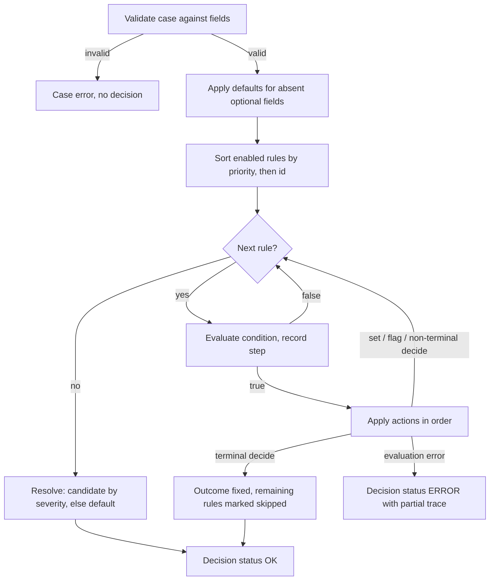

# PolicyPilot Rules DSL Specification

2026-09-22 · Lior Shaya

Document 3 of the PolicyPilot set. It defines the JSON format in which rules are written, validated, executed and diffed, following the scope in the [Project Brief](01-project-brief.md) and the engine semantics in the [Architecture](02-architecture.md). Document 4 (AI Pipeline and Prompt Specification) describes how the model produces documents in this format.

## Purpose and Design Principles

The Rules DSL is a JSON document that a model can produce, a validator can check completely, a 400-line engine can execute deterministically, and a business user can read as a decision table; every design choice below serves one of those four readers.

| Principle | What it means in practice |
| --- | --- |
| Declarative and finite | A rule set is data, not code: no loops, no user-defined functions, no external calls, no clock. Every rule set terminates in at most one pass over its rules. |
| Statically checkable | Every field a rule touches is declared with a type; every reference, enum value, operator and expression is checked before publishing, so an invalid rule set never reaches the engine. |
| JSON-native | The format is exactly what provider-native structured output produces and what a JSON Schema validates; there is no second textual syntax to parse or to teach the model. |
| Provenance is mandatory | A rule without a link to the policy passage it came from is invalid. The model may only cite; a human may add a rule with a note. |
| One evaluation order | Rules run in priority order, the first terminal decision wins, and the trace records every step, so two people reading the same rule set predict the same outcome. |
| Human-readable | Identifiers are words, labels are sentences, reasons are written for the applicant's letter, and the decision table is a lossless view of the JSON. |
| Versioned by value | A rule set version is the whole document. Rule ids are stable across versions and never reused, so diffs, patches and audit entries can name a rule unambiguously. |

The DSL version is `1.0`; the version string is part of every document so the validator and the engine can refuse documents they do not understand.

## Document Structure

A rule set document has seven top-level keys; `fields`, `defaults` and `rules` carry the logic, the rest is identity.

| Key | Type | Required | Meaning |
| --- | --- | --- | --- |
| `dslVersion` | `"1.0"` | yes | Format version; the validator refuses any other value |
| `id` | kebab-case string | yes | Stable identifier of the logical rule set (`consumer-lending`); shared by all its versions |
| `name` | string | yes | Display name |
| `language` | `"he"` or `"en"` | yes | Language of labels, reasons and quotes; drives text direction in the UI |
| `description` | string | no | One paragraph for humans |
| `fields` | array of Field | yes | The case schema: every field a rule may read or set |
| `defaults` | object | yes | The outcome and reason when no rule decides |
| `rules` | array of Rule | yes | The rules, in any order; evaluation order comes from `priority` |

A minimal but complete document:

```json
{
  "dslVersion": "1.0",
  "id": "minimal-example",
  "name": "Minimal example",
  "language": "en",
  "fields": [
    { "name": "age", "type": "integer", "unit": "years", "required": true },
    { "name": "monthly_income", "type": "number", "unit": "ILS", "required": true }
  ],
  "defaults": { "outcome": "refer", "reason": "No rule decided the case" },
  "rules": [
    {
      "id": "R-100",
      "label": "Reject applicants under 21",
      "priority": 100,
      "condition": { "field": "age", "op": "lt", "value": 21 },
      "actions": [ { "type": "decide", "outcome": "reject", "terminal": true, "reason": "Applicant is under the minimum age of 21" } ],
      "provenance": { "kind": "quoted", "paragraph": 1, "quote": "applicants must be at least 21 years old", "confidence": 0.97 }
    },
    {
      "id": "R-900",
      "label": "Approve when all conditions are met",
      "priority": 900,
      "condition": { "always": true },
      "actions": [ { "type": "decide", "outcome": "approve", "terminal": true, "reason": "All policy conditions are met" } ],
      "provenance": { "kind": "quoted", "paragraph": 4, "quote": "an application that meets all conditions is approved", "confidence": 0.95 }
    }
  ]
}
```

Reading the example: an applicant aged 19 is rejected by `R-100` and `R-900` is never evaluated; an applicant aged 40 passes `R-100` (recorded as not fired) and is approved by `R-900`. Both outcomes carry the rule id, the reason and the quoted policy text in their trace.

Unknown keys are rejected everywhere (`additionalProperties: false` throughout the schema), which is what turns a model's invented attribute into a validation error rather than silently ignored data.

## Field Schema

The `fields` array declares every name a rule may read or set; a case is valid only if it supplies every required field with the right type, and a rule is valid only if every name it uses is declared here.

| Attribute | Type | Required | Meaning |
| --- | --- | --- | --- |
| `name` | identifier (`^[a-z][a-z0-9_]{0,63}$`) | yes | Snake case, English, unique within the rule set |
| `type` | `number`, `integer`, `boolean`, `string`, `enum`, `date` | yes | See Types and Values |
| `unit` | string | no | Display and documentation only (`ILS`, `years`, `months`, `percent`); the engine does no unit conversion |
| `values` | array of strings | required when `type` is `enum` | The closed set of allowed values, in snake case |
| `required` | boolean, default `false` | no | A case missing a required field is rejected before evaluation |
| `derived` | boolean, default `false` | no | The field is computed by `set` actions and must not be supplied by the case; a derived field cannot be required |
| `default` | literal | no | Used when an optional, non-derived field is absent from the case |
| `minimum`, `maximum`, `exclusiveMinimum`, `exclusiveMaximum` | number | no | The domain of a `number` or `integer` field; a case value outside it is rejected before evaluation (`CASE_OUT_OF_RANGE`). This is data validity, not policy: `term_months` with `minimum: 1` says a zero term is not a case at all, while an income below the policy minimum is a valid case that a rule rejects |
| `description` | string | no | One sentence for the analyst and for the model; also where an input definition lives ("for the self-employed, the 12-month average") |
| `source` | quoted provenance | no | The paragraph that implies the field, when the authoring step inferred it from the policy |

**Who writes the schema**: the authoring prompt returns `fields` together with `rules`, inferred from the policy, and the analyst confirms or edits them before publishing (decision recorded in the Architecture document). The model must not invent fields the policy never implies; a field with no `source` and no use in any rule is flagged by the validator as `FIELD_UNUSED`.

**Case fields versus derived fields**: case fields are inputs the caller supplies (`age`, `monthly_income`); derived fields are outputs of `set` actions (`monthly_installment`, `debt_to_income`, `risk_band`) that later rules may read. A case that supplies a value for a derived field is rejected (`CASE_DERIVED_SUPPLIED`), so a caller cannot bypass a derivation.

Example of a field block for the lending policy:

```json
"fields": [
  { "name": "age", "type": "integer", "unit": "years", "required": true, "minimum": 0, "maximum": 120,
    "description": "Applicant age at the time of application", "source": { "kind": "quoted", "paragraph": 1, "quote": "גילו 21 עד 70 בעת הגשת הבקשה" } },
  { "name": "employment_type", "type": "enum", "values": ["salaried", "self_employed", "retired", "unemployed"], "required": true },
  { "name": "employment_months", "type": "integer", "unit": "months", "required": false, "minimum": 0,
    "description": "Months at the current employer, or months of self-employment" },
  { "name": "monthly_income", "type": "number", "unit": "ILS", "required": true, "minimum": 0,
    "description": "Net monthly income; for the self-employed, the average of the last 12 months" },
  { "name": "term_months", "type": "integer", "unit": "months", "required": true, "minimum": 1 },
  { "name": "has_guarantor", "type": "boolean", "required": false, "default": false },
  { "name": "monthly_installment", "type": "number", "unit": "ILS", "derived": true },
  { "name": "debt_to_income", "type": "number", "derived": true, "description": "Existing debt plus the new installment, divided by income" }
]
```

Reading the domains: `minimum: 0` on `monthly_income` admits an income of zero (an unemployed applicant is a real case, and the policy rejects it), while `minimum: 1` on `term_months` makes a zero term a data error; the authoring prompt infers domains from the text ("months", "amounts") and the analyst confirms them with the rest of the schema.

## Types, Values and Arithmetic

Six types, exact decimal arithmetic, no clock: the engine's numeric results are identical on every JVM and every run, which is what makes the byte-identical trace test in the brief possible.

| Type | JSON representation | Java representation | Comparisons allowed |
| --- | --- | --- | --- |
| `number` | JSON number, up to 12 decimal places | `BigDecimal` | `eq ne lt lte gt gte between in not_in present absent` |
| `integer` | JSON number without a fraction | `BigDecimal` with scale 0 (checked) | same as number |
| `boolean` | `true` / `false` | `Boolean` | `eq ne present absent` |
| `string` | JSON string, at most 2,000 characters | `String` | `eq ne in not_in matches present absent` |
| `enum` | JSON string that is one of the field's `values` | `String`, validated against the closed set | `eq ne in not_in present absent` |
| `date` | ISO-8601 calendar date, `"2026-09-16"` | `LocalDate` | `eq ne lt lte gt gte between present absent` |

**Decimal semantics**: all numeric literals and case values are parsed as `BigDecimal`; addition, subtraction and multiplication are exact; division uses 12 decimal places with `HALF_EVEN` rounding; comparisons are numeric (`1.0` equals `1`); `round` takes the number of places as its second argument and also uses `HALF_EVEN`. Money therefore never passes through binary floating point.

**Dates**: the engine has no notion of today. Any rule that needs a reference date reads it from a case field (for example `application_date`), so the same case always yields the same decision no matter when it is evaluated; the authoring prompt is told this and the validator rejects any use of the words `today` or `now` as identifiers.

**Expressions** appear in `set` actions and as the right-hand side of numeric comparisons. An expression is a number, a field reference, or a function node:

```json
{ "fn": "div", "args": [
  { "fn": "add", "args": [ { "field": "existing_monthly_debt" }, { "field": "monthly_installment" } ] },
  { "field": "monthly_income" }
] }
```

| Function | Arity | Result | Notes |
| --- | --- | --- | --- |
| `add`, `mul`, `min`, `max` | 2-8 | number | Left to right |
| `sub`, `div`, `pow` | 2 | number | `div` by zero and non-finite `pow` results raise an evaluation error (never silently zero); the exponent of pow must be a whole number, a negative one is a division at 12 places, and a fractional exponent or zero raised to zero or a negative power is EVAL\_NON\_FINITE |
| `abs` | 1 | number |  |
| `round` | 2 | number | `round(x, places)`, `HALF_EVEN` |
| `months_between` | 2 | integer | Whole months from the first date to the second; both arguments must be `date` fields |

A field reference inside an expression must name a `number`, `integer` or `date` field (dates only inside `months_between`); referencing a string, boolean or enum field in arithmetic is a validation error (`EXPR_TYPE_MISMATCH`). The maximum nesting depth is 8, which is enough for an annuity formula and shallow enough to read in a decision table cell; depth counts the function nodes on the longest path from the top of the expression, and a deeper expression is a validation error (EXPR\_DEPTH).

## Conditions

A condition is a tree whose leaves are comparisons on one field each and whose inner nodes are `all`, `any` and `not`; the tree is finite, side-effect free, and every leaf is checkable against the field schema.

**Comparison leaf**: `{ "field": <name>, "op": <operator>, "value": <operand> }` where the operand is a literal, a list of literals, a field reference `{ "field": "other" }`, or an expression (numeric fields only).

| Operator | Operand | Meaning |
| --- | --- | --- |
| `eq`, `ne` | literal or field reference | Equality by type: numeric for numbers, exact for strings and enums, calendar for dates |
| `lt`, `lte`, `gt`, `gte` | literal, field reference or expression | Numeric or date ordering |
| `between` | `[low, high]` | Inclusive on both ends; `low` must not exceed `high` (`BETWEEN_RANGE_INVALID`) |
| `in`, `not_in` | list of literals | Membership; for enum fields every listed value must be declared (`ENUM_VALUE_UNKNOWN`) |
| `matches` | string (Java regular expression) | String fields only; the whole value must match (Java `matches` semantics, so anchors are implicit); the pattern is compiled at validation time on a linear-time engine (RE2J, so no backreferences or lookaround and no catastrophic backtracking), is at most 200 characters (`REGEX_INVALID` otherwise), and the input is capped at 2,000 characters |
| `present`, `absent` | none | Whether the case supplied the field; the only operators that are true or false regardless of type |

**Combinators**: `{ "all": [c1, c2, ...] }` is true when every child is true; `{ "any": [...] }` when at least one is; `{ "not": c }` negates; `{ "always": true }` is the constant condition used by derivations and by the final approval rule. `all` and `any` require at least one child, so a vacuously true combinator cannot be written by accident.

**Missing values**: a comparison on an optional case field the case did not supply (and that has no default) evaluates to false, except `absent`, which evaluates to true; the trace step records the comparison with `actual: null` and `result: false`. This is a deliberate three-valued shortcut for case fields only: `not` of a missing comparison is therefore true, and the validator warns (`MISSING_FIELD_UNDER_NOT`) when an optional field appears under `not` without a `present` guard. A **derived** field that no rule has set is a different situation: it means a derivation was guarded or skipped, and reading it is an evaluation error (`EVAL_DERIVED_ABSENT`), never a silent false, so a failed guard can never turn into an accidental approval.

Examples from the lending policy:

```json
{ "field": "age", "op": "between", "value": [21, 70] }

{ "all": [
  { "field": "employment_type", "op": "eq", "value": "salaried" },
  { "field": "employment_months", "op": "lt", "value": 6 }
] }

{ "all": [
  { "field": "credit_events_24m", "op": "eq", "value": 1 },
  { "field": "has_guarantor", "op": "eq", "value": false }
] }

{ "all": [
  { "field": "employment_type", "op": "eq", "value": "retired" },
  { "field": "age", "op": "gt", "value": 70 },
  { "field": "age", "op": "gt", "value": { "fn": "sub", "args": [ 78, { "fn": "div", "args": [ { "field": "term_months" }, 12 ] } ] } }
] }
```

Reading the last example: the retiree's age plus the loan term in years must not pass 78, written as `age > 78 - term_months / 12`, which is the form a decision table cell can display.

What conditions cannot do, on purpose: reference another rule's outcome, read the trace, call a function outside the expression table, or compare two arbitrary expressions (the left side is always a field, which keeps every leaf attributable to one column of the decision table).

## Actions and Rules

A rule is one condition plus one to five actions of three kinds; `decide` is the only action that can end an evaluation, `set` is the only one that can write a field, and `flag` can do neither.

**Actions**

| Action | Shape | Effect |
| --- | --- | --- |
| `decide` | `{ "type": "decide", "outcome": "approve" / "reject" / "refer", "terminal": true, "reason": "..." }` | Records a decision. With `terminal: true` (the default) evaluation stops and this is the outcome; with `terminal: false` it is a candidate resolved at the end (see Evaluation Semantics). `reason` is written for the applicant's letter. |
| `set` | `{ "type": "set", "field": "debt_to_income", "value": <expression or literal> }` | Writes a derived field. The target must be declared `derived`; writing a case field is `DERIVED_WRITE_ONLY`. A later `set` of the same field overwrites, and the trace records both. |
| `flag` | `{ "type": "flag", "code": "HIGH_DTI", "message": "..." }` | Attaches a note to the decision without affecting the outcome; used for advisory conditions ("income close to the minimum") that a human reviewer should see. |

**Rule attributes**

| Attribute | Type | Required | Meaning |
| --- | --- | --- | --- |
| `id` | `R-` plus 2-4 digits | yes | Stable identity across versions; never reused after removal |
| `label` | string, 3-160 characters | yes | One sentence in the policy's language, shown as the row title |
| `priority` | integer 1-9999 | yes | Evaluation order, lower first; ties broken by `id` |
| `enabled` | boolean, default `true` | no | A disabled rule stays in the document, is skipped by the engine and shown greyed out |
| `condition` | condition tree | yes |  |
| `actions` | 1-5 actions | yes | Applied in order when the condition is true |
| `provenance` | quoted or analyst | yes | See Provenance |
| `tags` | up to 10 strings | no | Free grouping (`eligibility`, `affordability`, `credit_history`) used by the UI filter and the change-impact search |

**Recommended priority bands**: the bands are a convention the authoring prompt is given and the decision table displays as groups; the validator only warns (`PRIORITY_BAND_UNUSUAL`) when a rule's action does not match its band. Precedence between outcomes is the priority order itself: because every terminal `reject` sits in a lower band than every terminal `refer`, a case that meets both a rejection and a referral condition is rejected, which is the default reading of a policy that lists both. A referral that must take precedence over rejections ("VIP customers are always reviewed by a person first") is placed before them and tagged `precedence_intended`, which silences the `REFER_PRECEDES_REJECT` warning.

| Band | Purpose | Typical action |
| --- | --- | --- |
| 1-99 | Derivations | `set`, guarded when the expression can fail |
| 100-199 | Hard eligibility gates | terminal `reject` |
| 200-299 | Affordability and risk limits | terminal `reject` only |
| 300-399 | Referral conditions | terminal `refer` |
| 400-499 | Advisory | `flag`, non-terminal `decide` |
| 900-999 | Positive outcome | terminal `approve`, usually `always` |

A complete rule:

```json
{
  "id": "R-330",
  "label": "בדיקת חתם: אירוע אשראי אחד ללא ערב",
  "priority": 330,
  "condition": { "all": [
    { "field": "credit_events_24m", "op": "eq", "value": 1 },
    { "field": "has_guarantor", "op": "eq", "value": false }
  ] },
  "actions": [
    { "type": "decide", "outcome": "refer", "terminal": true, "reason": "נדרש ערב בשל אירוע אשראי אחד ב-24 החודשים האחרונים" }
  ],
  "provenance": { "kind": "quoted", "paragraph": 7, "quote": "מבקש עם אירוע אחד יידרש להעמיד ערב", "confidence": 0.88 },
  "tags": ["credit_history"]
}
```

Reading the example: the policy says an applicant with one credit event "will be required to provide a guarantor" but not what happens if none is provided; the model chose `refer` and a confidence of 0.88, and the reviewer pass raises an `ambiguity` finding on exactly this rule so the analyst decides between `refer` and `reject` before publishing. The rule sits at 330, in the referral band, so an applicant who also has two or more credit events is caught by the rejection at 220 first.

## Provenance

Every rule carries a provenance object of one of three kinds; the model may only cite the policy or mark a change as pending, and only the system, on a human's approval, can create the analyst kind. This is the mechanism that stops a model from inventing policy or claiming who approved it.

| Kind | Shape | Who may produce it | Validation |
| --- | --- | --- | --- |
| `quoted` | `{ "kind": "quoted", "paragraph": 7, "quote": "...", "confidence": 0.88 }` | The model (authoring and change prompts), or an analyst who links a rule to a passage | `paragraph` must exist in the policy version the rule set was generated from (`PROVENANCE_PARAGRAPH_MISSING`); `quote` must occur in that paragraph after whitespace and punctuation normalization (`PROVENANCE_QUOTE_MISMATCH`, an error); `confidence` is the model's own estimate in `[0, 1]` and is shown, never used for logic |
| `pending` | `{ "kind": "pending", "changeRequestId": "cr-0042", "rationale": "Threshold raised per request; paragraph 4 still states 8,000" }` | The model, only inside a change proposal, on a rule it added or replaced when the policy text no longer supports it | Accepted only in the `CHANGE_PROPOSAL` context; a draft from the authoring prompt that contains it is rejected (`PROVENANCE_PENDING_FROM_MODEL`), and a version cannot be published while any rule still carries it (`PROVENANCE_PENDING_AT_PUBLISH`) |
| `analyst` | `{ "kind": "analyst", "note": "Change request cr-0042: raise the minimum income to 9,000", "actor": "demo-analyst", "changeRequestId": "cr-0042" }` | The system, when a person approves a change proposal (every `pending` is rewritten to `analyst` with `actor` = the approver) or when a person adds or edits a rule in the UI | A rule the model authored or patched may never carry it (`PROVENANCE_ANALYST_FROM_MODEL`); rules carried over unchanged in a change proposal keep whatever provenance they had; `note` is mandatory and is copied into the audit entry on publish |

**Validation contexts**: the provenance rules depend on who produced the document. `AUTHORING`: every rule is the model's, so `analyst` and `pending` are both rejected. `CHANGE_PROPOSAL`: only the rules named in the patches are the model's; they may carry `quoted` or `pending`, never `analyst`; the other rules are untouched copies. `PUBLISH`: no `pending` may remain. `ANALYST_EDIT`: a person may create `analyst` provenance through the UI, which fills `actor` from the session. On approval of a change request, the system rewrites each `pending` into `analyst` with the approver as `actor`, the request text plus the model's rationale as `note`, and the `changeRequestId` kept, so the audit trail records who approved what and why without ever trusting the model on either.

**Quote normalization**: both the quote and the paragraph are decomposed to Unicode NFKD, lower-cased without regard to the locale, stripped of Hebrew niqqud and every other combining mark, of every punctuation character (Unicode categories P\*, Hebrew and Latin alike: quotation marks, geresh, gershayim, maqaf) and of every format character (category Cf: bidi overrides and isolates, zero-width characters), and whitespace runs collapse to one space; a quote that is still at least three characters long after this and then occurs as a substring passes. The rule is strict on purpose: a paraphrase is not a citation, and the repair loop (Document 4) sends the mismatch back to the model with the actual paragraph text.

**When the analyst edits a quoted rule**: the UI re-validates the quote; if the edited condition still matches the quoted passage the provenance stays `quoted`, otherwise the UI requires a note and switches it to `analyst`. Fields keep an optional `source` of kind `quoted` only.

**Why confidence is displayed but never used**: a rule with confidence 0.6 is still a rule; the number helps the reviewer prioritize what to read, and the evaluation set (Document 4) measures whether low confidence actually predicts errors. Using it in evaluation would make decisions depend on a model's mood.

## Evaluation Semantics

Evaluation is one pass over the rules in priority order, stopping at the first terminal decision; the eight steps below are the complete algorithm, and the conformance suite tests each one.



1. **Case validation**: every `required` field is present; every supplied value matches its type (integers have no fraction, enums are in `values`, dates parse); every numeric value is inside the field's declared domain (`minimum`, `maximum` and their exclusive forms), and every string is at most 2,000 characters; no derived field is supplied. Failure is a case error (`CASE_INVALID` with the list of problems: `CASE_REQUIRED_MISSING`, `CASE_TYPE_MISMATCH`, `CASE_OUT_OF_RANGE`, `CASE_DERIVED_SUPPLIED`), not a decision, and nothing is stored as a decision.
2. **Defaults**: an absent optional field with a `default` takes it; an absent optional field without one stays absent (see Missing values in Conditions).
3. **Ordering**: enabled rules sorted by `priority` ascending, then `id` ascending; disabled rules appear in the trace with status `disabled` and are not evaluated.
4. **Condition evaluation**: the tree is evaluated fully (no short-circuit), so the trace shows every comparison the rule made; the cost is negligible and the explanation is complete.
5. **Actions**: applied in the order written. `set` writes the derived field and records old and new values; `flag` appends to the decision's flags; `decide` with `terminal: true` fixes the outcome and stops; `decide` with `terminal: false` records a candidate and continues.
6. **Outcome resolution** when no terminal decision fired: the highest-severity candidate wins (`reject` over `refer` over `approve`); with no candidates, the rule set's `defaults.outcome` and `defaults.reason` apply and `decidingRuleId` is `null`.
7. **Evaluation errors**: division by zero, a non-finite `pow`, a `months_between` on an absent date, an arithmetic expression that reads an absent optional field, or reading a derived field that no rule has set, stop evaluation with `status: ERROR`, an `errorCode` (`EVAL_DIV_ZERO`, `EVAL_NON_FINITE`, `EVAL_ABSENT_DATE`, `EVAL_ABSENT_FIELD`, `EVAL_DERIVED_ABSENT`), the id of the failing rule and the partial trace; the decision is stored so the failure is auditable, and the UI shows it as an error, never as an outcome.
8. **Determinism**: no clock, no randomness, exact decimals, total ordering; the same case against the same version yields the same trace JSON byte for byte, which the test suite asserts.

**Outcome semantics**: `reject` and `refer` are final for the automated process. `approve` means that every condition of the policy the rule set can evaluate is met, and the decision's `flags` list the criteria the policy leaves to a person; for the lending policy every approval carries `STABLE_INCOME_MANUAL_CHECK`, because paragraph 4 requires a stable income without defining one. An approval is therefore a system approval, and the letter or the officer's screen shows its flags next to it. When a case meets both a rejection and a referral condition, the priority order decides, and by default rejections come first (see the priority bands).

**Simulation**: a what-if evaluation runs the same published version on a stored decision's input with some fields overridden; it returns a full decision object marked `simulation: true` with `basedOnDecisionId`, it is never stored as a decision, and it is the only way the chat may answer a counterfactual question ("would it be approved with a guarantor?"): the model asks the engine, it does not reason from rule definitions.

**Decision object**

```json
{
  "status": "OK",
  "outcome": "refer",
  "reason": "נדרש ערב בשל אירוע אשראי אחד ב-24 החודשים האחרונים",
  "decidingRuleId": "R-330",
  "terminal": true,
  "derived": { "monthly_installment": 1493.10, "debt_to_income": 0.2835 },
  "flags": [],
  "candidates": [],
  "trace": [ "...TraceStep objects, one per rule, in evaluation order..." ],
  "rulesetVersion": { "id": "consumer-lending", "versionNo": 1 },
  "durationMicros": 412
}
```

**TraceStep object**

| Field | Meaning |
| --- | --- |
| `ruleId`, `label`, `priority` | Identity of the rule |
| `status` | `fired`, `not_fired`, `skipped` (after a terminal decision), `disabled`, `error` |
| `comparisons` | One entry per leaf: `{ "field", "op", "expected", "actual", "result" }`, in tree order; `expected` is the evaluated operand (an expression is shown as its value and its text) |
| `actions` | For fired rules: `{ "type", "field"?, "from"?, "to"?, "outcome"?, "code"? }` per action applied |
| `error` | For status `error`: `{ "code", "detail" }`, and the decision's `errorRuleId` names the same rule |
| `provenance` | Copied from the rule, so the trace is self-contained for the explain prompt and the audit export |

The trace is the only input of the `explain` prompt and the only source of the UI's trace view; nothing about a decision is ever reconstructed from the rule set after the fact.

## Static Validation

Validation runs in three layers, schema then semantic then structural, and stops after the first layer that reports an error, so the model's repair prompt always gets the most basic problems first. Two schema violations are reported under their own codes instead of DSL\_SCHEMA, DSL\_VERSION\_UNSUPPORTED and DERIVED\_REQUIRED, so that the repair prompt gets a named problem; the reference implementation's invalid fixtures (fixtures/conformance/invalid-CODE.json, one per code) assert both the code and the layer stop.

| Layer | Code | Severity | Condition |
| --- | --- | --- | --- |
| Schema | `DSL_SCHEMA` | error | The document violates the JSON Schema; the message carries the JSON path and the schema keyword |
| Schema | `DSL_VERSION_UNSUPPORTED` | error | `dslVersion` is not `1.0` |
| Semantic | `FIELD_DUPLICATE` | error | Two fields share a name |
| Semantic | `FIELD_UNKNOWN` | error | A condition, expression or `set` names a field that is not declared |
| Semantic | `FIELD_TYPE_MISMATCH` | error | Operator or operand type does not fit the field type (`gt` on a boolean, a string literal against a number, `matches` on an enum) |
| Semantic | `FIELD_DOMAIN_INVALID` | error | `minimum` greater than `maximum`, or a domain on a non-numeric field |
| Semantic | `ENUM_VALUE_UNKNOWN` | error | An `eq`, `in` or `not_in` operand is not among the enum's `values` |
| Semantic | `EXPR_TYPE_MISMATCH` | error | An expression references a non-numeric field, or `months_between` a non-date field |
| Semantic | `EXPR_ARITY` | error | Wrong number of arguments for a function |
| Semantic | `EXPR_DEPTH` | error | An expression nests more than 8 function nodes deep |
| Semantic | `BETWEEN_RANGE_INVALID` | error | `low` greater than `high` |
| Semantic | `REGEX_INVALID` | error | A `matches` pattern does not compile on the linear-time engine (RE2J), uses syntax it does not support (backreferences, lookaround), or exceeds 200 characters |
| Semantic | `RESERVED_IDENTIFIER` | error | A field named `today`, `now`, `null`, `true` or `false` |
| Semantic | `RULE_ID_DUPLICATE` | error | Two rules share an `id` |
| Semantic | `DERIVED_WRITE_ONLY` | error | A `set` targets a field that is not `derived` |
| Schema | `DERIVED_REQUIRED` | error | A derived field is marked `required` or has a `default`; the schema encodes this constraint, and the violation is reported under this code rather than `DSL_SCHEMA` |
| Semantic | `PROVENANCE_PARAGRAPH_MISSING` | error | The paragraph index does not exist in the source policy version |
| Semantic | `PROVENANCE_QUOTE_MISMATCH` | error | The normalized quote is not a substring of the normalized paragraph |
| Semantic | `PROVENANCE_ANALYST_FROM_MODEL` | error | A rule the model authored or patched carries `analyst` provenance (rules carried over unchanged in a change proposal keep theirs) |
| Semantic | `PROVENANCE_PENDING_FROM_MODEL` | error | A draft from the authoring prompt carries `pending` provenance; only change proposals may |
| Semantic | `PROVENANCE_PENDING_AT_PUBLISH` | error | A version submitted for publishing still carries `pending` provenance |
| Structural | `DERIVED_CYCLE` | error | The dependency graph of `set` rules has a cycle |
| Structural | `DERIVED_ORDER` | error | A rule reads a derived field whose `set` rule has an equal or higher priority (runs later or ties) |
| Structural | `DERIVED_NEVER_SET` | warning | A derived field no rule sets |
| Structural | `FIELD_UNUSED` | warning | A declared field no rule reads or sets |
| Structural | `RULE_UNREACHABLE` | warning | A terminal rule whose condition is subsumed by an earlier terminal rule on the same fields (checked for single-field and `all`-of-single-field conditions with numeric and enum operands) |
| Structural | `RULE_OVERLAP_CONFLICT` | warning | Two rules with different `decide` outcomes whose numeric ranges on the same field overlap and neither is terminal-first in a way that resolves it |
| Structural | `REFER_PRECEDES_REJECT` | warning | A terminal `refer` has a lower priority than a terminal `reject`, so a case meeting both conditions is referred instead of rejected; silenced by the tag `precedence_intended` |
| Structural | `CANDIDATE_NEVER_WINS` | warning | A non-terminal `decide` is followed by a terminal `decide` with an `always` condition, so the candidate can never become the outcome |
| Structural | `DIVISION_BY_UNGUARDED_FIELD` | warning | A `div` whose divisor is a field that may be zero under its declared domain, in a rule whose condition does not exclude zero; the suggestion is a guard (`monthly_income gt 0`) or a domain (`exclusiveMinimum: 0`) |
| Structural | `MISSING_FIELD_UNDER_NOT` | warning | An optional field without a default appears under `not` with no `present` guard |
| Structural | `PRIORITY_BAND_UNUSUAL` | info | A rule's action does not match the recommended band |
| Structural | `NO_TERMINAL_APPROVE` | info | No rule can produce `approve`; every case ends in reject, refer or the default |

**Error reporting shape**: every finding is `{ "code", "severity", "path", "message", "ruleIds": [], "fieldNames": [] }`; `path` is a JSON pointer into the document (`/rules/3/condition/all/1/value`), which is what the decision table uses to highlight the cell and what the repair prompt quotes back to the model. The pointer is as specific as the check can make it: the node that is wrong, not the rule that holds it; when a node may take several shapes (a condition, an action, a provenance), the schema layer reports the errors of the shape the document most nearly matches.

**Publishing gate**: errors block publishing; warnings and infos are shown and can be acknowledged; an acknowledged warning is listed in the audit entry of the publish. The reviewer pass (Document 4) adds semantic findings of kinds `ambiguity`, `conflict`, `unsupported`, `gap`, `duplicate` and `injection`, anchored to rule ids and paragraph numbers (Document 4, Findings contract) and shown beside the validator's findings, so the UI treats both sources alike. Acknowledging a `gap` finding requires a resolution, not just a tick: `rule_added` (a rule now covers the passage), `flag_added` (a manual-check flag surfaces it on every decision it applies to), or `interpretation` (a note explaining why an existing rule already covers it); the choice and the note are part of the audit entry, so the meaning of every approval can be traced back to a recorded decision. Which review findings block a publish is decided in the Architecture, Flow 1.

**Structural checks are deliberately conservative**: `RULE_UNREACHABLE` and `RULE_OVERLAP_CONFLICT` only fire where the answer is certain (single-field numeric or enum conditions); general condition subsumption is undecidable in practice and belongs to the model's reviewer pass, which can say "these two rules seem to contradict each other" without being certain.

## JSON Schema

The schema below is the single source of truth for the format: the validator loads it, the structured-output call sends it to the provider, and the TypeScript types in the web app are generated from it. It has been checked as a valid draft 2020-12 schema, accepts the worked example in the next section, and rejects the thirteen malformed variants listed in the conformance suite.

```json
{
  "$schema": "https://json-schema.org/draft/2020-12/schema",
  "$id": "https://policypilot.dev/schemas/ruleset-1.0.json",
  "title": "PolicyPilot RuleSet",
  "type": "object",
  "additionalProperties": false,
  "required": ["dslVersion", "id", "name", "language", "fields", "defaults", "rules"],
  "properties": {
    "dslVersion": {"const": "1.0"},
    "id": {"type": "string", "pattern": "^[a-z0-9]+(-[a-z0-9]+)*$", "maxLength": 64},
    "name": {"type": "string", "minLength": 1, "maxLength": 120},
    "language": {"enum": ["he", "en"]},
    "description": {"type": "string", "maxLength": 2000},
    "fields": {"type": "array", "minItems": 1, "maxItems": 100, "items": {"$ref": "#/$defs/field"}},
    "defaults": {"$ref": "#/$defs/defaults"},
    "rules": {"type": "array", "minItems": 1, "maxItems": 500, "items": {"$ref": "#/$defs/rule"}}
  },
  "$defs": {
    "identifier": {"type": "string", "pattern": "^[a-z][a-z0-9_]{0,63}$"},
    "literal": {"type": ["number", "string", "boolean"]},
    "fieldRef": {
      "type": "object",
      "additionalProperties": false,
      "required": ["field"],
      "properties": {"field": {"$ref": "#/$defs/identifier"}}
    },
    "expression": {
      "anyOf": [
        {"type": "number"},
        {"$ref": "#/$defs/fieldRef"},
        {
          "type": "object",
          "additionalProperties": false,
          "required": ["fn", "args"],
          "properties": {
            "fn": {"enum": ["add", "sub", "mul", "div", "min", "max", "abs", "round", "pow", "months_between"]},
            "args": {"type": "array", "minItems": 1, "maxItems": 8, "items": {"$ref": "#/$defs/expression"}}
          }
        }
      ]
    },
    "quotedProvenance": {
      "type": "object",
      "additionalProperties": false,
      "required": ["kind", "paragraph", "quote"],
      "properties": {
        "kind": {"const": "quoted"},
        "paragraph": {"type": "integer", "minimum": 1},
        "quote": {"type": "string", "minLength": 3, "maxLength": 500},
        "confidence": {"type": "number", "minimum": 0, "maximum": 1}
      }
    },
    "analystProvenance": {
      "type": "object",
      "additionalProperties": false,
      "required": ["kind", "note", "actor"],
      "properties": {
        "kind": {"const": "analyst"},
        "note": {"type": "string", "minLength": 3, "maxLength": 500},
        "actor": {"type": "string", "minLength": 1, "maxLength": 80},
        "changeRequestId": {"type": "string", "minLength": 1, "maxLength": 64}
      }
    },
    "pendingProvenance": {
      "type": "object",
      "additionalProperties": false,
      "required": ["kind", "changeRequestId", "rationale"],
      "properties": {
        "kind": {"const": "pending"},
        "changeRequestId": {"type": "string", "minLength": 1, "maxLength": 64},
        "rationale": {"type": "string", "minLength": 3, "maxLength": 500}
      }
    },
    "provenance": {
      "oneOf": [
        {"$ref": "#/$defs/quotedProvenance"},
        {"$ref": "#/$defs/analystProvenance"},
        {"$ref": "#/$defs/pendingProvenance"}
      ]
    },
    "field": {
      "type": "object",
      "additionalProperties": false,
      "required": ["name", "type"],
      "properties": {
        "name": {"$ref": "#/$defs/identifier"},
        "type": {"enum": ["number", "integer", "boolean", "string", "enum", "date"]},
        "unit": {"type": "string", "maxLength": 20},
        "values": {
          "type": "array",
          "minItems": 1,
          "maxItems": 50,
          "uniqueItems": true,
          "items": {"$ref": "#/$defs/identifier"}
        },
        "required": {"type": "boolean", "default": false},
        "derived": {"type": "boolean", "default": false},
        "default": {"$ref": "#/$defs/literal"},
        "minimum": {"type": "number"},
        "maximum": {"type": "number"},
        "exclusiveMinimum": {"type": "number"},
        "exclusiveMaximum": {"type": "number"},
        "description": {"type": "string", "maxLength": 300},
        "source": {"$ref": "#/$defs/quotedProvenance"}
      },
      "allOf": [
        {
          "if": {"properties": {"type": {"const": "enum"}}},
          "then": {"required": ["values"]},
          "else": {"not": {"required": ["values"]}}
        },
        {
          "if": {"properties": {"derived": {"const": true}}, "required": ["derived"]},
          "then": {"properties": {"required": {"const": false}}, "not": {"required": ["default"]}}
        }
      ]
    },
    "comparison": {
      "type": "object",
      "additionalProperties": false,
      "required": ["field", "op"],
      "properties": {
        "field": {"$ref": "#/$defs/identifier"},
        "op": {
          "enum": ["eq", "ne", "lt", "lte", "gt", "gte", "in", "not_in", "between", "matches", "present", "absent"]
        },
        "value": {
          "anyOf": [
            {"$ref": "#/$defs/literal"},
            {"type": "array", "minItems": 1, "maxItems": 50, "items": {"$ref": "#/$defs/literal"}},
            {"$ref": "#/$defs/expression"}
          ]
        }
      },
      "allOf": [
        {
          "if": {"properties": {"op": {"enum": ["present", "absent"]}}},
          "then": {"not": {"required": ["value"]}},
          "else": {"required": ["value"]}
        },
        {
          "if": {"properties": {"op": {"enum": ["in", "not_in", "between"]}}},
          "then": {"properties": {"value": {"type": "array"}}}
        },
        {
          "if": {"properties": {"op": {"const": "between"}}},
          "then": {"properties": {"value": {"type": "array", "minItems": 2, "maxItems": 2}}}
        },
        {
          "if": {"properties": {"op": {"const": "matches"}}},
          "then": {"properties": {"value": {"type": "string", "maxLength": 200}}}
        }
      ]
    },
    "condition": {
      "oneOf": [
        {"$ref": "#/$defs/comparison"},
        {
          "type": "object",
          "additionalProperties": false,
          "required": ["all"],
          "properties": {"all": {"type": "array", "minItems": 1, "maxItems": 20, "items": {"$ref": "#/$defs/condition"}}}
        },
        {
          "type": "object",
          "additionalProperties": false,
          "required": ["any"],
          "properties": {"any": {"type": "array", "minItems": 1, "maxItems": 20, "items": {"$ref": "#/$defs/condition"}}}
        },
        {
          "type": "object",
          "additionalProperties": false,
          "required": ["not"],
          "properties": {"not": {"$ref": "#/$defs/condition"}}
        },
        {
          "type": "object",
          "additionalProperties": false,
          "required": ["always"],
          "properties": {"always": {"const": true}}
        }
      ]
    },
    "outcome": {"enum": ["approve", "reject", "refer"]},
    "defaults": {
      "type": "object",
      "additionalProperties": false,
      "required": ["outcome", "reason"],
      "properties": {"outcome": {"$ref": "#/$defs/outcome"}, "reason": {"type": "string", "minLength": 1, "maxLength": 300}}
    },
    "action": {
      "oneOf": [
        {
          "type": "object",
          "additionalProperties": false,
          "required": ["type", "outcome", "reason"],
          "properties": {
            "type": {"const": "decide"},
            "outcome": {"$ref": "#/$defs/outcome"},
            "terminal": {"type": "boolean", "default": true},
            "reason": {"type": "string", "minLength": 1, "maxLength": 300}
          }
        },
        {
          "type": "object",
          "additionalProperties": false,
          "required": ["type", "field", "value"],
          "properties": {
            "type": {"const": "set"},
            "field": {"$ref": "#/$defs/identifier"},
            "value": {"anyOf": [{"$ref": "#/$defs/literal"}, {"$ref": "#/$defs/expression"}]}
          }
        },
        {
          "type": "object",
          "additionalProperties": false,
          "required": ["type", "code", "message"],
          "properties": {
            "type": {"const": "flag"},
            "code": {"type": "string", "pattern": "^[A-Z][A-Z0-9_]{1,40}$"},
            "message": {"type": "string", "minLength": 1, "maxLength": 300}
          }
        }
      ]
    },
    "rule": {
      "type": "object",
      "additionalProperties": false,
      "required": ["id", "label", "priority", "condition", "actions", "provenance"],
      "properties": {
        "id": {"type": "string", "pattern": "^R-[0-9]{2,4}$"},
        "label": {"type": "string", "minLength": 3, "maxLength": 160},
        "priority": {"type": "integer", "minimum": 1, "maximum": 9999},
        "enabled": {"type": "boolean", "default": true},
        "condition": {"$ref": "#/$defs/condition"},
        "actions": {"type": "array", "minItems": 1, "maxItems": 5, "items": {"$ref": "#/$defs/action"}},
        "provenance": {"$ref": "#/$defs/provenance"},
        "tags": {
          "type": "array",
          "maxItems": 10,
          "uniqueItems": true,
          "items": {"type": "string", "minLength": 1, "maxLength": 40}
        }
      }
    }
  }
}
```

**Notes for the implementation**: the Java validator uses the networknt `json-schema-validator` with draft 2020-12, and this file is the canonical schema. Provider strict modes accept a subset of JSON Schema (recursion through `$ref` is fine; keywords such as `default` and `uniqueItems` are not, and OpenAI's strict mode requires every property to be listed as required), so the adapter derives a provider variant at startup: optional properties become required-but-nullable, unsupported keywords are dropped, and the model's response is normalized (nulls removed) before it is validated against the canonical schema locally. The schema file lives at `backend/src/main/resources/schemas/ruleset-1.0.schema.json`, and the web app's TypeScript types are generated from it with `json-schema-to-typescript` at build time, so the three consumers can never drift apart.

## Worked Example: The Sample Lending Policy

The demo policy is nine Hebrew paragraphs; the model's first draft produced 15 rules and three reviewer findings, and the published version 1 below has 20 rules after the analyst's resolution. The policy is synthetic and written for the demo; it is checked in as `fixtures/policies/consumer-lending/policy.he.md`, with the published rule set below as ruleset.v1.json beside it and the golden files produced by the reference implementation (Document 6).

| # | Policy paragraph (Hebrew) | English gloss |
| --- | --- | --- |
| 1 | הלוואה אישית תינתן ליחיד שגילו 21 עד 70 בעת הגשת הבקשה. | A personal loan is granted to an individual aged 21 to 70 at the time of application. |
| 2 | סכום ההלוואה יהיה בין 10,000 ל-150,000 ש"ח, ותקופת ההחזר בין 12 ל-84 חודשים. | The loan amount is between 10,000 and 150,000 ILS and the repayment term between 12 and 84 months. |
| 3 | המבקש יהיה שכיר בעל ותק של 6 חודשים לפחות במקום עבודתו הנוכחי, או עצמאי הפועל 24 חודשים לפחות, או גמלאי. מובטל אינו זכאי להלוואה. | A salaried employee with at least 6 months at the current employer, or self-employed for at least 24 months, or retired. An unemployed applicant is not eligible. |
| 4 | המבקש יציג הכנסה יציבה. ההכנסה החודשית נטו של המבקש לא תפחת מ-8,000 ש"ח. עבור עצמאי תובא בחשבון ההכנסה הממוצעת ב-12 החודשים האחרונים. | The applicant shall present a stable income. Net monthly income shall not be below 8,000 ILS. For the self-employed, the average of the last 12 months is used. |
| 5 | ההחזר החודשי של ההלוואה יחושב לפי לוח שפיצר בריבית שנתית של 9%. | The monthly installment is computed by the Spitzer (annuity) schedule at 9% annual interest. |
| 6 | יחס החוב להכנסה, המחושב כסך ההחזרים החודשיים הקיימים בתוספת ההחזר החודשי של ההלוואה המבוקשת, חלקי ההכנסה החודשית נטו, לא יעלה על 40%. בקשה שיחס החוב שלה בין 35% ל-40% תועבר לבדיקת חתם. | The debt-to-income ratio (existing repayments plus the new installment, divided by net income) shall not exceed 40%. A ratio between 35% and 40% is referred to an underwriter. |
| 7 | מבקש שנרשמו לו שני אירועי אשראי שליליים או יותר ב-24 החודשים האחרונים, בקשתו תידחה. מבקש עם אירוע אחד יידרש להעמיד ערב. | Two or more adverse credit events in the last 24 months: rejected. One event: the applicant will be required to provide a guarantor. |
| 8 | גמלאים עד גיל 75 רשאים לקבל הלוואה, ובלבד שתקופת ההחזר תסתיים לפני הגיעם לגיל 78. | Retirees up to age 75 may receive a loan, provided the term ends before they reach 78. |
| 9 | בקשה העומדת בכל התנאים לעיל תאושר. בקשה שלא הוכרעה על ידי הכללים לעיל תועבר לבדיקה ידנית. | An application meeting all conditions is approved. An application not decided by the rules above is referred to manual review. |

**Reviewer findings on the first draft**

| Kind | Severity | Anchors | Finding | Suggestion |
| --- | --- | --- | --- | --- |
| `conflict` | error | paragraphs 1, 8; `R-110` | Paragraph 1 caps age at 70, paragraph 8 allows retirees up to 75; the draft `R-110` rejected every applicant over 70 | Exclude retirees from `R-110` and add rules for paragraph 8 |
| `ambiguity` | warning | paragraph 7; `R-230` | "Will be required to provide a guarantor" does not say what happens when none is provided; the draft chose `refer` | Confirm `refer` or change to `reject` |
| `gap` | warning | paragraph 4 | "Stable income" has no measurable criterion and no rule covers it | Define a criterion, or acknowledge it as not automatable |

**Analyst resolution before publishing**: `R-110` was narrowed to non-retirees, `R-115` and `R-116` were added citing paragraph 8, the two referral rules were moved into the referral band (`R-320` for the 35-40% ratio, `R-330` for the single credit event) so that every rejection precedes every referral, `R-330` was confirmed as `refer` with a note in the audit entry, `R-020` was guarded with `monthly_income > 0` so an income of zero is rejected by `R-170` instead of failing the derivation, and the "stable income" gap was resolved as `flag_added`: `R-420` flags every approval for a manual stability check, citing paragraph 4. Two analyst rules were added with `analyst` provenance: `R-310` (missing seniority goes to manual review) and `R-410` (an advisory flag for income within 1,000 ILS of the minimum). Field domains were confirmed with the schema (`term_months` at least 1, amounts and counts at least 0). The published document, version 1:

```json
{
  "dslVersion": "1.0",
  "id": "consumer-lending",
  "name": "מדיניות אשראי צרכני - הלוואות אישיות",
  "language": "he",
  "description": "כללי אישור להלוואה אישית: זכאות, יכולת החזר והיסטוריית אשראי.",
  "fields": [
    {"name": "age", "type": "integer", "unit": "years", "required": true, "minimum": 0, "maximum": 120,
      "description": "גיל המבקש בעת הגשת הבקשה",
      "source": {"kind": "quoted", "paragraph": 1, "quote": "גילו 21 עד 70 בעת הגשת הבקשה"} },
    {"name": "requested_amount", "type": "number", "unit": "ILS", "required": true, "minimum": 0,
      "description": "סכום ההלוואה המבוקש",
      "source": {"kind": "quoted", "paragraph": 2, "quote": "סכום ההלוואה יהיה בין 10,000 ל-150,000 ש\"ח"} },
    {"name": "term_months", "type": "integer", "unit": "months", "required": true, "minimum": 1,
      "description": "תקופת ההחזר בחודשים",
      "source": {"kind": "quoted", "paragraph": 2, "quote": "תקופת ההחזר בין 12 ל-84 חודשים"} },
    {"name": "employment_type", "type": "enum", "values": ["salaried", "self_employed", "retired", "unemployed"], "required": true,
      "description": "מעמד תעסוקתי",
      "source": {"kind": "quoted", "paragraph": 3, "quote": "שכיר בעל ותק של 6 חודשים לפחות במקום עבודתו הנוכחי, או עצמאי הפועל 24 חודשים לפחות, או גמלאי"} },
    {"name": "employment_months", "type": "integer", "unit": "months", "required": false, "minimum": 0,
      "description": "ותק במקום העבודה הנוכחי, או חודשי פעילות כעצמאי",
      "source": {"kind": "quoted", "paragraph": 3, "quote": "בעל ותק של 6 חודשים לפחות"} },
    {"name": "monthly_income", "type": "number", "unit": "ILS", "required": true, "minimum": 0,
      "description": "הכנסה חודשית נטו; לעצמאי, הממוצע ב-12 החודשים האחרונים",
      "source": {"kind": "quoted", "paragraph": 4, "quote": "ההכנסה החודשית נטו של המבקש לא תפחת מ-8,000 ש\"ח"} },
    {"name": "existing_monthly_debt", "type": "number", "unit": "ILS", "required": true, "minimum": 0,
      "description": "סך ההחזרים החודשיים הקיימים",
      "source": {"kind": "quoted", "paragraph": 6, "quote": "סך ההחזרים החודשיים הקיימים"} },
    {"name": "credit_events_24m", "type": "integer", "required": true, "minimum": 0,
      "description": "מספר אירועי אשראי שליליים ב-24 החודשים האחרונים",
      "source": {"kind": "quoted", "paragraph": 7, "quote": "אירועי אשראי שליליים או יותר ב-24 החודשים האחרונים"} },
    {"name": "has_guarantor", "type": "boolean", "required": false, "default": false,
      "description": "האם הועמד ערב",
      "source": {"kind": "quoted", "paragraph": 7, "quote": "יידרש להעמיד ערב"} },
    {"name": "monthly_installment", "type": "number", "unit": "ILS", "derived": true,
      "description": "ההחזר החודשי של ההלוואה המבוקשת לפי לוח שפיצר" },
    {"name": "debt_to_income", "type": "number", "derived": true,
      "description": "יחס החוב להכנסה: החזרים קיימים בתוספת ההחזר החדש, חלקי ההכנסה" }
  ],
  "defaults": {"outcome": "refer", "reason": "בקשה שלא הוכרעה על ידי הכללים תועבר לבדיקה ידנית"},
  "rules": [
    { "id": "R-010", "label": "חישוב ההחזר החודשי לפי לוח שפיצר בריבית שנתית של 9%", "priority": 10,
      "condition": {"always": true},
      "actions": [ { "type": "set", "field": "monthly_installment",
        "value": { "fn": "round", "args": [
          { "fn": "div", "args": [
            {"fn": "mul", "args": [{"field": "requested_amount"}, 0.0075]},
            {"fn": "sub", "args": [1, {"fn": "pow", "args": [1.0075, {"fn": "sub", "args": [0, {"field": "term_months"}]}]}]} ] },
          2 ] } } ],
      "provenance": {"kind": "quoted", "paragraph": 5, "quote": "ההחזר החודשי של ההלוואה יחושב לפי לוח שפיצר בריבית שנתית של 9%", "confidence": 0.93},
      "tags": ["derivation"] },
    { "id": "R-020", "label": "חישוב יחס החוב להכנסה", "priority": 20,
      "condition": {"field": "monthly_income", "op": "gt", "value": 0},
      "actions": [ { "type": "set", "field": "debt_to_income",
        "value": { "fn": "round", "args": [
          { "fn": "div", "args": [
            {"fn": "add", "args": [{"field": "existing_monthly_debt"}, {"field": "monthly_installment"}]},
            {"field": "monthly_income"} ] },
          4 ] } } ],
      "provenance": {"kind": "quoted", "paragraph": 6, "quote": "סך ההחזרים החודשיים הקיימים בתוספת ההחזר החודשי של ההלוואה המבוקשת, חלקי ההכנסה החודשית נטו", "confidence": 0.95},
      "tags": ["derivation", "affordability"] },
    { "id": "R-100", "label": "דחייה: גיל נמוך מ-21", "priority": 100,
      "condition": {"field": "age", "op": "lt", "value": 21},
      "actions": [{"type": "decide", "outcome": "reject", "terminal": true, "reason": "גיל המבקש נמוך מגיל המינימום 21"}],
      "provenance": {"kind": "quoted", "paragraph": 1, "quote": "גילו 21 עד 70 בעת הגשת הבקשה", "confidence": 0.97},
      "tags": ["eligibility"] },
    { "id": "R-110", "label": "דחייה: גיל מעל 70 (למעט גמלאים)", "priority": 110,
      "condition": {"all": [ {"field": "age", "op": "gt", "value": 70}, {"field": "employment_type", "op": "ne", "value": "retired"} ]},
      "actions": [{"type": "decide", "outcome": "reject", "terminal": true, "reason": "גיל המבקש עולה על גיל המקסימום 70"}],
      "provenance": {"kind": "quoted", "paragraph": 1, "quote": "גילו 21 עד 70 בעת הגשת הבקשה", "confidence": 0.9},
      "tags": ["eligibility"] },
    { "id": "R-115", "label": "דחייה: גמלאי מעל גיל 75", "priority": 115,
      "condition": {"all": [ {"field": "employment_type", "op": "eq", "value": "retired"}, {"field": "age", "op": "gt", "value": 75} ]},
      "actions": [{"type": "decide", "outcome": "reject", "terminal": true, "reason": "גמלאי מעל גיל 75 אינו זכאי להלוואה"}],
      "provenance": {"kind": "quoted", "paragraph": 8, "quote": "גמלאים עד גיל 75 רשאים לקבל הלוואה", "confidence": 0.92},
      "tags": ["eligibility"] },
    { "id": "R-116", "label": "דחייה: תקופת ההחזר של גמלאי מסתיימת בגיל 78 או אחריו", "priority": 116,
      "condition": {"all": [ {"field": "employment_type", "op": "eq", "value": "retired"},
        {"field": "age", "op": "gte", "value": {"fn": "sub", "args": [78, {"fn": "div", "args": [{"field": "term_months"}, 12]}]}} ]},
      "actions": [{"type": "decide", "outcome": "reject", "terminal": true, "reason": "תקופת ההחזר חייבת להסתיים לפני גיל 78"}],
      "provenance": {"kind": "quoted", "paragraph": 8, "quote": "תקופת ההחזר תסתיים לפני הגיעם לגיל 78", "confidence": 0.9},
      "tags": ["eligibility"] },
    { "id": "R-120", "label": "דחייה: סכום ההלוואה מחוץ לטווח 10,000 עד 150,000", "priority": 120,
      "condition": {"not": {"field": "requested_amount", "op": "between", "value": [10000, 150000]}},
      "actions": [{"type": "decide", "outcome": "reject", "terminal": true, "reason": "סכום ההלוואה חייב להיות בין 10,000 ל-150,000 ש\"ח"}],
      "provenance": {"kind": "quoted", "paragraph": 2, "quote": "סכום ההלוואה יהיה בין 10,000 ל-150,000 ש\"ח", "confidence": 0.98},
      "tags": ["eligibility"] },
    { "id": "R-130", "label": "דחייה: תקופת ההחזר מחוץ לטווח 12 עד 84 חודשים", "priority": 130,
      "condition": {"not": {"field": "term_months", "op": "between", "value": [12, 84]}},
      "actions": [{"type": "decide", "outcome": "reject", "terminal": true, "reason": "תקופת ההחזר חייבת להיות בין 12 ל-84 חודשים"}],
      "provenance": {"kind": "quoted", "paragraph": 2, "quote": "תקופת ההחזר בין 12 ל-84 חודשים", "confidence": 0.98},
      "tags": ["eligibility"] },
    { "id": "R-140", "label": "דחייה: מבקש מובטל", "priority": 140,
      "condition": {"field": "employment_type", "op": "eq", "value": "unemployed"},
      "actions": [{"type": "decide", "outcome": "reject", "terminal": true, "reason": "מובטל אינו זכאי להלוואה"}],
      "provenance": {"kind": "quoted", "paragraph": 3, "quote": "מובטל אינו זכאי להלוואה", "confidence": 0.99},
      "tags": ["eligibility"] },
    { "id": "R-150", "label": "דחייה: שכיר עם ותק נמוך מ-6 חודשים", "priority": 150,
      "condition": {"all": [ {"field": "employment_type", "op": "eq", "value": "salaried"}, {"field": "employment_months", "op": "lt", "value": 6} ]},
      "actions": [{"type": "decide", "outcome": "reject", "terminal": true, "reason": "נדרש ותק של 6 חודשים לפחות במקום העבודה הנוכחי"}],
      "provenance": {"kind": "quoted", "paragraph": 3, "quote": "שכיר בעל ותק של 6 חודשים לפחות במקום עבודתו הנוכחי", "confidence": 0.96},
      "tags": ["eligibility"] },
    { "id": "R-160", "label": "דחייה: עצמאי הפועל פחות מ-24 חודשים", "priority": 160,
      "condition": {"all": [ {"field": "employment_type", "op": "eq", "value": "self_employed"}, {"field": "employment_months", "op": "lt", "value": 24} ]},
      "actions": [{"type": "decide", "outcome": "reject", "terminal": true, "reason": "נדרשת פעילות כעצמאי במשך 24 חודשים לפחות"}],
      "provenance": {"kind": "quoted", "paragraph": 3, "quote": "עצמאי הפועל 24 חודשים לפחות", "confidence": 0.96},
      "tags": ["eligibility"] },
    { "id": "R-170", "label": "דחייה: הכנסה חודשית נטו נמוכה מ-8,000", "priority": 170,
      "condition": {"field": "monthly_income", "op": "lt", "value": 8000},
      "actions": [{"type": "decide", "outcome": "reject", "terminal": true, "reason": "ההכנסה החודשית נטו נמוכה מהמינימום 8,000 ש\"ח"}],
      "provenance": {"kind": "quoted", "paragraph": 4, "quote": "ההכנסה החודשית נטו של המבקש לא תפחת מ-8,000 ש\"ח", "confidence": 0.98},
      "tags": ["eligibility"] },
    { "id": "R-200", "label": "דחייה: יחס חוב להכנסה מעל 40%", "priority": 200,
      "condition": {"field": "debt_to_income", "op": "gt", "value": 0.4},
      "actions": [{"type": "decide", "outcome": "reject", "terminal": true, "reason": "יחס החוב להכנסה עולה על 40%"}],
      "provenance": {"kind": "quoted", "paragraph": 6, "quote": "לא יעלה על 40%", "confidence": 0.97},
      "tags": ["affordability"] },
    { "id": "R-220", "label": "דחייה: שני אירועי אשראי שליליים או יותר", "priority": 220,
      "condition": {"field": "credit_events_24m", "op": "gte", "value": 2},
      "actions": [{"type": "decide", "outcome": "reject", "terminal": true, "reason": "שני אירועי אשראי שליליים או יותר ב-24 החודשים האחרונים"}],
      "provenance": {"kind": "quoted", "paragraph": 7, "quote": "שני אירועי אשראי שליליים או יותר ב-24 החודשים האחרונים, בקשתו תידחה", "confidence": 0.97},
      "tags": ["credit_history"] },
    { "id": "R-310", "label": "בדיקה ידנית: ותק לא דווח", "priority": 310,
      "condition": {"all": [ {"field": "employment_type", "op": "in", "value": ["salaried", "self_employed"]}, {"field": "employment_months", "op": "absent"} ]},
      "actions": [{"type": "decide", "outcome": "refer", "terminal": true, "reason": "לא ניתן לאמת ותק תעסוקתי ללא נתון"}],
      "provenance": {"kind": "analyst", "note": "ותק חסר אינו ניתן לאימות אוטומטי; הופנה לבדיקה ידנית בהחלטת האנליסט", "actor": "demo-analyst"},
      "tags": ["eligibility", "data_quality"] },
    { "id": "R-320", "label": "בדיקת חתם: יחס חוב להכנסה בין 35% ל-40%", "priority": 320,
      "condition": {"field": "debt_to_income", "op": "between", "value": [0.35, 0.4]},
      "actions": [{"type": "decide", "outcome": "refer", "terminal": true, "reason": "יחס החוב להכנסה בין 35% ל-40% מחייב בדיקת חתם"}],
      "provenance": {"kind": "quoted", "paragraph": 6, "quote": "בקשה שיחס החוב שלה בין 35% ל-40% תועבר לבדיקת חתם", "confidence": 0.95},
      "tags": ["affordability"] },
    { "id": "R-330", "label": "בדיקת חתם: אירוע אשראי אחד ללא ערב", "priority": 330,
      "condition": {"all": [ {"field": "credit_events_24m", "op": "eq", "value": 1}, {"field": "has_guarantor", "op": "eq", "value": false} ]},
      "actions": [{"type": "decide", "outcome": "refer", "terminal": true, "reason": "נדרש ערב בשל אירוע אשראי אחד ב-24 החודשים האחרונים"}],
      "provenance": {"kind": "quoted", "paragraph": 7, "quote": "מבקש עם אירוע אחד יידרש להעמיד ערב", "confidence": 0.88},
      "tags": ["credit_history"] },
    { "id": "R-410", "label": "סימון: הכנסה קרובה למינימום", "priority": 410,
      "condition": {"field": "monthly_income", "op": "between", "value": [8000, 9000]},
      "actions": [{"type": "flag", "code": "INCOME_NEAR_MINIMUM", "message": "ההכנסה בטווח של 1,000 ש\"ח מעל המינימום"}],
      "provenance": {"kind": "analyst", "note": "סימון לתשומת לב החתם, ללא השפעה על ההחלטה", "actor": "demo-analyst"},
      "tags": ["advisory"] },
    { "id": "R-420", "label": "סימון: יציבות ההכנסה נבדקת ידנית", "priority": 420,
      "condition": {"always": true},
      "actions": [{"type": "flag", "code": "STABLE_INCOME_MANUAL_CHECK", "message": "המדיניות דורשת הכנסה יציבה; הקריטריון אינו מוגדר ונבדק ידנית"}],
      "provenance": {"kind": "quoted", "paragraph": 4, "quote": "המבקש יציג הכנסה יציבה", "confidence": 0.9},
      "tags": ["advisory", "manual_criteria"] },
    { "id": "R-900", "label": "אישור: כל התנאים מתקיימים", "priority": 900,
      "condition": {"always": true},
      "actions": [{"type": "decide", "outcome": "approve", "terminal": true, "reason": "הבקשה עומדת בכל תנאי המדיניות"}],
      "provenance": {"kind": "quoted", "paragraph": 9, "quote": "בקשה העומדת בכל התנאים לעיל תאושר", "confidence": 0.96},
      "tags": ["outcome"] }
  ]
}
```

This document validates against the schema with no errors and no warnings: every quoted provenance resolves to its paragraph under the normalization rules, the derived-field ordering check passes (`R-010` sets `monthly_installment` at priority 10, `R-020` reads it at 20, `R-200` and `R-320` read `debt_to_income` at 200 and 320), every terminal rejection precedes every terminal referral, and the only division by a field that may be zero (`R-020` by `monthly_income`) is guarded by the rule's own condition.

## Worked Example: A Case and Its Trace

Case 17 of the demo fixture is a salaried applicant with one credit event and no guarantor; version 1 refers it to an underwriter through `R-330`, after 17 rules were evaluated and 3 were skipped. The numbers below were produced by the reference implementation of the semantics in this document (`reference_check.py` in the fixtures).

**Case input**

```json
{ "age": 34, "employment_type": "salaried", "employment_months": 30, "monthly_income": 9500,
  "existing_monthly_debt": 1200, "requested_amount": 60000, "term_months": 48, "credit_events_24m": 1 }
```

`has_guarantor` is absent and takes its default `false`; the two derived fields are computed by `R-010` and `R-020`: the installment is 60,000 × 0.0075 / (1 − 1.0075^−48) = 1,493.10 ILS, and the ratio is (1,200 + 1,493.10) / 9,500 = 0.2835.

**Decision**

```json
{
  "status": "OK",
  "outcome": "refer",
  "reason": "נדרש ערב בשל אירוע אשראי אחד ב-24 החודשים האחרונים",
  "decidingRuleId": "R-330",
  "terminal": true,
  "derived": { "monthly_installment": 1493.10, "debt_to_income": 0.2835 },
  "flags": [],
  "candidates": [],
  "rulesetVersion": { "id": "consumer-lending", "versionNo": 1 },
  "trace": [ "20 steps, summarized in the table below" ]
}
```

**Trace summary**

| Rule | Status | Comparisons (field op expected: actual → result) | Actions |
| --- | --- | --- | --- |
| R-010 | fired | always | set `monthly_installment` null → 1493.10 |
| R-020 | fired | monthly\_income gt 0: 9500 → true | set `debt_to_income` null → 0.2835 |
| R-100 | not fired | age lt 21: 34 → false |  |
| R-110 | not fired | age gt 70: 34 → false; employment\_type ne retired: salaried → true |  |
| R-115 | not fired | employment\_type eq retired: salaried → false; age gt 75: 34 → false |  |
| R-116 | not fired | employment\_type eq retired: salaried → false; age gte (78 − term\_months / 12) = 74: 34 → false |  |
| R-120 | not fired | requested\_amount between \[10000, 150000\]: 60000 → true (negated) |  |
| R-130 | not fired | term\_months between \[12, 84\]: 48 → true (negated) |  |
| R-140 | not fired | employment\_type eq unemployed: salaried → false |  |
| R-150 | not fired | employment\_type eq salaried: salaried → true; employment\_months lt 6: 30 → false |  |
| R-160 | not fired | employment\_type eq self\_employed: salaried → false; employment\_months lt 24: 30 → false |  |
| R-170 | not fired | monthly\_income lt 8000: 9500 → false |  |
| R-200 | not fired | debt\_to\_income gt 0.4: 0.2835 → false |  |
| R-220 | not fired | credit\_events\_24m gte 2: 1 → false |  |
| R-310 | not fired | employment\_type in \[salaried, self\_employed\]: salaried → true; employment\_months absent: 30 → false |  |
| R-320 | not fired | debt\_to\_income between \[0.35, 0.4\]: 0.2835 → false |  |
| R-330 | fired | credit\_events\_24m eq 1: 1 → true; has\_guarantor eq false: false → true | decide refer (terminal) |
| R-410 | skipped |  |  |
| R-420 | skipped |  |  |
| R-900 | skipped |  |  |

Three steps in full, as the engine emits them:

```json
{ "ruleId": "R-010", "label": "חישוב ההחזר החודשי לפי לוח שפיצר בריבית שנתית של 9%", "priority": 10,
  "status": "fired", "comparisons": [],
  "actions": [ { "type": "set", "field": "monthly_installment", "from": null, "to": 1493.10 } ],
  "provenance": { "kind": "quoted", "paragraph": 5, "quote": "ההחזר החודשי של ההלוואה יחושב לפי לוח שפיצר בריבית שנתית של 9%", "confidence": 0.93 } }

{ "ruleId": "R-116", "label": "דחייה: תקופת ההחזר של גמלאי מסתיימת בגיל 78 או אחריו", "priority": 116,
  "status": "not_fired",
  "comparisons": [
    { "field": "employment_type", "op": "eq", "expected": "retired", "actual": "salaried", "result": false },
    { "field": "age", "op": "gte", "expected": { "value": 74, "text": "(78 - (term_months / 12))" }, "actual": 34, "result": false }
  ],
  "provenance": { "kind": "quoted", "paragraph": 8, "quote": "תקופת ההחזר תסתיים לפני הגיעם לגיל 78", "confidence": 0.9 } }

{ "ruleId": "R-330", "label": "בדיקת חתם: אירוע אשראי אחד ללא ערב", "priority": 330,
  "status": "fired",
  "comparisons": [
    { "field": "credit_events_24m", "op": "eq", "expected": 1, "actual": 1, "result": true },
    { "field": "has_guarantor", "op": "eq", "expected": false, "actual": false, "result": true }
  ],
  "actions": [ { "type": "decide", "outcome": "refer", "terminal": true } ],
  "provenance": { "kind": "quoted", "paragraph": 7, "quote": "מבקש עם אירוע אחד יידרש להעמיד ערב", "confidence": 0.88 } }
```

What the demo's chat answers from this trace: the explanation of the original decision comes from the trace alone: "Application 17 was referred by R-330 because the applicant has one adverse credit event in the last 24 months and no guarantor; the policy (paragraph 7) says such an applicant will be required to provide a guarantor." The counterfactual ("would it be approved with a guarantor?") cannot come from the trace, because `R-410`, `R-420` and `R-900` were skipped and nothing about them was evaluated; the chat asks the engine for a simulation of the same version with `has_guarantor: true`, and the simulation returns `approve` by `R-900` with the flag `STABLE_INCOME_MANUAL_CHECK`, which is what the answer cites. The model never derives an outcome from rule definitions.

Other fixture cases and their expected outcomes, used by the conformance suite and produced by the reference implementation: a 40-year-old salaried applicant with a 13.9% ratio is approved by `R-900` with the `STABLE_INCOME_MANUAL_CHECK` flag; a 19-year-old is rejected by `R-100`; a self-employed applicant with a 36.6% ratio is referred by `R-320`; one with a 49.9% ratio is rejected by `R-200`; an applicant with a 37.0% ratio and two credit events is rejected by `R-220` (the referral at 320 is never reached); a 72-year-old retiree with a 36-month term is approved; a 74-year-old retiree with a 60-month term is rejected by `R-116`; a salaried applicant with no `employment_months` is referred by `R-310`; an applicant earning 8,500 is approved with both the `INCOME_NEAR_MINIMUM` and the `STABLE_INCOME_MANUAL_CHECK` flags; an applicant with an income of zero is rejected by `R-170` with no evaluation error, because `R-020` did not run; a term of zero or a negative debt is a case error (`CASE_OUT_OF_RANGE`), not a decision.

## Decision Table Rendering

The decision table is a lossless view of the JSON: one row per rule, one column per case field the rule set uses, a cell per comparison, and an action column; edits in the table are written back as JSON and validated exactly as a model draft.

**Layout**

| Column group | Content | Editable |
| --- | --- | --- |
| Identity | `id`, `priority` (grouped and colored by band), `label`, `enabled` toggle | label, priority, enabled |
| Condition columns | One column per field referenced anywhere in the rule set, in field order; a cell shows every leaf comparison on that field in the rule, rendered as `≥ 21`, `∈ {salaried, self_employed}`, `[10,000 .. 150,000]`, `absent`, `≥ 78 − term_months / 12` | Single-field leaves under a top-level `all` (the common case) |
| Structure | A compact rendering of `any` and `not` when the condition is not a flat `all` of single-field leaves, for example `NOT [amount ∈ [10,000 .. 150,000]]` | Through the rule drawer only |
| Action | Outcome badge (`approve`, `reject`, `refer`, `set field`, `flag CODE`) with terminal marker and the reason on hover | Through the rule drawer |
| Provenance | Paragraph number and the first words of the quote; `analyst` provenance shows a person icon and the note | Through the rule drawer |
| Findings | Validation and reviewer findings anchored to the rule, as severity chips | Acknowledge or open |

For the lending policy the table has 9 condition columns (`age`, `employment_type`, `employment_months`, `requested_amount`, `term_months`, `monthly_income`, `debt_to_income`, `credit_events_24m` plus `has_guarantor`) and 20 rows; derived-field columns are shown after the case-field columns with a distinct header color, and rows whose action is `set` show the expression in the action column.

**Cell grammar**: a cell renders leaves with a fixed vocabulary so the model's output and a human's edit look identical: `eq` as `= v`, `ne` as `≠ v`, `lt`/`lte`/`gt`/`gte` as `<`, `≤`, `>`, `≥`, `between` as `[a .. b]`, `in` as `∈ {a, b}`, `not_in` as `∉ {a, b}`, `matches` as `~ /pattern/`, `present`/`absent` as the words; an expression operand renders as its infix text from the trace (`78 − term_months / 12`). Numbers use the field's `unit` and locale grouping, and Hebrew labels render right-to-left inside the cell while operators stay left-to-right.

**Editing round-trip**: an edit in a condition cell parses the cell grammar back into a comparison leaf and replaces that leaf in the rule's JSON, leaving the rest of the tree untouched; if the rule's condition is not a flat `all` of single-field leaves, the cell is read-only and the drawer's JSON editor is used. Every edit runs the validator; an error keeps the cell in an error state and blocks publishing until fixed. A rule edited so that its quote no longer supports it prompts for an `analyst` note (Provenance).

**Why a table and not a tree editor**: the table is what ESI's users (and the interviewers) already read all day; it makes gaps visible (an empty column across a band means no rule considers that field), and it keeps the DSL honest, because anything the table cannot show is by definition a rule too complex for a business user to own.

## Change Patches, Diff and Versioning

A change request becomes a list of rule-level patches; patches are applied to a copy of the version, the copy is validated like any draft, and the structural diff between the two documents is what the UI shows and the audit entry stores.

**Patch format** (the structured output of the `change` prompt, Document 4):

```json
{
  "summary": "העלאת סף ההכנסה המינימלית ל-9,000 ש\"ח",
  "patches": [
    { "op": "replace", "ruleId": "R-170",
      "rule": { "id": "R-170", "label": "דחייה: הכנסה חודשית נטו נמוכה מ-9,000", "priority": 170,
        "condition": { "field": "monthly_income", "op": "lt", "value": 9000 },
        "actions": [ { "type": "decide", "outcome": "reject", "terminal": true, "reason": "ההכנסה החודשית נטו נמוכה מהמינימום 9,000 ש\"ח" } ],
        "provenance": { "kind": "pending", "changeRequestId": "cr-0042", "rationale": "Paragraph 4 still states 8,000; the new threshold comes from the request, not from the policy text" },
        "tags": ["eligibility"] },
      "rationale": "R-170 encodes the 8,000 minimum from paragraph 4; the request raises it to 9,000. The policy text no longer supports the new value, so the provenance is marked pending until a person approves." },
    { "op": "replace", "ruleId": "R-410",
      "rule": { "id": "R-410", "label": "סימון: הכנסה קרובה למינימום", "priority": 410,
        "condition": { "field": "monthly_income", "op": "between", "value": [9000, 10000] },
        "actions": [ { "type": "flag", "code": "INCOME_NEAR_MINIMUM", "message": "ההכנסה בטווח של 1,000 ש\"ח מעל המינימום" } ],
        "provenance": { "kind": "pending", "changeRequestId": "cr-0042", "rationale": "The advisory band follows the new minimum" },
        "tags": ["advisory"] },
      "rationale": "The advisory band follows the minimum; keeping it at 8,000-9,000 would flag income that is now rejected outright." }
  ],
  "untouched": [ "R-020", "R-200", "R-320" ],
  "notes": "debt_to_income depends on income but its thresholds are unchanged by the request."
}
```

| Patch op | Payload | Constraints |
| --- | --- | --- |
| `add` | `rule` (full Rule) | `id` must be new for the whole lineage of the rule set (retired ids are never reused); the model proposes `R-` ids in the band of the rule's purpose |
| `replace` | `ruleId`, `rule` (full Rule with the same `id`) | Whole-rule replacement keeps the format simple; the field-level diff is computed, not sent |
| `remove` | `ruleId` | The id is retired and recorded in the version's `retiredIds` list |
| `add_field` | `field` (full Field) | Only for derived fields or optional case fields; a new required case field would invalidate every stored case and is refused |
| `set_defaults` | `defaults` |  |

Every patch carries a `rationale` in the policy's language; `untouched` lists the candidate rules the impact search retrieved that the model decided not to change, which the UI shows so the analyst can see what was considered. A patched rule whose new content is still supported by the policy text keeps `quoted` provenance; one that is not carries `pending`, and on approval the system rewrites it to `analyst` with the approver as `actor`, the request text and the rationale as `note`, and the `changeRequestId`, so the published version never contains a provenance the model asserted about a person.

**Version lineage**: a `ruleset_version` row is immutable; a new version records `parent_version_id`, the change request that produced it, and the structural diff. Version numbers are sequential per rule set. A version created by approving a change request is the only way to get from one published version to the next; a draft regenerated from a new policy version starts a new lineage only when the analyst chooses "replace", which the demo does not exercise.

**Structural diff**: computed by comparing the two documents by identity: `fields` by `name`, `rules` by `id`, `defaults` as a whole. For a modified rule the diff lists changed attributes with `from` and `to`, and for conditions it lists changed leaves by their JSON pointer, so the side-by-side view highlights `condition.value: 8000 → 9000` rather than the whole rule. The diff is stored in the audit entry as JSON and rendered in the UI from that JSON, never recomputed from the documents later.

**Regression report**: after the patched copy validates, every stored decision's input snapshot for the base version is re-evaluated against the copy; the report lists `{ caseId, before, after, decidingRuleBefore, decidingRuleAfter }` for every flipped outcome plus counts per transition (`approve → reject: 12`). The demo fixture set is generated so that, for the request above, exactly 12 of the 200 cases flip from `approve` or `refer` to `reject`, which is the number the presenter reads out.

## Engine Conformance Suite

Thirty-one named test cases define what "implements the DSL" means; they are written as JSON fixtures (`fixtures/conformance/*.json`, each with a rule set, a case and the expected decision or error) so the Java engine, the Python reference implementation used for this document, and any future port run the same suite on every push, and the golden files (`cases-expected.json`, `sample-decision.json`) are produced by the reference and checked by the engine (Document 6).

| # | Name | Setup | Expected |
| --- | --- | --- | --- |
| C-01 | Priority order | Two terminal rules, priorities 200 and 100, both true | The priority-100 rule decides; the other is `skipped` |
| C-02 | Tie by id | Two terminal rules with priority 100, ids `R-20` and `R-10`, both true | `R-10` decides |
| C-03 | Terminal stops | Terminal reject at 100, `always` approve at 900 | Outcome reject; the approve step has status `skipped`, not `not_fired` |
| C-04 | Non-terminal candidates | Non-terminal approve, non-terminal refer, non-terminal reject, all true, no terminal rule | Outcome reject; `candidates` lists all three in evaluation order |
| C-05 | Candidate severity | Non-terminal approve and non-terminal refer only | Outcome refer |
| C-06 | Default outcome | No rule fires | `defaults.outcome`, `decidingRuleId` null, `terminal` false |
| C-07 | Every step traced | Five rules, second is terminal | Trace has five steps: `not_fired`, `fired`, then three `skipped` |
| C-08 | Full comparison recording | `all` of three leaves where the first is false | All three comparisons appear in the step with their results |
| C-09 | Missing optional field | Optional field absent, no default, `lt` comparison | Comparison `actual: null`, `result: false`; rule not fired |
| C-10 | `absent` on missing field | Same case, `absent` operator | Rule fires |
| C-11 | Default applied | Optional boolean with `default: false`, case omits it, `eq false` | Rule fires; trace shows `actual: false` |
| C-12 | Missing required field | Required field absent | `CASE_INVALID`; no decision object |
| C-13 | Wrong type in case | Integer field supplied as `"34"` | `CASE_INVALID` |
| C-14 | Derived field supplied | Case supplies a derived field | `CASE_INVALID` (`CASE_DERIVED_SUPPLIED`) |
| C-15 | Derived chain | `set a` at 10, `set b = a * 2` at 20, comparison on `b` at 100 | Correct value; trace shows both `set` actions with `from: null` |
| C-16 | Overwrite derived | Two `set` rules on the same field at 10 and 20 | Second value wins; both steps record `from` and `to` |
| C-17 | Decimal exactness | `set x = 0.1 + 0.2`, comparison `x eq 0.3` | Rule fires |
| C-18 | Division rounding | `set x = 1 / 3` | `x` is `0.333333333333` (12 places, HALF\_EVEN) |
| C-19 | Division by zero | `set x = 1 / 0` | `status: ERROR`, `errorCode: EVAL_DIV_ZERO`, `errorRuleId` names the rule, partial trace up to the failing step |
| C-20 | `between` inclusive | `between [21, 70]` with 21 and with 70 | Fires for both |
| C-21 | `in` on enum | `in ["a", "b"]` with value `b` | Fires |
| C-22 | `matches` | `matches "^IL[0-9]{2}"` with `IL12` and with `XX12` | Fires only for the first |
| C-23 | Date ordering | `date` field, `lt "2026-01-01"` with `2025-12-31` | Fires |
| C-24 | `months_between` | Two date fields 2025-01-15 and 2026-03-10 | 13 |
| C-25 | Disabled rule | `enabled: false` on a rule that would fire | Status `disabled`, no effect |
| C-26 | Byte-identical trace | The lending version 1 and the 200 fixture cases, evaluated twice | Serialized decisions are byte-identical |
| C-27 | Rejection precedes referral | Lending version 1, a 37.0% ratio and two credit events | Reject by `R-220`; `R-320` has status `skipped` |
| C-28 | Absent derived field is loud | `set d` guarded by `income gt 0` at 20, comparison on `d` at 200, case with income 0 and no rule rejecting it earlier | `status: ERROR`, `errorCode: EVAL_DERIVED_ABSENT`, `errorRuleId` is the reading rule |
| C-29 | Guarded derivation, business rejection | Lending version 1, income 0 | Reject by `R-170`, `status: OK`, `debt_to_income` absent in `derived`, no error |
| C-30 | Out-of-range case | Lending version 1, `term_months: 0`; separately `existing_monthly_debt: -5000` | `CASE_INVALID` with `CASE_OUT_OF_RANGE`; no decision, no evaluation |
| C-31 | Simulation leaves the original untouched | Case 17 simulated with `has_guarantor: true` | Simulation result approve by `R-900` with `simulation: true` and `basedOnDecisionId`; the stored decision 17 is unchanged and no new decision row exists |

**Validator conformance** (the same fixtures directory, `invalid-*.json`): one fixture per error code in Static Validation, each expected to produce exactly that code at the given JSON pointer, plus one fixture per warning (`REFER_PRECEDES_REJECT` from the lending rule set with `R-320` moved to priority 210, `DIVISION_BY_UNGUARDED_FIELD` from `R-020` without its guard, `CANDIDATE_NEVER_WINS` from `R-320` made non-terminal), one fixture per provenance context (a change proposal with `pending` is accepted, the same document at publish is rejected, a model patch claiming `analyst` is rejected while the untouched analyst rules pass), and thirteen schema-level rejections that were used to check the schema in this document: an unknown top-level key, a `between` with three values, `present` with a `value`, a rule id `RULE1`, a derived field marked required, an enum field without `values`, an empty `all`, `analyst` provenance without a `note`, `pending` provenance without a `rationale`, `dslVersion` `2.0`, a field named `Age`, a `matches` pattern of 201 characters, and a `matches` operand that is not a string.

**Performance fixture**: the lending version 1 against 200 cases must complete in under 1 second in the integration test, and a single decision in under 50 ms including persistence; the engine itself is expected to take well under 1 ms per case.

## Non-Goals and Future Extensions

The DSL stops where a business user's decision table stops; everything below is either deliberately excluded or parked with a note on what it would take.

| Item | Status | Reason, and what it would take |
| --- | --- | --- |
| Loops, recursion, user-defined functions | Excluded | They make rules non-terminating or non-explainable; the expression table grows by adding pure functions instead |
| External lookups (credit bureau call, exchange rate) | Excluded | Everything a rule needs must be in the case, so decisions are reproducible; integrations populate the case before evaluation |
| Rule chaining across rule sets (a rule set calling another) | Excluded | One document, one evaluation; composition happens by generating one rule set from several policies, with provenance pointing at each |
| Lookup tables (income bands to scores) | Future | A `table` field type with a `lookup` function; needed for pricing and scoring domains, not for the demo policies |
| Lists in cases (several loans, several applicants) | Future | `any_of` / `all_of` quantifiers over a list field; the trace format already supports repeated comparisons |
| Score accumulation (points per rule, threshold at the end) | Future | A `score` action and a `total_score` derived field; easy to add, omitted to keep the first version small |
| Temporal validity of rules (effective from, until) | Future | `effectiveFrom` on rules with the reference date taken from the case, never from the clock |
| Localized number formats in quotes | Excluded | Quotes are matched after normalization; numbers in rules are always plain JSON numbers |
| Fuzzy or probabilistic conditions | Excluded | Out of scope by principle: the model may estimate, the engine may not |

The DSL version will move to `1.1` only for additive changes (new functions, new optional attributes); anything that changes evaluation semantics is `2.0` and requires a migration of stored versions, which is why the version string is mandatory in every document.
